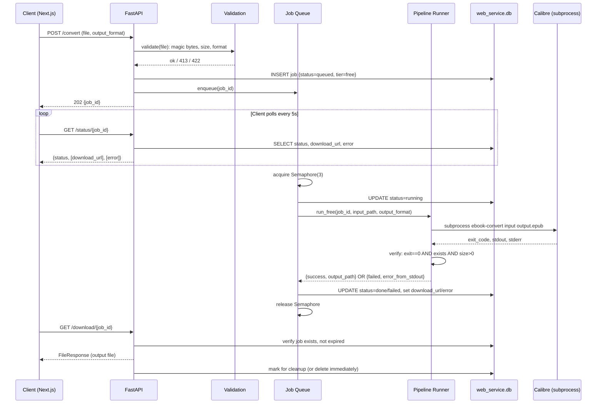

# feat: PDF-to-Kindle Freemium Web Service — Phase 1 (Core Conversion Service)

## Overview

Build the backend and basic UI for a freemium ebook conversion web service on the
existing `claude-dev-01` Hetzner VM. Phase 1 delivers: free-tier Calibre pass-through
conversions, an async job queue, file lifecycle management, a FastAPI API, a minimal
Next.js upload UI, and VM deployment. No Stripe billing in Phase 1 — the premium
pipeline path is implemented and tested locally but gated (always runs free tier until
Phase 2 wires in payment).

Phase 2 (separate plan): Stripe Checkout, HMAC token generation and validation,
premium tier unlock, pricing page.

## Problem Frame

EbookAutomation's conversion pipeline produces significantly better Kindle output than
raw Calibre — handling multi-column layouts, font-based heading detection, footnote
linking, and OCR cleanup. The Hetzner VM (`claude-dev-01`) is now bootstrapped with the
pipeline deployed. A web front-end turns this into a product.

The freemium model: free tier demonstrates basic conversion is possible; premium tier
demonstrates quality. The quality gap is documented and visually demonstrable — the
upgrade pitch sells itself.

(see origin: `docs/brainstorms/2026-05-13-freemium-web-service-requirements.md`)

## Requirements Trace

- **R1** Free tier: basic Calibre pass-through → EPUB/MOBI, 20MB limit, 3/IP/day, no account
- **R2** Premium tier: full smart pipeline → EPUB/MOBI/KFX, 100MB limit, 1 credit/conversion
- **R3** Credit purchase via Stripe signed tokens — *Phase 2; infrastructure scaffolded here*
- **R4** Async job queue: upload returns job_id, poll `/status/<id>`, 3 concurrent max, 120s timeout
- **R5** File lifecycle: per-job isolated temp dir, deleted on download or 24h expiry
- **R6** Security: magic-byte validation, subprocess isolation, restricted user, HTTPS, rate limiting
- **R7** SEO landing pages — *Phase 3; Next.js SSR foundation laid here*
- **R8** Stack: FastAPI + Next.js, claude-dev-01 VM, SQLite, Cloudflare

## Scope Boundaries

- Phase 1 delivers: free conversion flow end-to-end, working deployment on VM
- KFX output pipeline path is implemented but not user-exposed until Phase 2 (requires valid credit token)
- No user accounts, no email, no Stripe in Phase 1
- Rate limiting is handled at Cloudflare layer; backend enforces a soft per-IP counter as defence-in-depth
- Visual QA of conversion output is out of scope

### Deferred to Separate Tasks

- **Stripe integration, credit tokens, premium tier unlock**: Phase 2 plan (EB-45 follow-on)
- **SEO landing pages, structured data, quality comparison page**: Phase 3
- **Docker containerisation per job**: documented upgrade path, post-MVP
- **Redis/Celery job queue**: upgrade path when concurrency demands it
- **Email-to-Kindle delivery**: separate ticket

## Context & Research

### Relevant Code and Patterns

| What | Where | Notes |
|---|---|---|
| Free tier entry point | `tools/pdf_to_balabolka.py:2977` `extract_text_via_calibre()` | Wraps `ebook-convert` subprocess; no timeout |
| Premium entry point | `tools/pdf_to_balabolka.py:12635` `process_kindle_html()` | Full smart pipeline |
| Format routing | `tools/pdf_to_balabolka.py:3226` `extract_text_auto()` | Routes by extension to pdfminer/EPUB/Calibre paths |
| SQLite layer pattern | `tools/pattern_db.py` | `get_db()` factory + `init_db()` to model `web_service.db` after |
| Calibre subprocess pattern | `tools/pdf_to_balabolka.py:3001` | No timeout; captures stdout only |
| Per-page timeout | `tools/pdf_to_balabolka.py:5632` `_extract_page_with_timeout()` | 30s/page, thread-based |
| Config loading | `config/settings.json` + `config/settings.linux.json.example` | Linux path overrides needed |
| Supported formats | `tools/pdf_to_balabolka.py:37` `SUPPORTED_FORMATS` | pdf, epub, mobi, azw, azw3, djvu |
| Env var pattern | `.env` + `python-dotenv` | All secrets via env, never config files |
| Per-process executor pattern | `tools/batch_qa.py` `ThreadPoolExecutor` | Model for pipeline-in-executor |

### Institutional Learnings

- **EB-142 (Calibre stdout/stderr):** Calibre writes errors to **stdout**, not stderr. Capturing
  stderr alone misses the actual failure message. Always capture both; derive human-readable
  error from stdout. KFX plugin errors (memory, font embedding) appear in stdout.
- **SCRUM-290 (0-byte output / silent failure):** Calibre can exit 0 and produce a 0-byte KFX.
  Job `done` state must be gated on: `exit_code == 0 AND file_exists AND file_size > 0`.
- **SCRUM-290 (large file timing):** A 101MB PDF took 1285 seconds (21 min) on the VM. The
  brainstorm's 120s timeout will hard-fail files near the 100MB limit. Requires a tiered
  timeout or a revised file size cap (see Open Questions).
- **EB-221/EB-224 (Linux cross-platform fixes):** `$env:TEMP` is null on Linux. `.exe` suffixes
  must be omitted on Linux. `config/settings.linux.json.example` is the starting point for
  production VM config. `anthropic` package was missing from requirements.txt until EB-221 —
  audit all deps before deploying.
- **BookSmith plan (tkinter headless failure):** `pdf_to_balabolka.py` has top-level `tkinter`
  imports (lines 24–25). These cause `ImportError` on headless Linux without `python3-tk`.
  The pipeline **must** be invoked as a subprocess, not imported directly. This also provides
  process isolation: a pipeline crash cannot take down the FastAPI server.
- **BookSmith plan (KFX filename mismatch):** After `ebook-convert` exits, the expected output
  filename may differ from what the KFX plugin wrote. Recovery: scan the output dir for the
  newest `.kfx` file if the expected filename is missing.
- **SCRUM-285 (free-tier baseline quality):** pdfminer flattens tables, lists, and code blocks
  into `<p>` sequences. For the quality comparison page (Phase 3), use a technical book
  (programming, science) — the quality gap is most visible there.
- **pyspellchecker controls all 9 OCR cleanup phases:** Without it, `fix_ocr_artifacts()` skips
  everything. Must be in `requirements.txt` on the VM or the premium pipeline delivers no OCR
  benefit.

### External References

- FastAPI background tasks and file uploads: https://fastapi.tiangolo.com/tutorial/background-tasks/
- FastAPI `run_in_executor` pattern for blocking calls: asyncio docs, `loop.run_in_executor()`
- Stripe Checkout stateless token pattern: Stripe docs (Phase 2 — not needed for Phase 1)
- Next.js App Router with API routes and SSR: https://nextjs.org/docs
- `python-magic` for MIME type detection: pypi.org/project/python-magic/
- `filetype` library (no libmagic C dependency): pypi.org/project/filetype/
- systemd service unit for Python web apps: systemd.io
- Nginx reverse proxy for uvicorn: nginx docs

## Key Technical Decisions

- **Pipeline as subprocess, not Python import:** `tkinter` top-level imports crash on headless
  Linux. Subprocess isolation also means a pipeline crash cannot take down FastAPI. The
  subprocess calls the existing CLI entry point with `--cli` mode and JSON output. Trade-off:
  slightly higher startup overhead per job; acceptable for v1.
  (see origin: BookSmith plan + EB-221 Linux fixes)

- **Separate `data/web_service.db`, not extending `data/ebook_patterns.db`:** Keeps web service
  job/token state decoupled from pipeline learning data. The rsync script
  (`tools/sync_pattern_db.ps1`) explicitly manages `ebook_patterns.db` only; extending the sync
  to a second DB is a deliberate future step.

- **Tiered conversion timeout by file size:** The flat 120s from R4f is incompatible with large
  PDFs (SCRUM-290: 101MB → 21 min). Tiered: <10MB→120s, 10–50MB→300s, 50–100MB→600s. This
  is a departure from R4f and must be confirmed with the requirements before Phase 2.

- **`asyncio.Semaphore(3)` + `ThreadPoolExecutor` for concurrency control:** Pipeline functions
  are blocking/synchronous — no asyncio in the existing codebase. `run_in_executor` bridges
  them into FastAPI's async context. Semaphore enforces the 3-concurrent-job cap.

- **`filetype` library for magic-byte validation (no libmagic C dependency):** `python-magic`
  requires `libmagic` installed system-wide on the VM; `filetype` is pure Python with no
  C dependency, easier to deploy. Trade-off: slightly less comprehensive MIME coverage;
  sufficient for the 6 supported ebook formats.

- **Next.js on Vercel, FastAPI API on VM behind Cloudflare:** Simplest Phase 1 deployment.
  Vercel handles Next.js SSL + CDN for free. API calls from Next.js to FastAPI go via the
  Cloudflare-proxied API domain. No nginx config needed for the frontend in Phase 1.

- **systemd for FastAPI process management:** Ensures the service starts on boot, restarts on
  failure, and logs to journald. Standard pattern for long-running Python services on Linux.
  `gunicorn` or `uvicorn` as the ASGI server.

- **`shell=False` on all subprocess calls:** Prevents shell injection from user-supplied
  filenames. Each argument is a separate list element. Never `shell=True`.

## Open Questions

### Resolved During Planning

- **Tkinter headless failure**: Invoke pipeline as subprocess, not Python import. (resolved)
- **Separate DB vs. extending pattern DB**: Separate `data/web_service.db`. (resolved)
- **Frontend deployment**: Next.js on Vercel for Phase 1. (resolved)
- **Process manager**: systemd + uvicorn. (resolved)
- **File type library**: `filetype` (pure Python, no libmagic dep). (resolved)

### Deferred to Implementation

- **Timeout calibration**: Measure actual p95 conversion times on `claude-dev-01` for PDFs
  at 5MB, 20MB, 50MB, and 100MB before finalising the tiered timeout values. The 600s cap
  for large files may need to be raised or the file size limit lowered.
- **KFX plugin on VM Linux**: Verify the Calibre KFX Output plugin is installed and functional
  on `claude-dev-01` before exposing KFX as an output option. A Phase 2 prerequisite.
- **`config/settings.json` Linux production values**: Derive from `config/settings.linux.json.example`
  during deployment; exact paths depend on VM layout.
- **Calibre invocation path**: Whether to use `ebook-convert` (Calibre CLI) directly or the
  existing `extract_text_via_calibre()` function via subprocess depends on whether tkinter is
  the only blocker or whether there are other import-time side effects.

## Output Structure

```
web_service/
├── __init__.py
├── main.py                  # FastAPI app, lifespan, CORS, middleware
├── config.py                # Load env + config/settings.json; resolve tool paths
├── pipeline_runner.py       # Subprocess wrapper: free tier + premium tier paths
├── job_queue.py             # asyncio Semaphore + ThreadPoolExecutor + task dispatch
├── job_store.py             # SQLite CRUD for jobs table (web_service.db)
├── validation.py            # Magic-byte check, file size, format whitelist
├── routes/
│   ├── __init__.py
│   ├── convert.py           # POST /convert — upload, validate, enqueue
│   ├── status.py            # GET /status/{job_id}
│   └── download.py          # GET /download/{job_id} — serve + schedule cleanup
└── frontend/                # Next.js project root
    ├── package.json
    ├── next.config.js
    ├── app/
    │   ├── page.tsx          # Upload form (SSR landing page)
    │   └── status/
    │       └── [id]/page.tsx # Status polling page
    ├── components/
    │   ├── UploadZone.tsx
    │   ├── FormatSelector.tsx
    │   └── ConversionStatus.tsx
    └── lib/
        └── api.ts            # API client (typed fetch wrappers)

deploy/
├── web_service.service      # systemd unit
├── nginx.conf               # Reverse proxy for FastAPI API
└── deploy.sh                # git pull + restart + smoke test
```

## High-Level Technical Design

> *This illustrates the intended approach and is directional guidance for review, not
> implementation specification. The implementing agent should treat it as context, not
> code to reproduce.*

**Free-tier conversion flow (Phase 1):**



**Job state machine:**

```
queued → running → done
                 ↘ failed
queued → expired (24h TTL, cleaned by background sweep)
```

## Implementation Units

- [ ] **Unit 1: Web service configuration and project scaffold**

**Goal:** Create the `web_service/` Python package and `deploy/` scaffold. Load all
runtime configuration (tool paths, limits, API keys) from environment variables and
`config/settings.json` in one place. No configuration scattered across modules.

**Requirements:** R8a (FastAPI + VM), R6g (secrets via env only)

**Dependencies:** None

**Files:**
- Create: `web_service/__init__.py`
- Create: `web_service/config.py`
- Create: `deploy/` directory with `.gitkeep`
- Modify: `requirements.txt` (add: `fastapi`, `uvicorn[standard]`, `python-multipart`,
  `filetype`, `aiofiles`)

**Approach:**
- `config.py` reads `config/settings.json` using the same `Path(__file__).resolve().parent`
  pattern already established in `pdf_to_balabolka.py` — paths are relative to the
  project root, not a hardcoded location
- Expose a `Settings` dataclass with: calibre path, pipeline script path, max file sizes
  (free/premium), concurrent job limit, job TTL, output dir, temp dir root
- Calibre path uses the `exeSuffix` pattern from EB-221/EB-224: no `.exe` on Linux
- All secrets (Stripe key, ANTHROPIC_API_KEY) read from env, never from config file

**Patterns to follow:**
- `tools/pdf_to_balabolka.py:54-72` `_load_api_model()` for the `config/settings.json`
  loading pattern
- `tools/pattern_db.py` for the module-level `get_db()` / `init_db()` pattern

**Test scenarios:**
- Happy path: `Settings` loads correctly from a mock `config/settings.json` with Linux paths
- Happy path: Calibre path resolves without `.exe` suffix on Linux
- Edge case: Missing required env var raises `ConfigurationError` with a named-variable message
- Edge case: `config/settings.json` missing — raises `FileNotFoundError` with a clear message

**Verification:**
- `python -c "from web_service.config import Settings; s = Settings(); print(s.calibre_path)"` succeeds on the VM
- All secrets read from environment only; no hardcoded values in `config.py`

---

- [ ] **Unit 2: SQLite job store (`web_service.db`)**

**Goal:** Create and manage the `data/web_service.db` SQLite database. Provide CRUD
operations for the `jobs` table. This DB is entirely separate from `data/ebook_patterns.db`.

**Requirements:** R4 (job states), R5 (file lifecycle and expiry)

**Dependencies:** Unit 1 (config for DB path)

**Files:**
- Create: `web_service/job_store.py`
- Create: `tests/test_web_job_store.py`

**Approach:**
- `jobs` table schema:
  ```
  job_id       TEXT PRIMARY KEY  -- UUID4
  status       TEXT              -- queued | running | done | failed | expired
  tier         TEXT              -- free | premium
  input_fmt    TEXT
  output_fmt   TEXT
  token_hash   TEXT NULLABLE     -- Phase 2: HMAC token identifier
  created_at   INTEGER           -- Unix timestamp
  expires_at   INTEGER           -- created_at + TTL (3600s free, 86400s premium)
  error_msg    TEXT NULLABLE
  output_size  INTEGER NULLABLE  -- bytes, set when done
  ```
- `init_db()` runs `CREATE TABLE IF NOT EXISTS` — idempotent, safe to call on startup
- All DB access is synchronous (SQLite + asyncio is fine via `run_in_executor` for writes;
  reads from the status endpoint are fast enough for inline sync calls)
- Background cleanup sweep: a periodic `asyncio` task deletes expired jobs and their
  temp directories (runs every 10 minutes)

**Patterns to follow:**
- `tools/pattern_db.py:get_db()`, `init_db()`, and the `with sqlite3.connect(...)` context
  manager pattern already established in the repo

**Test scenarios:**
- Happy path: create job → status is `queued`; transition to `running`; transition to `done`
  with `output_size`
- Happy path: transition to `failed` stores `error_msg`
- Edge case: `get_job(unknown_id)` returns `None`, not raises
- Edge case: expired jobs (TTL elapsed) are returned with `status=expired` by cleanup sweep
- Edge case: concurrent status updates to the same job_id are serialised by SQLite's write lock
- Integration: `init_db()` is idempotent — running twice does not corrupt schema

**Verification:**
- All state transitions tested and passing
- Expired jobs are removed from DB and their temp dirs deleted

---

- [ ] **Unit 3: File validation middleware**

**Goal:** Validate uploaded files before they enter the job queue: magic bytes, file size,
and format whitelist. Reject invalid files with structured error responses before any
disk I/O beyond the initial upload buffer.

**Requirements:** R6a (magic-byte validation), R1c (free tier format/size limits),
R2d (premium 100MB limit)

**Dependencies:** Unit 1 (config for size limits and format list)

**Files:**
- Create: `web_service/validation.py`
- Create: `tests/test_web_validation.py`

**Approach:**
- Use the `filetype` library to detect MIME type from the first 262 bytes (magic number
  pattern); no `libmagic` C dependency required
- Format whitelist maps allowed MIME types to the `SUPPORTED_FORMATS` list from the pipeline
- File size checked against the tier limit before writing the file to a temp location
- Free tier: 20MB, EPUB/MOBI output only
- Premium tier: 100MB, EPUB/MOBI/KFX output (KFX gated in Phase 2)
- On failure: return structured JSON `{"error": "...", "code": "..."}` with 413 (size)
  or 422 (format)

**Patterns to follow:**
- `tools/pdf_to_balabolka.py:37` `SUPPORTED_FORMATS` list as the whitelist source of truth

**Test scenarios:**
- Happy path: valid PDF bytes accepted as `application/pdf`
- Happy path: valid EPUB bytes accepted
- Edge case: file with `.pdf` extension but PNG magic bytes → 422 with "Invalid file type"
- Edge case: empty file (0 bytes) → 422 with "Empty file"
- Edge case: file size exactly at 20MB limit → accepted; 20MB + 1 byte → 413
- Error path: unsupported format (e.g., DOCX) → 422 with supported formats listed
- Edge case: DJVU file accepted (in `SUPPORTED_FORMATS` but less common)

**Verification:**
- All test scenarios pass; no false positives on valid ebook files

---

- [ ] **Unit 4: Pipeline subprocess runner**

**Goal:** Wrap both the free-tier Calibre pass-through and the premium smart pipeline
as a controlled subprocess invocation. Enforce timeouts, capture stdout+stderr, verify
output artifact existence and size, and handle KFX filename mismatch recovery.

**Requirements:** R1 (free tier output), R2 (premium pipeline), R4f (timeout), R5a
(per-job temp dir), R5c (cleanup), R6b (subprocess isolation), R6c (restricted user)

**Dependencies:** Unit 1 (config for paths, timeout tiers)

**Files:**
- Create: `web_service/pipeline_runner.py`
- Create: `tests/test_web_pipeline_runner.py`

**Approach:**
- **Free tier path:** `ebook-convert <input> <output>.<format>` — direct Calibre subprocess
  call with no additional pipeline logic. Arguments as a list (`shell=False`).
- **Premium tier path:** `python tools/pdf_to_balabolka.py --cli --input <path> ...` — invokes
  the existing CLI entry point. Set `PYTHONIOENCODING=utf-8` in `env`. Working directory
  must be the project root so `config/settings.json` resolves correctly.
- **Timeout tiers (departure from R4f — see Open Questions):**
  - <10MB input: 120s
  - 10–50MB: 300s
  - 50–100MB: 600s
- **stdout+stderr handling (EB-142 lesson):** Capture both. Derive human-readable error
  from Calibre's stdout (not stderr). Log both with distinct prefixes for monitoring.
- **Artifact verification (SCRUM-290 lesson):**
  ```
  exit_code == 0 AND output_path.exists() AND output_path.stat().st_size > 0
  ```
- **KFX filename mismatch recovery:** If expected `output.kfx` is missing after exit 0,
  scan the temp dir for the newest `.kfx` file created after job start. Use that instead.
- **Restricted user:** Document that the systemd service unit should run as a dedicated
  `www-ebook` system user with write access only to the temp dir and output dir.
  Implementation of the restricted user is a deployment step (Unit 7).
- **Per-job temp dir:** `tempfile.mkdtemp(prefix='job_{job_id}_')` under a configured base
  temp dir. Passed to the pipeline subprocess via argument. Destroyed on completion by
  the job queue (not the runner itself — the runner returns the output path).

**Patterns to follow:**
- `tools/pdf_to_balabolka.py:2977` `extract_text_via_calibre()` for Calibre subprocess pattern
- `tools/pattern_db.py` and `tools/batch_qa.py` for subprocess + error handling patterns
- `tools/sync_pattern_db.ps1` for the SSH pattern showing VM working directory structure

**Test scenarios:**
- Happy path: valid small PDF → free tier → EPUB output exists, size > 0, exit 0
- Happy path: valid PDF → premium tier → function is called with correct CLI args
- Edge case: exit 0 but 0-byte output → runner returns failure with "Conversion produced empty output"
- Edge case: KFX filename mismatch → runner scans dir and returns the actual .kfx path
- Error path: Calibre exits with code 1 → runner returns failure with message extracted from stdout
- Error path: conversion exceeds timeout → `TimeoutExpired` caught → job fails with "Conversion timed out"
- Integration: temp dir is created before subprocess and path is passed as argument
- Integration: `PYTHONIOENCODING=utf-8` is set in subprocess env for the premium path
- Edge case: `shell=False` enforced — no string interpolation of user-provided paths

**Verification:**
- Runner tested against a real small PDF on the VM via manual smoke test
- 0-byte KFX detection confirmed with a mock Calibre that writes an empty file

---

- [ ] **Unit 5: FastAPI application — endpoints and async job queue**

**Goal:** Implement the three core endpoints and the asyncio job dispatch mechanism.
`POST /convert` validates, enqueues, and returns a `job_id`. `GET /status/{job_id}`
returns current state. `GET /download/{job_id}` serves the output file and triggers
cleanup. The job queue runs pipeline jobs via `run_in_executor` with an asyncio Semaphore
limiting concurrency to 3.

**Requirements:** R4a–R4f (job queue behaviour), R5 (file lifecycle)

**Dependencies:** Units 1–4

**Files:**
- Create: `web_service/main.py`
- Create: `web_service/job_queue.py`
- Create: `web_service/routes/convert.py`
- Create: `web_service/routes/status.py`
- Create: `web_service/routes/download.py`
- Create: `tests/test_web_endpoints.py`

**Approach:**
- `main.py`: FastAPI app, `lifespan` context manager for `init_db()` and queue startup,
  CORS config (allow Vercel frontend domain), include routers
- `job_queue.py`: `asyncio.Semaphore(max_workers=3)`, `ThreadPoolExecutor(max_workers=3)`,
  `async def dispatch_job(job_id)` that: acquires semaphore → updates DB to `running` →
  calls `await loop.run_in_executor(pool, pipeline_runner.run, ...)` → updates DB to
  `done`/`failed` → releases semaphore. Background sweep task for expired job cleanup.
- `POST /convert`: multipart form, calls `validation.validate()`, writes file to temp dir,
  inserts job record, fires `asyncio.create_task(dispatch_job(job_id))`, returns 202
- `GET /status/{job_id}`: reads job from DB, returns `{status, download_url?, error?}`;
  404 if job_id unknown; 200 otherwise regardless of status
- `GET /download/{job_id}`: verifies job is `done` and not expired; `FileResponse` with
  `Content-Disposition: attachment`; deletes output file and marks job `expired` after
  response sent (via `BackgroundTask`)

**Technical design (directional):**
```
# Job dispatch (non-prescriptive sketch)
async def dispatch_job(job_id):
    async with semaphore:          # blocks if 3 jobs already running
        job_store.set_running(job_id)
        result = await loop.run_in_executor(pool, pipeline_runner.run, job_id, ...)
        if result.success:
            job_store.set_done(job_id, result.output_path, result.output_size)
        else:
            job_store.set_failed(job_id, result.error_message)
```

**Patterns to follow:**
- `tools/batch_qa.py` `ThreadPoolExecutor` pattern for blocking jobs in an async context

**Test scenarios:**
- Happy path: `POST /convert` with valid PDF → 202 with `job_id` UUID
- Happy path: `GET /status/{job_id}` on a `done` job → 200 with `download_url`
- Happy path: `GET /download/{job_id}` → file bytes served, cleanup triggered
- Edge case: `GET /status/{unknown_id}` → 404
- Edge case: `GET /download/{job_id}` after file already cleaned up → 410 Gone
- Edge case: `GET /download/{job_id}` on a `failed` job → 422 with error message
- Edge case: 4th concurrent job waits until a slot opens (semaphore blocks, then unblocks)
- Error path: pipeline raises exception in executor → job set to `failed`, semaphore released
- Integration: full flow — upload → poll until done → download → file is served → temp dir
  cleaned up → subsequent download returns 410

**Verification:**
- Full integration test passes with a real small PDF on the VM
- Concurrent semaphore behaviour verified with 4 simultaneous mock jobs

---

- [ ] **Unit 6: Next.js upload UI (Phase 1 — basic flow only)**

**Goal:** Build the minimum viable Next.js frontend: an upload form with drag-and-drop,
format selection, status polling, and a download trigger. No SEO optimization in Phase 1;
that lands in Phase 3. The page must be SSR-rendered (not pure CSR) to lay the foundation
for Phase 3 SEO work.

**Requirements:** R8b (Next.js frontend), R7a (SSR foundation)

**Dependencies:** Unit 5 (API endpoints must be defined)

**Files:**
- Create: `web_service/frontend/package.json`
- Create: `web_service/frontend/next.config.js`
- Create: `web_service/frontend/app/page.tsx` (upload form)
- Create: `web_service/frontend/app/status/[id]/page.tsx` (status polling)
- Create: `web_service/frontend/components/UploadZone.tsx`
- Create: `web_service/frontend/components/FormatSelector.tsx`
- Create: `web_service/frontend/components/ConversionStatus.tsx`
- Create: `web_service/frontend/lib/api.ts`

**Approach:**
- Next.js App Router (`app/` directory) with TypeScript
- `NEXT_PUBLIC_API_URL` env var for the FastAPI API domain; set in Vercel project settings
- `app/page.tsx` is a Server Component that renders the upload form with zero client JS
  for the initial paint; `UploadZone` is a Client Component (`"use client"`)
- Status polling: `useEffect` + `setInterval(5000)` in `ConversionStatus` Client Component;
  clears interval when status reaches `done` or `failed`
- Download: renders a link to `/download/{job_id}` on the FastAPI API directly (not proxied
  through Next.js) — this lets the FastAPI `FileResponse` stream directly to the browser
- No auth, no cookies, no session state in Phase 1
- Minimal styling; functional over polished; Phase 3 handles visual design and SEO markup

**Test scenarios:**
- Happy path: UploadZone renders a drag-and-drop area; file drop triggers `onDrop` with the
  file object and calls `api.startConversion()`
- Happy path: FormatSelector shows only EPUB and MOBI options for free tier
- Happy path: ConversionStatus polls every 5s and renders each status label correctly
- Happy path: download link is rendered when status is `done`
- Edge case: ConversionStatus stops polling when status is `done` or `failed`
- Error path: failed conversion renders error message from API response
- Edge case: API unreachable → UI shows "Service unavailable" rather than a blank error

**Verification:**
- Manual smoke test: upload a small PDF, watch status progress to done, click download, verify
  the downloaded EPUB opens in an ebook reader
- `next build` completes without errors or TypeScript warnings

---

- [ ] **Unit 7: VM deployment (systemd + Nginx + Cloudflare)**

**Goal:** Deploy the FastAPI backend on `claude-dev-01` as a managed systemd service
behind Nginx. Configure Cloudflare as the public-facing layer. Connect Next.js on Vercel
to the API domain. Produce a repeatable `deploy.sh` script.

**Requirements:** R8a (VM hosting), R8e (Cloudflare), R8f (HTTPS)

**Dependencies:** Units 1–5 (application must be deployable)

**Files:**
- Create: `deploy/web_service.service` (systemd unit)
- Create: `deploy/nginx.conf` (reverse proxy for FastAPI)
- Create: `deploy/deploy.sh` (git pull + install deps + restart)
- Create: `deploy/README.md` (first-deployment walkthrough)

**Approach:**
- **systemd unit:** Runs `uvicorn web_service.main:app --host 127.0.0.1 --port 8001`
  as a dedicated system user (`www-ebook`). `Restart=always`, `WorkingDirectory` set to
  project root. `EnvironmentFile=/etc/web_service.env` for secrets.
- **Nginx:** Reverse proxy `api.yourdomain.com` → `127.0.0.1:8001`. Pass `X-Forwarded-For`
  header for Cloudflare IP attribution. TLS terminated by Certbot/Let's Encrypt.
- **`www-ebook` system user:** Read access to pipeline code; write access only to
  `data/web_service.db`, configured temp dir, and output dir. No shell, no home directory.
  This implements R6c (restricted subprocess user).
- **Cloudflare:** Set to proxy mode (orange cloud) on the API subdomain. Enable
  rate-limiting rule: max 10 requests/IP/minute to `POST /convert`. DDoS protection on.
- **Vercel:** Connect the `web_service/frontend/` subdirectory as the Vercel project root.
  Set `NEXT_PUBLIC_API_URL` environment variable to the Cloudflare-proxied API domain.
- **`deploy.sh`:** `git pull origin master` → `pip install -r requirements.txt` →
  `npm ci --prefix web_service/frontend` → `npm run build --prefix web_service/frontend` →
  `systemctl restart web_service` → `curl http://localhost:8001/health` smoke test.

**Test expectation:** none — deployment artifacts are configuration; verification is
the smoke test in `deploy.sh` plus the manual end-to-end test below.

**Verification:**
- `curl https://api.yourdomain.com/health` returns `{"status": "ok"}`
- Manual upload of a small PDF through the live Vercel frontend completes successfully
- Systemd service survives a `systemctl restart web_service` and continues serving requests
- Cloudflare proxy log shows requests being rate-limited after 10/minute threshold

## System-Wide Impact

- **Interaction with existing pipeline:** The web service invokes the pipeline via subprocess;
  it does not modify `tools/pdf_to_balabolka.py`. Regressions in the pipeline's outputs
  will surface in web service jobs but are tested separately by `test_pipeline.py`.
- **`data/web_service.db` is a new file:** Not tracked by `tools/sync_pattern_db.ps1`.
  The web service DB lives only on the VM; no desktop sync needed. If the DB is lost, in-flight
  jobs are lost but no user data is stored permanently — acceptable for v1.
- **Disk space on VM:** A 100MB PDF can produce a >1GB KFX output (SCRUM-290: 101MB → 1055MB).
  The VM needs monitoring for disk utilisation. The 24-hour expiry and cleanup sweep are the
  primary safeguard.
- **`requirements.txt` additions:** `fastapi`, `uvicorn[standard]`, `python-multipart`,
  `filetype`, `aiofiles` are new. These do not conflict with existing deps. Audit before
  deploying that `pyspellchecker` and `anthropic` are present (both were previously missing
  on the VM).
- **Unchanged invariants:** `tools/pdf_to_balabolka.py`, `tools/pattern_db.py`, and all
  existing pipeline code are read-only from the web service's perspective. No modifications
  to the pipeline for Phase 1.
- **Calibre KFX plugin:** Required for KFX output (Phase 2). Phase 1 free tier only produces
  EPUB/MOBI — plugin absence does not affect Phase 1.

## Risks & Dependencies

| Risk | Mitigation |
|------|------------|
| Large PDF timeout mismatch (SCRUM-290: 101MB → 21min) | Tiered timeout; benchmark on VM before finalising; consider lowering premium file limit to 50MB if benchmarks confirm |
| KFX Output plugin not on VM Linux | Verify during Phase 1 deployment; KFX not exposed to users until Phase 2 regardless |
| tkinter import crashes pipeline subprocess on headless VM | Subprocess invocation avoids import; verify `python pdf_to_balabolka.py --cli` works headlessly as a Phase 1 deployment check |
| 0-byte output false success (SCRUM-290) | Artifact size verification in `pipeline_runner.py`; tested explicitly |
| Disk exhaustion from large output files | Cleanup sweep + 24h TTL; VM disk monitoring (not in scope for Phase 1 — note for ops) |
| `pyspellchecker` / `anthropic` missing from VM requirements | Full `pip install -r requirements.txt` in `deploy.sh`; validate with dry run before launch |
| Calibre stdout error messages not surfaced to users (EB-142) | Explicit stdout capture and parsing in `pipeline_runner.py`; tested |
| KFX filename mismatch (BookSmith plan) | Directory scan for newest `.kfx` in runner; tested |
| Next.js `NEXT_PUBLIC_API_URL` misconfiguration | `next build` fails fast if the env var is missing; verified in CI |
| SQLite write contention (3 concurrent jobs) | SQLite WAL mode enabled; 3 concurrent writers is within SQLite's tested concurrency |

## Documentation / Operational Notes

- `deploy/README.md` must cover: first-time VM setup, `www-ebook` user creation, Certbot
  setup, Cloudflare DNS configuration, and Vercel project link.
- **Pre-launch checklist (to be completed before Phase 2):**
  - [ ] `config/settings.linux.json.example` → production `config/settings.json` on VM
  - [ ] Calibre KFX Output plugin installed and tested on VM
  - [ ] `pyspellchecker` in `requirements.txt`
  - [ ] `anthropic>=0.50.0` in `requirements.txt`
  - [ ] Headless pipeline invocation tested (`python pdf_to_balabolka.py --cli`)
  - [ ] Disk monitoring configured on VM
  - [ ] Cloudflare rate limiting rule active on `POST /convert`
- **Timeout calibration:** Before Phase 2 launch, measure actual p95 conversion time on VM
  for PDFs at 5MB, 20MB, 50MB, 100MB. Revise tiered timeout values or lower the 100MB limit
  if p95 exceeds 600s.

## Phased Delivery

### Phase 1 (this plan)
- FastAPI backend with free-tier Calibre pass-through
- Async job queue, job store, file validation, pipeline runner
- Minimal Next.js upload UI
- VM deployment (systemd + Nginx + Let's Encrypt + Cloudflare)

### Phase 2 (separate plan, anchored to EB-45)
- Stripe Checkout integration
- HMAC token generation and single-use validation
- Premium tier unlock (full pipeline + KFX output)
- Pricing page with credit pack options

### Phase 3 (separate plan)
- SEO landing pages (`/pdf-to-kfx`, `/academic-pdf-to-kindle`)
- Quality comparison page (before/after screenshots)
- Schema.org structured data
- Core Web Vitals audit

### Phase 4 (separate plan)
- Per-job Docker containerisation (security hardening upgrade)
- Redis + Celery job queue (concurrency upgrade)

## Sources & References

- **Origin document:** [docs/brainstorms/2026-05-13-freemium-web-service-requirements.md](docs/brainstorms/2026-05-13-freemium-web-service-requirements.md)
- **Calibre stderr/stdout lesson:** [docs/solutions/eb-142-calibre-stderr-capture.md](docs/solutions/eb-142-calibre-stderr-capture.md)
- **Large file timing + 0-byte failure:** [docs/solutions/scrum-290-a2-pilot-findings.md](docs/solutions/scrum-290-a2-pilot-findings.md)
- **Linux cross-platform fixes:** commits `0dc6cc8` (EB-221/EB-223), `9ce5cd6` (EB-224)
- **BookSmith plan (pipeline wrapping gotchas):** [docs/plans/2026-04-11-001-feat-booksmith-extraction-plan.md](docs/plans/2026-04-11-001-feat-booksmith-extraction-plan.md)
- **Free-tier quality baseline evidence:** [docs/solutions/scrum-285-python-kfx-layout-investigation.md](docs/solutions/scrum-285-python-kfx-layout-investigation.md)
- **Pipeline entry point:** `tools/pdf_to_balabolka.py:12635` (`process_kindle_html`)
- **SQLite pattern to model:** `tools/pattern_db.py`
- **Related ticket:** [EB-45](https://jlfowler1084.atlassian.net/browse/EB-45)
- **SEO skill ticket:** [INFRA-371](https://jlfowler1084.atlassian.net/browse/INFRA-371)
