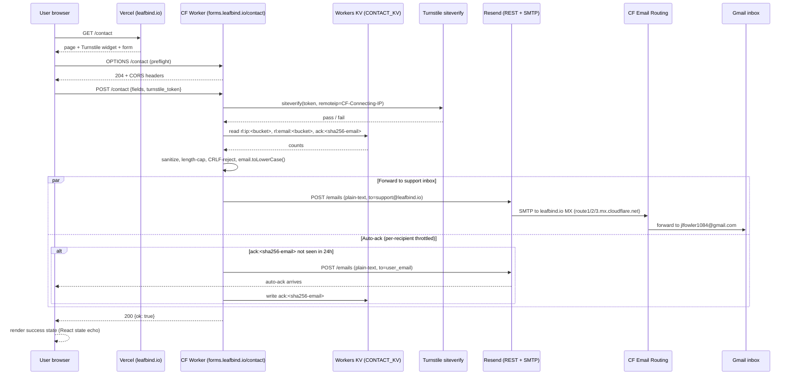

# feat: Add support@leafbind.io inbox + on-site contact form (EB-264)

## Overview

Ship a public support contact path for leafbind.io: an inbound `support@leafbind.io` inbox forwarded to the operator's Gmail, an outbound reply path that authenticates as `support@leafbind.io` (no personal-address leakage), and an on-site `/contact` page backed by a Cloudflare Worker on a new `forms.leafbind.io` subdomain that validates Turnstile, dual-rate-limits in Workers KV, sanitizes input, and forwards via Resend. The work also updates IA (footer Support column, Recover-tokens relocation), adds `ContactPage` JSON-LD, and corrects the existing `llms.txt` line that currently advertises a contact path that does not exist.

## Problem Frame

Today, leafbind.io has no public way to reach support. `components/Footer.tsx` has Convert / Account columns but no support link. `public/llms.txt` tells AI assistants *"Contact: via the conversion result page"* — but `app/(app)/status/[id]/page.tsx` has no contact UI. Two audiences are un-served: pre-purchase users with capability or billing questions, and post-conversion users with quality issues or failures. The full problem framing, scope decisions, and trade-offs are captured in the origin document (see origin: `docs/brainstorms/eb-264-support-inbox-and-contact-form-requirements.md`). This plan implements v1 of that scope: marketing-footer-reachable `/contact` page + full inbox plumbing. Post-conversion contextual entry (v2) and recover-page entry (v3) are explicitly deferred.

## Requirements Trace

Sixteen requirements (R1–R16) from the origin document.

- **R1, R3 (Inbox plumbing — inbound + DMARC):** Cloudflare Email Routing for `support@leafbind.io` → Gmail; DMARC `p=none` monitor mode; `dmarc-reports@leafbind.io` aggregate mailbox provisioned. → **Unit 1**
- **R2 (Outbound auth + SPF + DKIM):** Resend domain verification adds DKIM record; SPF record is replaced-in-place at apex to include both Cloudflare Email Routing and Resend; Gmail "Send mail as" via Resend SMTP relay so manual replies authenticate as `support@leafbind.io`. → **Unit 2** (DNS work touching SPF deferred to Unit 2 because the Resend `include:` cannot be added before Resend is set up)
- **R4 (Page):** `/contact` page in the Next.js app, reachable from footer. → **Unit 4, Unit 5**
- **R5 (Fields):** Name (≤200) / Email (validated) / Topic (native `<select>`: General / Conversion issue / Billing / Other) / Message (20–5000) / hidden honeypot + Turnstile token. → **Unit 4**
- **R6 (Helper text):** Conversion-issue copy guides users to include the conversion ID; sets v2 expectations. → **Unit 4**
- **R7 (Validation + button labels):** Per-field on-blur validation + full-form on first submit; submit-button label "Send message" / "Sending…". → **Unit 4**
- **R8 (Success/failure states):** Inline success with React-state-only echo, focus management + aria-live, aria-describedby on field errors, distinct copy per failure mode, sessionStorage draft preservation. → **Unit 4**
- **R9 (Anti-spam):** Turnstile managed-mode with server-side validation (with mandatory `remoteip`); honeypot returns identical-success-UI; `wrangler secret put TURNSTILE_SECRET_KEY`. → **Unit 3, Unit 4**
- **R10 (Worker submission path):** Greenfield Cloudflare Worker at `forms.leafbind.io/contact` (POST); explicit OPTIONS preflight handler; JSON-only responses; CORS allow-list (`https://leafbind.io` + `https://www.leafbind.io`); dual rate-limiting (per-IP + per-email, fixed-hour buckets) in a single KV namespace with key prefixes; input length caps + sanitization (HTML strip, CRLF reject, email lowercase normalization); plain-text-only outbound; SDK-mediated send; documented failure modes (incl. network timeout fail-closed); secrets via `wrangler secret put`. → **Unit 3**
- **R11 (Auto-acknowledgment):** Plain-text auto-reply ≤1 minute; per-recipient throttle (1 per 24hr per email). → **Unit 3**
- **R12 (Footer):** New Support column with `/contact` + `/recover`; remove `/recover` from Account. → **Unit 5**
- **R13 (Sitemap):** `/contact` added at priority 0.5, `changeFrequency: yearly`. → **Unit 6**
- **R14 (JSON-LD):** `ContactPage` schema via existing `JsonLd` component; extend `web_service/frontend/lib/structured-data.ts` (single-file edit: add `ContactPageSchema` interface + append to `SchemaData` union + `buildContactPageSchema()` helper). → **Unit 4**
- **R15 (Privacy):** No cookies (except Turnstile); KV rate-limit state acknowledged with sha256-normalized email key; privacy line under form. → **Unit 3, Unit 4**
- **R16 (llms.txt):** Replace existing aspirational `Contact` line with `Contact: https://leafbind.io/contact`. → **Unit 6**

## Scope Boundaries

v1 explicitly does **not** include:
- File attachments (image or PDF)
- Bounded retrieval support chatbot
- Multi-language form copy
- Analytics event tracking on the form (lives in EB-265 Phase 2)
- A help-desk / ticketing system, threading, or tagging
- Account-column dissolution (Pricing + Quality stay in Account; nothing else moves)
- Any change to `leafbind.io` apex DNS posture — apex stays DNS-only to Vercel
- Any change to `api.leafbind.io` (it is the production FastAPI backend and is untouched by this plan)

**Included in v1 (resolves an earlier contradiction in this section):** Gmail "Send mail as `support@leafbind.io`" setup is in v1, configured in Unit 2. Without it, manual replies leak the operator's personal Gmail address — that defeats R2's brand-trust goal.

### Deferred to Separate Tasks
- **v2 — Contextual entry on `/status/[id]`:** Result-page "Need help with this conversion?" button that pre-fills conversion ID. **Open question for v2 design:** whether v2 supports PDF re-upload (requires new multipart endpoint + storage backend, not a v1 backend reuse) or only conversion-ID-based reference (v1 backend extends with optional `conversion_id` field, no schema break). The v1 Worker request schema is JSON-only by design; "v2 reuses backend without rework" is true *only* for the no-re-upload variant. Triggered when at least one v1 inbound mentions a conversion ID, or earlier on user request. Future EB ticket.
- **v3 — Contextual entry on `/recover`:** Same pattern for users who lost their download. Future EB ticket.
- **DMARC upgrade `p=none` → `p=quarantine`:** 30-day calendar review. **Pre-created during planning (not deferred to ship-time)** — see Unit 7's verification step 8. Aggregate-report mailbox is `dmarc-reports@leafbind.io`, provisioned in Unit 1.
- **Bounded retrieval support chatbot:** Conditional on email volume justifying it. Separate future ticket.
- **Vercel `productionBranch` CI gate:** Standing protection against future drift (EB-257 was a one-time fix; nothing prevents recurrence). Captured as a separate INFRA ticket — out of scope for EB-264.

## Context & Research

### Relevant Code and Patterns

- **Loading-state precedent:** `web_service/frontend/components/UploadZone.tsx` (not `RecoverClient.tsx` — the origin doc misremembered). `useState<boolean>` for in-flight, `useState<string | null>` for error, label-swap via ternary, inline error render.
- **Input validation precedent:** `web_service/frontend/components/TokenField.tsx`. Client-side regex, `onBlur` validation (not onChange), inline `<p style={{ color: "red", fontSize: "0.9em" }}>` errors. **Note:** TokenField does NOT wire `aria-describedby` between input and error — Unit 4 must add this to avoid copying the a11y gap.
- **Native `<select>` styling precedent:** `web_service/frontend/components/FormatSelector.tsx`. Inline style with `var(--color-border)`, padding `6px 12px`, `fontSize: 14`, `borderRadius: 4`.
- **Interactive-utility-page precedent:** `web_service/frontend/app/(app)/recover/page.tsx`. `(app)` route-group layout, `max-w-3xl px-6 py-12` container, client component inside a card. `/contact` mirrors this — **not** `(marketing)` despite the origin doc's R4 saying `app/(marketing)/contact/page.tsx`.
- **JSON-LD pattern:** `web_service/frontend/components/JsonLd.tsx` + `web_service/frontend/lib/structured-data.ts`. Add `ContactPageSchema` interface, append to the `SchemaData` union, add `buildContactPageSchema()` static helper modeled on the existing `buildSoftwareApplicationSchema()`. **All three changes happen in one file** (`lib/structured-data.ts`).
- **Footer current shape:** `web_service/frontend/components/Footer.tsx`. `md:grid-cols-3` with Brand / Convert / Account columns. Plan changes to `md:grid-cols-4` with new Support column.
- **Sitemap pattern:** `web_service/frontend/app/sitemap.ts`. Convention is priority 0.7+, monthly. `/contact` deviates intentionally to 0.5/yearly — annotate this in the comment.
- **Design tokens:** `web_service/frontend/design-tokens.ts` + `web_service/frontend/app/globals.css`. Three-way drift-guarded (also `web_service/static/leafbind-tokens.css`); `tools/check-token-drift.mjs` runs in `prebuild`. **Use `var(--color-...)` references, never hardcoded hex.**
- **api.leafbind.io is the production FastAPI backend** (per `deploy/VERCEL.md`, `deploy/nginx.conf` line 3 `server_name leafbind.io www.leafbind.io api.leafbind.io;`, and `web_service/frontend/next.config.js` `NEXT_PUBLIC_API_URL`). It serves `/convert`, `/status/{id}`, `/download/{id}`, `/stripe/create-session`, `/stripe/webhook`, `/health`. **Do not touch its DNS, route, or origin server. The Worker for EB-264 lives on a new dedicated subdomain `forms.leafbind.io`.**
- **No existing Cloudflare Worker, KV namespace, Turnstile, or transactional-email code in the repo.** This is the first Worker in the project; create `cloudflare/contact-worker/` greenfield.
- **No existing select/combobox component** beyond native `<select>` in `FormatSelector`. Native is correct for v1.
- **No existing Playwright harness on the frontend.** `playwright ^1.60.0` is in `devDependencies` but there's no `playwright.config.*`, no `tests/` directory, no `test` npm script. Unit 4 must scaffold the harness as part of its work.
- **Only existing route handler:** `web_service/frontend/app/api/event/route.ts` (Plausible proxy on the Vercel apex). Not a Worker precedent.

### Institutional Learnings

- **`docs/solutions/best-practices/vercel-production-branch-misconfiguration-2026-05-15.md` (EB-257):** After deploying `/contact`, verify via `npx vercel ls leafbind --scope <team>` that the new deploy lands as `Production`, not `Preview`. GitHub status-check "green" is not a shipping signal. The `productionBranch` field is not exposed by `vercel project inspect` — verify via REST `GET /v9/projects/<id>` and confirm `link.productionBranch: 'master'`. This is a point-in-time check; standing protection requires a separate INFRA ticket (out of EB-264 scope).
- **`docs/solutions/security-issues/xss-unescaped-session-id-fastapi-fstring-templates-2026-05-15.md`:** Output-escaping rules transfer directly to the Worker. Any HTML the Worker constructs (email body, error responses) must escape user-supplied values. Adopt the 5-rule prevention checklist. Worker always sends plain-text email per R10, but error and success responses still need this discipline. **Also: never log `env` objects or unsanitized request bodies — strip `turnstile_token` and `email` before any error log.**
- **`docs/solutions/workflow-issues/cloudflare-cache-purge-fallback-querystring-2026-05-14.md`:** Clarifies the leafbind.io topology — apex is DNS-only to Vercel, `api.leafbind.io` is proxied through Cloudflare to the FastAPI backend. The new `forms.leafbind.io` subdomain will be added as CF-proxied with a placeholder origin, intercepted entirely by the Worker route binding.
- **`docs/solutions/eb233-design-system-decisions.md`:** AI-slop checklist applies to `/contact` page copy and visual design. No gradient mesh, no glassmorphism, single primary CTA, no urgency copy, brand-token-driven styling. **Tone-warning:** the H1 candidate "Get in touch" is the single most common SaaS contact-page heading and risks slop — revisit at implementation against the calm/specific "Made with care, not ads" register.
- **`docs/solutions/eb252-next-plausible-next16-compat.md`:** If `/contact` fires a Plausible custom event on success (out of v1 scope, captured in EB-265), beware that `POST /api/event` silently 404s if `next.config.js` rewrites are misordered against App Router handlers. EB-264 does not add this event in v1.
- **`docs/solutions/best-practices/pre-implementation-render-check-2026-04-22.md`:** When debugging deliverability post-launch, isolate the failing layer first: Worker logs → Resend dashboard → CF Email Routing logs → Gmail spam folder → DNS auth headers. Do not change DNS first.

### External References

Not gathered as a separate research pass — the technical choices are well-established. Specific docs the implementer should consult at execution time:
- Cloudflare Turnstile siteverify endpoint: `https://challenges.cloudflare.com/turnstile/v0/siteverify` (single-use enforced server-side; pass `remoteip` to bind tokens to client IP)
- Cloudflare Workers KV free tier: 1,000 writes/day / 100,000 reads/day (paid plan $5/mo unlocks 1M writes/mo)
- Resend free tier: 100 emails/day AND 3,000 emails/month (whichever hits first — daily is the binding constraint at 2 emails per submission ⇒ ~50 submissions/day)
- Cloudflare Workers free tier: 100,000 requests/day; ES module Worker format (`export default { fetch }`)
- `@cloudflare/vitest-pool-workers` for Worker tests — runs in real Workers runtime via Miniflare; current Workers test idiom
- Gmail "Send mail as" via SMTP: requires SMTP credentials from a domain-verified provider (Resend SMTP host `smtp.resend.com`, ports 465/587)
- DMARC aggregate-report mailbox: `rua=mailto:` requires a real mailbox; XML reports need a parser like dmarcian or Google Postmaster Tools to be human-readable

## Key Technical Decisions

- **Worker route:** `https://forms.leafbind.io/contact` on a **new** Cloudflare-proxied subdomain dedicated to the contact form. **Rationale:** `api.leafbind.io` is the production FastAPI backend (verified via `deploy/VERCEL.md`, `deploy/nginx.conf`, `next.config.js`). Placing a Worker route on `api.leafbind.io/contact` would create shared-surface risk (any future CORS/cache/WAF rule change on the subdomain affects both Worker and backend). A new dedicated subdomain is the cleanest isolation: zero risk to the FastAPI backend, zero negotiation with Vercel routing, and a clear single-purpose boundary that's trivial to reason about during incidents. (Corrects the original Worker-route assumption that was based on incorrect topology research.)
- **`/contact` page route group:** `web_service/frontend/app/(app)/contact/page.tsx`. **Rationale:** It's an interactive utility page like `/recover` — both use the `(app)` route group's `max-w-3xl` container and client-component-in-card shell. The origin doc R4 said `(marketing)`; repo convention says `(app)`. Following the convention.
- **Submit-state precedent:** `web_service/frontend/components/UploadZone.tsx` (not `RecoverClient.tsx`). **Rationale:** `RecoverClient` uses a full-page POST without `useState` flags, so it cannot serve as a precedent for the in-flight label swap R7 requires. `UploadZone` has the exact `useState<boolean>` + `useState<string|null>` + ternary-label pattern.
- **Transactional email provider:** **Resend** over Postmark or Cloudflare Email Workers SMTP. **Rationale:** Resend's free tier (100/day + 3,000/mo) accommodates expected volume; the SDK has first-class Cloudflare Workers support (works in V8 isolates without polyfills); Resend supports custom SMTP credentials for Gmail "Send mail as" alias; Postmark is $15/mo above free for similar features; Cloudflare Email Workers SMTP is newer and less battle-tested. Decision is reversible (the Worker's send module is one thin wrapper).
- **Footer layout:** `md:grid-cols-4` with new Support column. **Rationale:** Existing brand + Convert + Account stays; Support adds /contact + /recover (relocated). Account becomes [Pricing, Quality]. The Account column becoming label/content-mismatched ("Account" with no account links) is acknowledged and deferred — it parks for a future auth feature; renaming/restructuring out of scope for EB-264.
- **Worker test framework:** `vitest` + `@cloudflare/vitest-pool-workers`. **Rationale:** Current idiomatic Workers test setup; runs in a real Workers runtime via Miniflare; no Worker-test precedent in the repo so we're free to choose. Worker scaffold is an ES module Worker (`export default { fetch }`), TypeScript, no router lib (single endpoint), `compatibility_date >= 2024-09-23` (the date `@cloudflare/vitest-pool-workers` started supporting modern bindings).
- **KV namespace structure:** **One namespace** (`CONTACT_KV`) with key prefixes (`rl:ip:`, `rl:email:`, `ack:`). **Rationale:** TTL semantics are per-key not per-namespace; inspectability works fine with prefix filtering (`wrangler kv:key list --prefix=rl:ip:`); one namespace = one provisioning step, one wrangler.toml binding. The earlier "three namespaces" plan was over-engineered for v1 volume. Recoverable to multi-namespace later if needed.
- **Outbound reply path (R2 from origin):** Gmail "Send mail as `support@leafbind.io`" configured with Resend's SMTP relay credentials, so every outbound message (auto-ack + human reply) authenticates as support@leafbind.io. The operator's `jlfowler1084@gmail.com` is never exposed. **Note:** Resend's REST API key (used by the Worker) and Resend's SMTP credentials (used by Gmail) are two separate credentials — both are issued by Resend but serve different surfaces. See Unit 2 for the cred-handling detail.
- **Resend shared-IP fallback decision:** If mail-tester score < 9 with SPF/DKIM/DMARC all passing, the cause is likely Resend shared-IP reputation — accept the lower score for v1 (document it) rather than upgrading to a Resend dedicated IP ($30/mo) at this stage.
- **`docs/solutions/` entries to produce:** **Two consolidated entries** (not four). One for "Cloudflare Workers first deployment on leafbind topology" (the genuinely load-bearing topology decision worth capturing for any future Worker in this project) and one for "leafbind email auth stack" (combined SPF + DKIM + DMARC + Email Routing + Resend + Gmail Send-mail-as as a single integrated configuration record). Turnstile and DMARC-progression are folded into these as sub-sections, not standalone entries — they're one-time setup that won't recur.
- **Drop the `RecoverClient` mention from R7 in the origin doc.** The plan cites `UploadZone.tsx` going forward. Marked as a planning-time correction; origin doc is not retroactively edited (it's a historical artifact).

## Open Questions

### Resolved During Planning
- *Worker subdomain (api.leafbind.io vs new dedicated):* **forms.leafbind.io (new subdomain).** Corrects the original assumption that api.leafbind.io was empty — it is the production FastAPI backend.
- *Transactional provider (Resend / Postmark / CF Email Workers SMTP):* Resend.
- *Page route group (`(app)` vs `(marketing)`):* `(app)`.
- *Submit-state precedent reference:* `UploadZone.tsx`.
- *Footer layout (4-col vs 3-col collapse):* `md:grid-cols-4` with Support column.
- *Worker test framework:* vitest + `@cloudflare/vitest-pool-workers`; ES module Worker, TypeScript, no router lib.
- *KV namespace structure (one shared vs three):* **One namespace with key prefixes.** Origin doc/earlier plan said three; document-review identified this as over-engineering.
- *Worker route HTTP method scope:* Route binding matches all methods (wrangler does not method-scope). Worker code dispatches: 204 + CORS headers for OPTIONS (preflight), POST handler for actual submit, 405 for everything else.
- *CORS allow-list:* Both `https://leafbind.io` and `https://www.leafbind.io` are allowed origins.
- *Resend `remoteip` in Turnstile siteverify:* **Mandatory** (CF-Connecting-IP). Closes the token-replay-across-IPs vector.
- *docs/solutions entries:* **Two** (Worker topology + leafbind email stack), not four.

### Deferred to Implementation
- *Exact DKIM selector record value:* Look up from Resend dashboard after adding leafbind.io as a verified sending domain.
- *Exact `wrangler.toml` structure:* ES module Worker template with `compatibility_date` ≥ 2024-09-23 and KV + secret bindings. IDs filled at implementation.
- *KV namespace ID:* Created via `wrangler kv:namespace create CONTACT_KV` at implementation; ID committed to `wrangler.toml` only after creation.
- *Footer `sm:` breakpoint behavior:* Validate visually at implementation. If the 4-col layout looks cramped on tablet (768–1024px), introduce `sm:grid-cols-2 md:grid-cols-4`.
- *Auto-ack content shape:* Origin doc R11 specifies a terse body. Implementation may add the user's Topic + first 100 chars of message + "reply directly to this email" for phishing-distrust mitigation — if quick to do without scope creep. Track as a P3 in-unit decision.
- *Turnstile widget compact mode:* Decide at implementation whether to set `size='compact'` (cleaner on narrow screens) vs. default normal mode.
- *Page H1 copy:* "Get in touch" is the default candidate but is generic SaaS; evaluate an alternative ("Questions about your conversion?", "Help, feedback, anything else") before merge.
- *Topic helper-text dynamic vs static:* Plan currently specifies the helper text as static. If the implementer prefers dynamic per-topic copy (e.g., Billing has no conversion-ID guidance), decide at implementation.

## Output Structure

This plan creates two new directory hierarchies. The first is greenfield; the second adds to existing structure.

```
cloudflare/
└── contact-worker/                  # NEW — first Worker in the repo
    ├── wrangler.toml                # Worker config: route binding (forms.leafbind.io/contact), 1 KV namespace, secret bindings
    ├── package.json                 # Worker package: vitest, @cloudflare/vitest-pool-workers, resend SDK
    ├── tsconfig.json                # Worker TS config (target ES2022, module ESNext)
    ├── .dev.vars                    # NEW (gitignored — see Unit 3) — local-dev secrets for vitest/Miniflare
    ├── src/
    │   ├── index.ts                 # Worker entry: OPTIONS preflight + POST /contact handler
    │   ├── turnstile.ts             # Cloudflare Turnstile siteverify wrapper (mandatory remoteip)
    │   ├── rate-limit.ts            # KV-backed dual rate-limiter (per-IP + per-email, key-prefixed in one namespace)
    │   ├── sanitize.ts              # Input sanitization (HTML strip, length caps, CRLF reject, email lowercase)
    │   ├── send.ts                  # Resend SDK wrapper: forward + auto-ack with per-recipient throttle
    │   └── types.ts                 # Request/response/error shapes
    └── test/
        ├── index.test.ts            # Worker integration: full request lifecycle, OPTIONS preflight, CORS
        ├── turnstile.test.ts        # Turnstile mocking (siteverify fail / pass / network timeout)
        ├── rate-limit.test.ts       # KV-backed rate-limit unit tests (IPv6 /64, case-insensitive email)
        └── sanitize.test.ts         # Sanitization unit tests (XSS, CRLF, length caps)
```

```
web_service/frontend/                # EXISTING — additions and modifications
├── app/
│   ├── (app)/
│   │   └── contact/                 # NEW
│   │       ├── page.tsx             # Server component: page shell + JsonLd + ContactPage schema
│   │       └── ContactForm.tsx      # Client component: form, validation, submit, success/error
│   ├── sitemap.ts                   # MODIFIED: + /contact entry with annotated low-priority comment
│   └── robots.ts                    # NO CHANGE (existing /api/ disallow + allow:/ already correct)
├── components/
│   └── Footer.tsx                   # MODIFIED: md:grid-cols-4, new Support column
├── lib/
│   └── structured-data.ts           # MODIFIED in one file: + ContactPageSchema + SchemaData union + buildContactPageSchema()
├── playwright.config.ts             # NEW (Unit 4) — first Playwright config in the frontend
├── tests/                           # NEW (Unit 4) — first frontend tests dir
│   └── contact-form.spec.ts         # NEW (Unit 4) — Playwright e2e test
├── package.json                     # MODIFIED (Unit 4): add `test:e2e` script
└── public/
    └── llms.txt                     # MODIFIED: replace Contact line
```

## High-Level Technical Design

> *This illustrates the intended approach and is directional guidance for review, not implementation specification. The implementing agent should treat it as context, not code to reproduce.*



The form POSTs to a **new dedicated subdomain** (`forms.leafbind.io`) — chosen over `api.leafbind.io` because the latter serves the production FastAPI backend. The Worker is the only place secrets live (Turnstile secret, Resend API key). Resend issues two separate credentials: a REST API key (Worker-side) and SMTP credentials (Gmail Send-mail-as side). The user's browser never sees either — only the Turnstile site key (public by design).

## Implementation Units

- [ ] **Unit 1: Cloudflare zone foundation — Email Routing + forms.leafbind.io DNS + DMARC monitor**

**Goal:** Provision `support@leafbind.io` inbound, the `dmarc-reports@leafbind.io` aggregate mailbox, the new `forms.leafbind.io` proxied subdomain, and DMARC `p=none` monitor.

**Requirements:** R1, R3.

**Dependencies:** None. First unit on the critical path.

**Files:**
- No repo files modified. All work is on Cloudflare DNS / Email Routing via Cloudflare MCP or the dashboard.

**Approach:**
- Enable Cloudflare Email Routing on the leafbind.io zone (currently `enabled: false, status: "unconfigured"` per the 2026-05-15 API check).
- Add destination address `jlfowler1084@gmail.com` and verify (Cloudflare sends a confirm email).
- Create routing rules:
    - `support@leafbind.io` → forward to `jlfowler1084@gmail.com`
    - `dmarc-reports@leafbind.io` → forward to `jlfowler1084@gmail.com` (or to a dmarcian-style ingest address if the operator subscribes later — for v1, forwarding to Gmail with an inbox filter is sufficient since aggregate volume will be near-zero at p=none/low-traffic state)
- Cloudflare auto-adds the three MX records (`route1/2/3.mx.cloudflare.net`) and an SPF baseline TXT record. **Verify these exist. Do NOT add a second SPF TXT record at this stage** — Resend's `include:` will be added in Unit 2 by *replacing* the SPF record in place, since multiple SPF records cause DMARC PermError.
- Add DMARC monitor record at `_dmarc.leafbind.io`: `v=DMARC1; p=none; rua=mailto:dmarc-reports@leafbind.io; pct=100`.
- Provision the new `forms.leafbind.io` proxied subdomain: add an `A` record `forms.leafbind.io → 192.0.2.1` (RFC 5737 documentation-only placeholder), orange-cloud (proxied). The Worker route binding (Unit 3) will intercept all requests before any origin server is consulted.
- **Critical: do NOT touch `api.leafbind.io` or any of its records.** It serves the production FastAPI backend.

**Patterns to follow:**
- DNS-only-to-Vercel for leafbind.io apex (per `docs/solutions/workflow-issues/cloudflare-cache-purge-fallback-querystring-2026-05-14.md`).
- Existing proxied subdomain convention (api.leafbind.io is the model — same orange-cloud posture, different origin).

**Test scenarios:**
- *Happy path:* `dig MX leafbind.io` returns the three `route{1,2,3}.mx.cloudflare.net` records.
- *Happy path:* `dig TXT _dmarc.leafbind.io` returns the `p=none; rua=mailto:dmarc-reports@leafbind.io; pct=100` record.
- *Happy path:* Sending a test email to `support@leafbind.io` from an external account arrives in `jlfowler1084@gmail.com` within 60 seconds.
- *Happy path:* `dig forms.leafbind.io @8.8.8.8` returns the placeholder A record; `https://forms.leafbind.io/anything` returns a Cloudflare 1000-series error (origin unreachable) — proves the subdomain is reaching CF edge, ready for the Worker route binding.
- *Edge case:* `dig leafbind.io ANY @8.8.8.8` and `@1.1.1.1` agree on the DMARC record (propagation check).
- *Regression guard:* `curl https://api.leafbind.io/health` returns 200 from the FastAPI backend — confirms Unit 1 did NOT touch the production subdomain.

**Verification:**
- Cloudflare Email Routing dashboard shows `Status: Active` with rules for `support@leafbind.io` and `dmarc-reports@leafbind.io`.
- DMARC TXT record present and propagated.
- `forms.leafbind.io` resolves and reaches CF edge with placeholder origin.
- `api.leafbind.io` continues to serve the FastAPI backend unchanged.
- A live inbound test message to `support@leafbind.io` arrives in the operator's Gmail inbox.

- [ ] **Unit 2: Resend account + SPF replace-in-place + Gmail Send-mail-as**

**Goal:** Verify `leafbind.io` as a Resend sending domain, install the Resend-published DKIM record, replace the SPF record at the apex (single TXT) to include both Cloudflare Email Routing and Resend, configure Gmail "Send mail as `support@leafbind.io`" via Resend SMTP relay.

**Requirements:** R2.

**Dependencies:** Unit 1 complete (Email Routing exists, baseline SPF in place).

**Files:**
- No repo files modified. Configuration lives in Resend dashboard, Cloudflare DNS, and Gmail account state.

**Approach:**
- Sign up a Resend account (free tier: 100 emails/day, 3,000/mo).
- Add `leafbind.io` as a verified domain in Resend. Resend provides:
    - A DKIM TXT record (e.g., `resend._domainkey` selector)
    - A required `include:` token for SPF (e.g., `include:amazonses.com` or `include:_spf.resend.com` — fetch current value from Resend dashboard at implementation time)
- Add the DKIM record at the Cloudflare zone (this is a new TXT record at a sub-selector, does not conflict with the apex SPF).
- **SPF replace-in-place:** Locate the existing SPF TXT record at the `leafbind.io` apex (created by Cloudflare Email Routing in Unit 1). **Replace its value** (not add a second TXT) with the combined record:
    - `v=spf1 include:_spf.mx.cloudflare.net include:<resend-spf-token> -all`
- Verify with `dig TXT leafbind.io` that exactly one `v=spf1` record exists.
- Wait for Resend domain verification status: `verified` (both DKIM and SPF must show ✓).
- **Issue two separate Resend credentials** (Resend exposes them separately, and they have different blast radii on compromise):
    1. A **REST API key** scoped to "sending only" — used by the Worker in Unit 3 (`wrangler secret put RESEND_API_KEY`).
    2. **SMTP credentials** (host, port, username, password) — used by Gmail Send-mail-as. SMTP credential compromise grants sending permission for all Resend-verified domains on the account, broader than the REST scope; rotate immediately if leaked.
- In Gmail Settings → Accounts → Send mail as: add `support@leafbind.io` as an alias. Configure with Resend SMTP host (`smtp.resend.com`), port 465 (TLS) or 587 (STARTTLS), the SMTP username, the SMTP credential.
- Gmail issues a verification email; it lands in the operator's Gmail (via the Unit 1 routing rule). Click the verification link.
- Send a test outbound reply from Gmail using the new alias; mail-tester.com (or equivalent) scores it; target ≥ 9/10 with SPF=PASS, DKIM=PASS, DMARC=PASS, alignment=aligned. **If score < 9 with all auth passing, accept the lower score for v1** — the cause is likely Resend shared-IP reputation, mitigation is a Resend dedicated IP ($30/mo) which is not justified at v1 volume.
- Verify the "Return-Path" header in a received message is `*@resend.com` or `*@bounces.resend.com` — if it contains `gmail.com` or `jlfowler1084`, the Send-mail-as alias has silently fallen back to the personal address and must be reconfigured.

**Patterns to follow:**
- Treat the Resend REST API key and SMTP credential as high-value secrets: never commit, never log, never display.

**Test scenarios:**
- *Happy path:* Resend dashboard shows `leafbind.io` verified with both `DKIM: ✓` and `SPF: ✓`.
- *Happy path:* `dig TXT leafbind.io` returns exactly ONE record starting with `v=spf1` (no PermError from multiple SPF records).
- *Happy path:* `dig TXT resend._domainkey.leafbind.io` returns the Resend-provided DKIM public key.
- *Happy path:* Manual reply from Gmail using the new alias to an external Gmail account arrives with `Authentication-Results: spf=pass smtp.mailfrom=...resend.com; dkim=pass header.d=leafbind.io; dmarc=pass`.
- *Happy path:* mail-tester.com score ≥ 9/10 with SPF/DKIM/DMARC all passing.
- *Edge case:* Send a manual reply to a non-Gmail provider (Outlook/Hotmail or Proton); confirm Inbox placement and that `Return-Path` does NOT contain a `gmail.com` or personal-address fragment.
- *Verification:* The "From" line in the recipient's mail client reads `support@leafbind.io`, not `jlfowler1084@gmail.com`. Personal address is not exposed.
- *Regression guard:* `dig MX leafbind.io` still returns the three `route{1,2,3}.mx.cloudflare.net` records (SPF replacement did not affect MX).

**Verification:**
- Resend dashboard shows the domain verified and two credentials issued (REST + SMTP).
- Gmail Send-mail-as alias is verified and functional.
- mail-tester.com score documented (≥9/10 expected; lower acceptable if attributable to Resend shared-IP).
- No mention of `jlfowler1084@gmail.com` in the recipient's view of the message.

- [ ] **Unit 3: Cloudflare Worker — Turnstile, KV rate-limit, sanitize, Resend send**

**Goal:** Build the greenfield `contact-worker` that handles `forms.leafbind.io/contact`. Handles OPTIONS preflight, validates Turnstile, enforces dual rate-limiting in KV (one namespace, key prefixes), sanitizes input, forwards to support@leafbind.io, sends per-recipient-throttled auto-ack.

**Requirements:** R9, R10, R11, R15.

**Dependencies:** Unit 1 (`forms.leafbind.io` proxied), Unit 2 (Resend REST API key + domain verified).

**Files:**
- Create: `cloudflare/contact-worker/wrangler.toml`
- Create: `cloudflare/contact-worker/package.json` (devDeps: `vitest`, `@cloudflare/vitest-pool-workers`, `wrangler`, `typescript`, `@cloudflare/workers-types`. runtime deps: `resend`)
- Create: `cloudflare/contact-worker/tsconfig.json`
- Create: `cloudflare/contact-worker/.dev.vars` — **gitignored** (add `cloudflare/contact-worker/.dev.vars` to `.gitignore` BEFORE creating the file, never commit; contains placeholder values for local vitest runs only — real keys live in `wrangler secret put`)
- Create: `cloudflare/contact-worker/src/index.ts`
- Create: `cloudflare/contact-worker/src/turnstile.ts`
- Create: `cloudflare/contact-worker/src/rate-limit.ts`
- Create: `cloudflare/contact-worker/src/sanitize.ts`
- Create: `cloudflare/contact-worker/src/send.ts`
- Create: `cloudflare/contact-worker/src/types.ts`
- Test: `cloudflare/contact-worker/test/index.test.ts`
- Test: `cloudflare/contact-worker/test/turnstile.test.ts`
- Test: `cloudflare/contact-worker/test/rate-limit.test.ts`
- Test: `cloudflare/contact-worker/test/sanitize.test.ts`
- Modify: `.gitignore` — add `cloudflare/contact-worker/.dev.vars` before creating the file

**Approach:**
- `wrangler init` the project as an **ES module Worker, TypeScript yes, no router lib**. Configure `name = "contact-worker"`, `compatibility_date >= 2024-09-23`, route binding `forms.leafbind.io/contact` (no method scope at the binding — code dispatches), one KV binding (`CONTACT_KV`), three secret bindings (`TURNSTILE_SECRET_KEY`, `RESEND_API_KEY`, `SUPPORT_INBOX_ADDRESS`).
- Provision: `wrangler kv:namespace create CONTACT_KV`; copy the namespace ID into `wrangler.toml`.
- `wrangler secret put TURNSTILE_SECRET_KEY` / `RESEND_API_KEY` / `SUPPORT_INBOX_ADDRESS` (= `support@leafbind.io`).
- For local test secrets: populate `.dev.vars` with placeholder values; tests stub the Resend SDK and Turnstile siteverify so the real keys are never needed locally.
- `src/index.ts` — entry handler dispatch:
    - `OPTIONS /contact` → return 204 with `Access-Control-Allow-Origin: <validated-origin>`, `Access-Control-Allow-Methods: POST, OPTIONS`, `Access-Control-Allow-Headers: Content-Type`, `Access-Control-Max-Age: 86400`. Origin is validated against the allow-list `["https://leafbind.io", "https://www.leafbind.io"]`; unknown origins get 403.
    - `POST /contact` → invoke the handler chain (below).
    - Any other method or path → 405.
- POST handler chain (in order; `200 {ok:true}` is the "silent drop" response — identical to real success per R9 to defeat oracle attacks):
    - Parse + validate JSON body shape; reject malformed → 400.
    - Sanitize: HTML-strip; CRLF-reject in email field; **lowercase the email** before any further use (KV keys derive from `sha256(email.toLowerCase().trim())`); enforce length caps Name ≤200, Message 20–5000; over-cap → 413.
    - Honeypot check → if filled, 200 `{ok:true}` silent drop (skip remaining steps).
    - Turnstile siteverify with **mandatory `remoteip = request.headers.get('CF-Connecting-IP')`**, wrapped in try/catch — both 5xx and network timeout / DNS error fail-closed (200 `{ok:true}` silent drop). Cloudflare enforces single-use server-side.
    - Rate-limit per-IP: KV read `rl:ip:${prefix}:${floor(unix/3600)}` with `CF-Connecting-IP`, IPv6 bucketed to /64 (first 4 hex groups); if at cap (5/hour), 200 `{ok:true}` silent drop.
    - Rate-limit per-email: KV read `rl:email:${sha256(email)}:${floor(unix/86400)}`; if at cap (3/day), 200 `{ok:true}` silent drop.
    - Forward to support: `Resend.emails.send({from:"support@leafbind.io", to:env.SUPPORT_INBOX_ADDRESS, replyTo:user.email, subject, text:plainTextBody})`. **No HTML.** On 5xx, retry once with jitter; on second 5xx, return 502 with `{error:"send failed"}` (this is the only loud failure — auto-ack failures stay silent).
    - Auto-ack with throttle: read `ack:${sha256(email)}`; if absent, `Resend.emails.send({to:user.email, ...})` and write `ack:${sha256(email)}` with 86400s TTL. Auto-ack failure is logged via `console.error` (with sensitive fields stripped — see below) but does NOT block the main response.
    - Return 200 `{ok:true}` JSON.
- Log sanitization rule: **never** log `env` objects; before any `console.error(...)` of a request body, strip `turnstile_token` and `email` fields. The plan's adopted XSS-prevention checklist applies here.
- `src/turnstile.ts` — POST to `https://challenges.cloudflare.com/turnstile/v0/siteverify` with `{secret, response, remoteip}`. Entire call wrapped in try/catch: network exception, DNS failure, 5xx, parse error → return `false`. Only `success: true` → return `true`.
- `src/rate-limit.ts` — Two functions: `checkPerIp(env, ip)` and `checkPerEmail(env, normalizedEmail)`. Each: read counter from KV (key shape as in handler chain), increment, write back with TTL = bucket window × 2. Return `{ok: boolean, retryAfter?: number}`. **Acknowledged limitation:** Fixed-window keying (`floor(unix/3600)`) means at the hour-boundary an attacker can get 10 submissions in ~2 seconds (5 just before, 5 just after). Accepted for v1 volume; upgrade to a 2-bucket sliding window if abuse materializes. KV is eventually consistent (~60s globally) so distributed colos can briefly exceed bucket caps; also accepted at v1 volume. Honeypot identical-UI does not close the timing oracle (network call latency to Resend means real success takes ~300–1500ms vs honeypot drop ~10–50ms) — this is defense-in-depth, not complete defense; Turnstile + rate-limit are the load-bearing controls.
- `src/sanitize.ts` — strip HTML tags, entity-encode the rest, validate single RFC 5321-ish address (`/^[^\s@]+@[^\s@]+\.[^\s@]+$/` + reject CRLF), lowercase email, enforce caps. IDN/punycode emails are accepted (Resend handles deliverability check downstream).
- `src/send.ts` — Two Resend SDK calls. Plain-text only. Auto-ack failure does NOT propagate to user-facing response.
- `src/types.ts` — TypeScript shapes: `ContactSubmitRequest`, `ContactSubmitResponse`, `Env` (bindings type), `RateLimitResult`, `TurnstileVerifyResponse`.
- Worker tests use `@cloudflare/vitest-pool-workers`. Mock Turnstile siteverify (success/fail/network-exception cases), mock Resend SDK (success/5xx cases), use Miniflare's KV emulation.

**Execution note:** Security-sensitive (anti-spam, secrets, input sanitization). Adopt test-first for `sanitize`, `rate-limit`, and `turnstile` modules — write the test for each XSS / header-injection / over-cap / CRLF / IPv6-bucket / case-variant-email / network-timeout case before the implementation. The "RED test first" cycle catches the easy-to-miss cases.

**Technical design** *(directional guidance — not implementation specification)*:

```
fetch(req, env, ctx)
  ├── method===OPTIONS → 204 + CORS (origin allow-listed)
  ├── method!==POST || path!==/contact → 405
  └── handler(req, env)
        ├── parse body → if invalid JSON, 400
        ├── sanitize.normalize → if over-cap, 413; if CRLF in email, 400
        ├── honeypot filled? → 200 {ok:true} (silent)
        ├── turnstile.verify(token, remoteip) → if fail/error, 200 {ok:true} (silent)
        ├── rate-limit.checkPerIp(CF-Connecting-IP) → if at cap, 200 {ok:true} (silent)
        ├── rate-limit.checkPerEmail(sha256(email)) → if at cap, 200 {ok:true} (silent)
        ├── send.forwardToSupport(sanitized) → if 5xx after 1 retry, 502
        ├── send.maybeAutoAck(sha256(email), email) → log on failure, don't block
        └── 200 {ok:true} JSON
```

**Patterns to follow:**
- XSS prevention 5 rules from `docs/solutions/security-issues/xss-unescaped-session-id-fastapi-fstring-templates-2026-05-15.md`.
- Secrets exclusively via `wrangler secret put`. Never commit, never log.

**Test scenarios:**
- *Happy path:* Valid body + valid Turnstile token + within rate-limits → 200 `{ok: true}`, support inbox receives plain-text message, user receives auto-ack within ~1 min.
- *Happy path:* OPTIONS preflight from `https://leafbind.io` → 204 with full CORS header set.
- *Happy path:* OPTIONS preflight from `https://www.leafbind.io` → 204 with `Access-Control-Allow-Origin: https://www.leafbind.io` (echoes the allow-listed origin).
- *Happy path:* Auto-ack throttle: same user email submits twice in 24hr → first gets auto-ack, second does not. Support inbox still receives both.
- *Edge case:* Name = 201 chars → 413 with `{error: "name too long"}`.
- *Edge case:* Message = 5001 chars → 413.
- *Edge case:* IPv6 client IP `2001:db8:1234:5678::1` → rate-limit bucket key uses `2001:db8:1234:5678` /64 prefix not full address.
- *Edge case:* CGNAT shared IP submitting 6th request in same hour → 200 `{ok:true}` silent drop, but support inbox does NOT receive (assert mock not called).
- *Edge case:* Email case variants: `User@Example.COM` and `user@example.com` hit the same rate-limit bucket and the same auto-ack throttle key.
- *Error path:* Honeypot field filled → 200 `{ok:true}` (identical to success per R9), support inbox does NOT receive.
- *Error path:* Turnstile siteverify returns 500 → fail-closed, 200 `{ok:true}` silent drop.
- *Error path:* Turnstile siteverify call throws (network timeout / DNS error) → try/catch returns false, 200 `{ok:true}` silent drop.
- *Error path:* Turnstile siteverify returns `success: false` → 200 `{ok:true}` silent drop.
- *Error path:* Turnstile single-use replay (same token, second call) → siteverify returns false, 200 `{ok:true}` silent drop.
- *Error path:* Email field contains `attacker@example.com\r\nBcc: victim@example.com` (CRLF injection) → 400 with `{error: "invalid email"}`.
- *Error path:* Message contains `<script>alert(1)</script>` → forwarded body has script tags entity-encoded; support inbox renders as literal text.
- *Error path:* OPTIONS preflight from `https://evil.example` → 403 (origin not in allow-list).
- *Error path:* POST with `Origin: https://evil.example` → handled (POSTs from non-browsers without origin still work; browser CORS is already enforced at preflight).
- *Error path:* Method GET → 405.
- *Error path:* Path /other → 405 (or default Worker behavior; verify route binding scope).
- *Error path:* Resend returns 500 → Worker retries once with jitter, then 502 to client.
- *Integration:* `send.maybeAutoAck` fails (Resend 500 only on auto-ack call) but `send.forwardToSupport` succeeded → 200 `{ok:true}` to client (auto-ack failure does not propagate).
- *Integration:* Per-recipient auto-ack throttle defeats relay amplification: attacker submits 100 requests with `victim@example.com` → first triggers auto-ack to victim, requests 2-100 do not. Support inbox receives all 100 unless rate-limit kicks in first.

**Verification:**
- `vitest` test suite passes with 100% of enumerated scenarios.
- `wrangler deploy` succeeds and `forms.leafbind.io/contact` returns 200 to a hand-crafted curl with a valid Turnstile token.
- `wrangler kv:key list --binding=CONTACT_KV` shows at least one rate-limit key after a test curl.
- `curl https://api.leafbind.io/health` still returns 200 — regression check that Unit 3 did not affect the FastAPI backend subdomain.

- [ ] **Unit 4: Frontend — `/contact` page, `ContactForm`, Playwright harness**

**Goal:** Ship the `/contact` page with form fields, validation, submit-state UX, success/failure handling, Turnstile widget, JSON-LD, and the first Playwright test harness in the frontend.

**Requirements:** R4, R5, R6, R7, R8, R9 (client side), R14, R15 (client side).

**Dependencies:** Unit 3 (Worker endpoint exists — though dev can parallel via stub).

**Files:**
- Create: `web_service/frontend/app/(app)/contact/page.tsx`
- Create: `web_service/frontend/app/(app)/contact/ContactForm.tsx`
- Modify (single file): `web_service/frontend/lib/structured-data.ts` — add `ContactPageSchema` interface, append to `SchemaData` union, add `buildContactPageSchema()` helper.
- **Scaffold first Playwright harness in the frontend:**
    - Create: `web_service/frontend/playwright.config.ts`
    - Create: `web_service/frontend/tests/contact-form.spec.ts`
    - Modify: `web_service/frontend/package.json` — add `"test:e2e": "playwright test"` script
- Modify: `web_service/frontend/.gitignore` — add `test-results/`, `playwright-report/` if not already present

**Approach:**
- `page.tsx` (server component): page title via `metadata`, H1 (candidate "Get in touch" — open question per Open Questions), sub-heading "We typically reply within one business day.", `<ContactForm />`, `<JsonLd schema={buildContactPageSchema()} />`. Layout uses the `(app)` route group shell (`max-w-3xl` container).
- `ContactForm.tsx` (client component, `"use client"`): React state for each field (name / email / topic / message), `submitting: boolean`, `error: string | null`, `success: { echoMessage: string } | null`. Native `<select>` for Topic, styled per FormatSelector.tsx pattern. Hidden honeypot field (CSS `display:none` + `aria-hidden="true"`). Cloudflare Turnstile widget mounted between Message field and submit button (vanilla `<div data-sitekey>` per Cloudflare docs is preferred to a wrapper lib).
- **Accessibility:** Each form input gets an `id`; each error `<p>` gets a stable `id` like `${field}-error`; each input has `aria-describedby={errorId}` and `aria-invalid={!!fieldError}`. Success container has `tabIndex={-1}`, `role="status"`, `aria-live="polite"`; focus moves to it on submit success.
- Per-field validation on blur (per TokenField.tsx pattern, plus the a11y wiring TokenField is missing); full-form validation on first submit-click so tab-skipped fields surface their errors at once.
- Submit handler: POST to `https://forms.leafbind.io/contact` with `Content-Type: application/json`, body = `{name, email, topic, message, honeypot, turnstile_token}`. On 200, set success state with the user's submitted message text (React state, not server echo); focus moves to success container; truncate echo at 300 chars with a "Show full" button toggle (`aria-expanded` toggled; collapse returns focus to the toggle).
- On non-200, set error state with the failure-mode-specific copy per R8:
    - Network timeout / fetch threw: "Something went wrong. Your message is still here — try again."
    - 429 (would not occur normally — Worker silent-drops, but covered defensively): "You've sent several messages recently. Please wait a few minutes before trying again."
    - 401/403 / Turnstile token rejected: "Verification timed out — refresh the page. Your message text will be preserved."
    - Turnstile widget never loaded (`window.turnstile == null` after 5s): "Verification couldn't load. Please email support@leafbind.io directly."
- Auto-save draft to `sessionStorage` on every input change AND before the fetch fires (so a mid-submit navigation does not lose content). Restore on `useEffect` mount. Clear sessionStorage on success.
- Submit button: rest = "Send message"; in-flight = "Sending…" + disabled; required-incomplete = "Send message" + disabled (label unchanged per R7).
- Privacy line under form: "We only use your email to reply to you. We do not share or sell your information."
- Topic helper text under the Topic select: per R6 — "For issues with a specific PDF, please include the conversion ID from your result page in your message."
- `lib/structured-data.ts` extension (one file edit): add `interface ContactPageSchema { "@context": "https://schema.org"; "@type": "ContactPage"; name: string; url: string; description: string; }`. Append to `type SchemaData = ... | ContactPageSchema`. Add `export function buildContactPageSchema(): ContactPageSchema { return { ... } }`.
- **Playwright config:** `baseURL: process.env.PLAYWRIGHT_BASE_URL ?? "http://localhost:3000"`, default to chromium-only at v1, retries 0 locally / 2 in CI, screenshot on failure. `test:e2e` npm script invokes `playwright test`.

**Execution note:** Test the failure copy by intentionally blocking Turnstile (`challenges.cloudflare.com`) in DevTools and mocking the Worker to return 429 / 500 / network error. Each failure-mode copy must be reachable and rendered.

**Patterns to follow:**
- `web_service/frontend/components/UploadZone.tsx` — the loading-state useState pattern (the canonical precedent, not RecoverClient).
- `web_service/frontend/components/TokenField.tsx` — onBlur validation pattern + inline error rendering style. **Add the missing `aria-describedby` wiring** that TokenField lacks.
- `web_service/frontend/components/FormatSelector.tsx` — native `<select>` styling.
- `web_service/frontend/app/(app)/recover/page.tsx` — page shell, container width, card pattern.
- `web_service/frontend/components/JsonLd.tsx` — schema emission convention.
- AI-slop avoidance per `docs/solutions/eb233-design-system-decisions.md`: no centred-form cliché, brand-token-driven styling, calm copy register matching "Made with care, not ads".

**Test scenarios:**
- *Happy path:* User fills required fields, passes Turnstile, clicks Send → button shows "Sending…", submit completes, success state renders with echoed message, focus moves to success container, screen reader announces via aria-live.
- *Happy path:* Echoed message > 300 chars → truncated with "Show full" expand affordance; aria-expanded toggles correctly.
- *Edge case:* Email field with whitespace ("  user@example.com  ") → trimmed before validation.
- *Edge case:* Message exactly 19 chars → inline error "Message must be at least 20 characters" with aria-describedby wiring.
- *Edge case:* Message exactly 5001 chars → inline error or button stays disabled; server-side cap also enforced.
- *Edge case:* sessionStorage has a draft from a prior failed submit → form pre-populates on next page load; clears on success.
- *Edge case:* User tabs through fields without typing → on submit click, all required-field errors surface at once.
- *Edge case:* Topic = Billing → helper text (currently static) is appropriate; if dynamic per-topic is chosen at implementation, billing copy reads differently.
- *Error path:* Worker returns 429 → inline rate-limit copy renders, form fields remain populated.
- *Error path:* Network offline (fetch throws) → inline network-timeout copy renders.
- *Error path:* Turnstile widget fails to mount (CDN blocked) → fallback copy with mailto link surfaces after 5s.
- *Error path:* Form submitted with all fields valid but honeypot filled (simulated bot) → 200 from server, success state renders (no oracle for the bot).
- *Integration:* JSON-LD validates clean in Google Rich Results Test (no errors, no warnings).
- *Integration:* Page is keyboard-accessible end-to-end (tab through all fields, submit with Enter).
- *Integration:* Screen-reader announces success state (aria-live="polite" + role="status" + focus-move).
- *Integration:* `aria-describedby` correctly associates each input with its error message id.
- *Integration:* Playwright test runs the happy path against a Miniflare-emulated Worker or a mocked fetch (TBD at implementation).

**Verification:**
- `npm run lint` and `npm run build` pass without warnings.
- `npm run check:tokens` passes (no design-token drift introduced).
- `npm run test:e2e` runs the new Playwright suite to green.
- Google Rich Results Test on `/contact` reports zero errors and zero warnings.
- Manual a11y check: keyboard-only completion + screen-reader announcement.

- [ ] **Unit 5: Footer + IA refactor — add Support column, relocate Recover**

**Goal:** Update `components/Footer.tsx` to add a fourth Support column containing `/contact` and `/recover`; remove `/recover` from the Account column.

**Requirements:** R12.

**Dependencies:** None (parallel with Unit 4; logically gates user-facing reachability of /contact).

**Files:**
- Modify: `web_service/frontend/components/Footer.tsx`

**Approach:**
- Change `md:grid-cols-3` → `md:grid-cols-4`.
- Add new Support column with `<h3 className="text-sm font-semibold text-text-base">Support</h3>` and a `<ul>` containing `<li><Link href="/contact">Contact</Link></li>` and `<li><Link href="/recover">Recover tokens</Link></li>`.
- Remove `<li><Link href="/recover">Recover tokens</Link></li>` from the Account column.
- Verify visual rendering at sm (mobile, 1-col stack), md (tablet — may need `sm:grid-cols-2 md:grid-cols-2 lg:grid-cols-4` if cramped), lg (desktop, full 4-col).
- **Acknowledged:** Account column now contains only Pricing + Quality, which are product-info not account-management links. Renaming or dissolving the Account label is out of scope (per Scope Boundaries) — parks for a future auth-feature ticket.

**Patterns to follow:**
- Existing Footer class conventions: `mt-3 space-y-2 text-sm text-text-muted`, `hover:text-text-base transition`.

**Test scenarios:**
- *Happy path:* Footer renders with 4 columns at md breakpoint and above; Support column has Contact + Recover tokens; Account column has Pricing + Quality.
- *Edge case:* At sm breakpoint (mobile), columns stack to 1 column; all 4 sections visible.
- *Edge case:* At md breakpoint (768px–1023px), if 4-col is cramped, escalate to `sm:grid-cols-2 md:grid-cols-2 lg:grid-cols-4`. Decision against rendered output.
- *Integration:* Click "Contact" in footer from `/pricing` → navigates to `/contact`. Click "Recover tokens" from `/contact` → navigates to `/recover`.

**Verification:**
- Footer renders correctly on `/`, `/pricing`, `/quality`, all `/convert/*` pages, `/guides/*`, `/contact`, `/recover`, `/status/[id]`.
- Lighthouse audit on `/` shows no new accessibility or layout-shift issues.

- [ ] **Unit 6: Sitemap + llms.txt + robots verification**

**Goal:** Add `/contact` to the sitemap with intentionally-low priority/frequency and a comment explaining the deviation; replace the aspirational `Contact` line in llms.txt with the live URL; verify robots.txt requires no change.

**Requirements:** R13, R16.

**Dependencies:** Unit 4 (the page exists).

**Files:**
- Modify: `web_service/frontend/app/sitemap.ts`
- Modify: `web_service/frontend/public/llms.txt`
- Verify (no change): `web_service/frontend/app/robots.ts`

**Approach:**
- In `sitemap.ts`, add a new entry immediately before the closing `]` of the array, with an inline comment:
    ```typescript
    // /contact: intentional low-priority entry. Lower than convention (0.7+) because
    // the page has minimal SEO value but is publicly discoverable and benefits from
    // being indexed for AI-mediated discovery. Do not normalize to 0.7.
    { url: `${base}/contact`, lastModified: now, changeFrequency: "yearly", priority: 0.5 },
    ```
- In `public/llms.txt`, find the line `Contact: via the conversion result page (no public contact form on the marketing site as of 2026-05)` and replace with `Contact: https://leafbind.io/contact`.
- Verify `app/robots.ts`: existing `allow: "/"` rule covers `/contact`; existing `disallow: ["/status/", "/api/"]` is unaffected (the Worker lives on `forms.leafbind.io`, a different host entirely, so the `/api/` disallow on `leafbind.io` does not apply to it).

**Patterns to follow:**
- Existing sitemap.ts entry shape.
- llms.txt "About" section structure (where the Contact line lives).

**Test scenarios:**
- *Happy path:* `curl https://leafbind.io/sitemap.xml` returns the new entry with priority 0.5 and `changeFrequency yearly`.
- *Happy path:* `curl https://leafbind.io/llms.txt` shows the updated Contact line; the prior aspirational line is gone.
- *Edge case:* `npm run build` produces well-formed sitemap.xml (no truncation).
- *Integration:* GSC ingests the new entry within 72 hours (the property is already verified per `memory/project_leafbind_gsc_state.md`).

**Verification:**
- New sitemap entry live on production.
- llms.txt update live on production.
- GSC discovers the new entry.

- [ ] **Unit 7: End-to-end verification + docs/solutions entries + DMARC follow-up ticket**

**Goal:** Verification of all R1–R16 against the deployed system, satisfy origin-doc success criteria, capture two consolidated `docs/solutions/` entries, and create the DMARC follow-up Jira ticket as a hard step (not a deferred TODO).

**Requirements:** Verification of R1–R16 (all implemented in Units 1–6). Integration / acceptance unit.

**Dependencies:** Units 1–6 complete.

**Files:**
- Create: `docs/solutions/best-practices/cloudflare-workers-first-deployment-leafbind-2026-05-NN.md` — covers `wrangler init`, dedicated-subdomain route binding in a Vercel-hosted project, KV namespace setup with key prefixes, secret management via `wrangler secret put`, `.dev.vars` for local development, Turnstile integration as a sub-section.
- Create: `docs/solutions/best-practices/leafbind-email-auth-stack-2026-05-NN.md` — consolidated inbound Email Routing + Resend domain verification + SPF replace-in-place + DKIM + DMARC p=none monitor + Gmail Send-mail-as via Resend SMTP + the verification dig commands. (Folds in what would have been a separate Email Routing entry and DMARC progression entry.)
- Modify: Jira ticket EB-264 — paste verification artifacts (mail-tester score, Rich Results screenshot, Vercel productionBranch confirmation).
- Create: New Jira follow-up ticket for the DMARC `p=none` → `p=quarantine` 30-day review (see step 8 below).

**Approach:**
- After deploy, run the full verification checklist:
    1. Vercel productionBranch check: `npx vercel ls leafbind --scope <team>` confirms the `/contact` deploy lands as `Production`. REST `GET /v9/projects/<id>` confirms `link.productionBranch: 'master'`.
    2. mail-tester.com score on (a) auto-ack outbound and (b) manual Gmail-composed reply via the Send-mail-as alias. Target ≥9/10; lower acceptable if all SPF/DKIM/DMARC pass and the gap is attributable to Resend shared-IP reputation.
    3. Google Rich Results Test on `https://leafbind.io/contact` reports zero errors and zero warnings.
    4. End-to-end live test: submit the form from an external incognito browser (fresh IP, fresh email) → confirm support inbox receives plain-text message + user inbox receives auto-ack within ~1 min.
    5. Honeypot live test: POST a body with honeypot filled → 200 response, support inbox receives NO message.
    6. Rate-limit live test: POST 6 valid submissions from the same IP in 60 minutes → submission 6 silently dropped, support inbox sees only 5.
    7. Cross-provider deliverability: send a manual reply to recipient addresses at Gmail, Outlook/Hotmail, and Proton/iCloud — confirm Inbox placement (not Spam) at all three, with `Authentication-Results` showing spf=pass, dkim=pass, dmarc=pass.
    8. **Create the DMARC follow-up Jira ticket NOW (not at some future ship-time).** Title: `feat: DMARC p=none → p=quarantine upgrade for leafbind.io`. Due date: ship date + 30 days. Description includes: aggregate-report mailbox (`dmarc-reports@leafbind.io`), parsing approach (Gmail filter / dmarcian free), data-quality gate for the upgrade ("review last 7 days of reports; if no legitimate-source failures detected, upgrade to p=quarantine"). Link this ticket as `relates to` EB-264.
    9. Regression check: `curl https://api.leafbind.io/health` returns 200 from the FastAPI backend — confirms no collateral damage.
- Write the two consolidated `docs/solutions/` entries.

**Patterns to follow:**
- The verification ritual from `docs/solutions/best-practices/vercel-production-branch-misconfiguration-2026-05-15.md`.

**Test scenarios:**
- *Happy path (full integration):* Submit from a fresh incognito browser using a friend's email → message arrives in support inbox; auto-ack arrives at friend's email; both pass authentication checks.
- *Happy path:* Manual reply from Gmail using Send-mail-as alias arrives at friend's external inbox with `Authentication-Results: spf=pass; dkim=pass; dmarc=pass`.
- *Error path:* Vercel deploy shows as `Preview` instead of `Production` → STOP, fix `productionBranch`, re-deploy.
- *Error path:* mail-tester score < 9 with all auth passing → accept and document the Resend-shared-IP reason.
- *Error path:* mail-tester score < 9 with one of SPF/DKIM/DMARC failing → diagnose layer-by-layer per `docs/solutions/best-practices/pre-implementation-render-check-2026-04-22.md`. Worker logs first, then Resend dashboard, then DNS, then Gmail spam folder. Do not change DNS first.
- *Error path:* `api.leafbind.io/health` returns non-200 post-deploy → STOP, the EB-264 work has hit the production backend; investigate before declaring Done.

**Verification:**
- All 7 origin-doc success criteria are met, **plus the outcome criterion:** within 30 days post-launch, ≥5 inbound messages from non-test users arrive at `support@leafbind.io`. Zero real inbound is the trigger to re-evaluate footer placement / page copy / form discoverability before declaring v1 a product failure. Additionally: ≥1 of the 30-day inbounds mentions a conversion ID → this is the explicit trigger to prioritize v2 (contextual entry on `/status/[id]`) within the following 60 days.
- Two `docs/solutions/` entries exist with proper frontmatter (module, tags, problem_type).
- DMARC follow-up Jira ticket created with 30-day due date, linked to EB-264.
- EB-264 transitions to Done with verification artifacts attached.

## System-Wide Impact

- **Interaction graph:** New Cloudflare Worker on `forms.leafbind.io` introduces a fourth runtime tier alongside Vercel (Next.js render of `leafbind.io`), Hetzner VM (FastAPI on `api.leafbind.io`), and existing Cloudflare DNS/proxy. The new subdomain is dedicated to the contact-form Worker; no other workload shares it. The Footer change is a shared component, so it renders on every `(marketing)` and `(app)` page — verify no layout shift on `/`, `/pricing`, all `/convert/*`, `/quality`, `/guides/*`, `/recover`, `/status/[id]`.
- **Error propagation:** Worker fails silently on Turnstile failures, rate-limit hits, and honeypot trips (200 + identical UI per R9). Worker fails loudly (502) on Resend send failure for the support-forward path. Auto-ack failure does NOT propagate (the support inbox forward is the load-bearing success criterion). Cloudflare Email Routing failures are silent — captured by the Unit 7 live test and ongoing Resend dashboard monitoring.
- **State lifecycle risks:** KV is eventually consistent (~60s globally); rate-limit bypass via different colos in rapid succession is possible at the bucket edge. Accepted for v1 — see Risks. Fixed-window keying allows ~10 submissions in ~2 seconds at the hour boundary; also accepted at v1 volume.
- **API surface parity:** `forms.leafbind.io/contact` is the only public endpoint at this new subdomain. `api.leafbind.io` continues to serve the FastAPI backend (`/convert`, `/status/{id}`, `/download/{id}`, `/stripe/*`, `/health`) unchanged. The existing `/api/event` route handler on `leafbind.io` (Plausible proxy) is unaffected.
- **Integration coverage:** Worker-side unit tests verify the request lifecycle; Unit 4 Playwright tests verify the frontend integration; Unit 7 live tests cover the cross-provider deliverability and the Vercel-deploy / DMARC-flow integration that automated tests cannot.
- **Unchanged invariants:** `leafbind.io` apex remains DNS-only to Vercel. `api.leafbind.io` continues to be CF-proxied to the FastAPI backend with no route changes. The existing `/api/event` Plausible proxy is unchanged. All `(marketing)` pages and the Footer's brand + Convert columns are unchanged. The Account column's link contents change (lose `/recover`); the column label is preserved deliberately.

## Risks & Dependencies

| Risk | Likelihood | Impact | Mitigation |
|------|-----------|--------|------------|
| Implementer follows the original (pre-revision) plan and treats `api.leafbind.io` as greenfield, breaking the FastAPI backend | Low (caught by revision; possible if implementer reads stale notes) | High (production outage) | Plan is now explicit: Worker lives on `forms.leafbind.io` (new). Unit 1 explicitly forbids touching `api.leafbind.io`. Units 1, 3, and 7 include a regression-check `curl https://api.leafbind.io/health` step. |
| Cloudflare Email Routing silently drops messages | Low | High | Live test from external account in Unit 1 and Unit 7. Document loss detection path (Resend dashboard delivery logs + CF Email Routing dashboard activity feed). |
| Resend free-tier daily cap (100/day) trips before monthly cap (3K/mo) | Very low at launch | Medium | At 2 emails per submission (forward + auto-ack), the daily cap = ~50 submissions/day. Per-IP and per-email rate limits keep individual abusers well below this. A real spike triggers Resend dashboard alerts; upgrade path = paid plan (~$20/mo) for 50K/mo. |
| Cloudflare Workers KV free-tier daily write cap (1,000/day) trips | Very low at launch | Medium | Each accepted submission writes 2-3 KV keys → quota = ~333-500 accepted submissions/day, well above Resend's daily cap which trips first. Upgrade path = Workers Paid ($5/mo) for 1M writes/mo. |
| Resend shared-IP sender reputation reduces deliverability score | Low–Medium | Low–Medium | Mail-tester score ≥9 is the target; lower accepted if all auth passes. Upgrade path: Resend dedicated IP ($30/mo). Not justified at v1 volume. |
| Turnstile solve-farm bypass over time | Medium long-term | Medium | KV rate-limits and per-recipient auto-ack throttle are independent backstops. Monitor support inbox spam ratio quarterly. Escalation: invisible Turnstile mode or a manual review queue. |
| Honeypot timing oracle (real-success latency vs silent-drop latency) distinguishable to a sophisticated attacker | Low (Turnstile + rate-limit are the real defenses) | Low | Acknowledged as defense-in-depth only, not a complete oracle defense. Acceptable at v1 volume; could be closed later with a fixed-floor response delay if attack volume materializes. |
| Personal Gmail address exposed if Send-mail-as misconfigured (silent fallback to `*@gmail.com`) | Low | Medium | Unit 2 verifies the `Return-Path` header in a received message and the From line in the recipient's mail client. Two cross-provider sends (Gmail + Outlook + Proton). |
| DMARC `p=none` window is a spoofing-enablement period | Low | Low (low brand value pre-traction) | Aggregate-report mailbox provisioned in Unit 1. DMARC upgrade ticket pre-created in Unit 7 step 8 (not deferred to ship-time TODO). Data-quality gate documented. |
| 4-col footer cramped at md breakpoint (768–1023px) | Medium | Low | Tested visually in Unit 5; escalate to `sm:grid-cols-2 md:grid-cols-2 lg:grid-cols-4` if needed. |
| KV bucket alignment (fixed-window /3600) allows 10-in-2-seconds at hour boundary | Medium | Low | Acknowledged for v1; upgrade to 2-bucket sliding window if abuse materializes. |
| First Playwright harness in the frontend may surface CI setup issues | Medium during dev | Low | Unit 4 scaffolds locally first; CI integration deferred to a follow-up if needed for v1. |
| Vercel productionBranch silently flips again post-EB-257 (no standing guard) | Low | High | Unit 7 checks at deploy time. Standing CI guard is captured as a separate INFRA ticket out of EB-264 scope. |
| Worker tests use `@cloudflare/vitest-pool-workers` (greenfield in repo) | Low | Low | Independent test harness from the Python pipeline suite. No interference. |
| Token-drift guard fires on a hardcoded hex in form code | Medium during dev | Low | Pre-commit + `prebuild` catch it. Always use `var(--color-...)`. |

## Documentation / Operational Notes

- **Worktree:** All code work lands in a worktree branch `feat/EB-264-contact-form-and-worker` per `.claude/worktree-policy.json`. Master is protected; this plan and the origin doc are docs-only (exempt). All code edits (Worker, frontend, Footer, sitemap, llms.txt, .gitignore) need the worktree.
- **PR strategy:** Two PRs recommended:
  - PR 1: Frontend changes (`/contact` page + ContactForm + Playwright harness + Footer + structured-data.ts + sitemap.ts + llms.txt). Can deploy to Vercel even before the Worker is live — the form's submit fails gracefully until the Worker exists, which is acceptable for a brief pre-Worker window.
  - PR 2: Worker (`cloudflare/contact-worker/`) + DNS/Resend setup notes + `docs/solutions/` entries. Deploys via `wrangler deploy`. Gated on Units 1–2 (DNS + Resend setup) being complete.
  - Alternatively: single PR if the implementer prefers atomic landing.
- **Secrets:** Three Worker secrets via `wrangler secret put`: `TURNSTILE_SECRET_KEY`, `RESEND_API_KEY`, `SUPPORT_INBOX_ADDRESS`. Document the names in `.env.example` (operator-edit only; Claude cannot Write to `.env*` per global credential write guard). Local dev: `cloudflare/contact-worker/.dev.vars` (gitignored before creation) holds placeholder values for the vitest harness.
- **Post-deploy verification ritual** (mandatory per EB-257 learning):
  1. `npx vercel ls leafbind` — confirm `/contact` deploy is `Production`.
  2. REST `GET /v9/projects/<id>` — confirm `link.productionBranch: 'master'`.
  3. End-to-end form submission from an external incognito browser.
  4. mail-tester.com on auto-ack and on manual reply.
  5. Google Rich Results Test on `/contact`.
  6. **Regression: `curl https://api.leafbind.io/health` returns 200.**
- **Follow-up tickets to create — pre-created during planning, not deferred to ship-time:**
  - DMARC `p=none` → `p=quarantine` upgrade (30-day delay; created in Unit 7 step 8).
  - v2 — Contextual entry on `/status/[id]` (triggered by first conversion-ID-mentioning inbound or 30 days post-launch).
  - INFRA: Vercel productionBranch standing CI gate (out of EB-264 scope; ensures EB-257 recurrence is automatically caught).
- **Monitoring:** No automated alerts in v1. Operator-monitored Gmail + Resend dashboard. Volume trigger for ticketing migration: ~20 messages/week sustained (per origin doc Scope Boundaries).

## Sources & References

- **Origin document:** [docs/brainstorms/eb-264-support-inbox-and-contact-form-requirements.md](../brainstorms/eb-264-support-inbox-and-contact-form-requirements.md)
- **Jira ticket:** EB-264 — Add support@leafbind.io inbox + on-site contact form
- **Related Jira tickets:** EB-45 (Leafbind freemium web service), EB-265 (analytics + GSC; complements v2 trigger detection), EB-261 (llms.txt for AI Overview / GEO), EB-257 (Vercel productionBranch fix — verification ritual model).
- **Related code:**
  - `web_service/frontend/components/UploadZone.tsx` (submit-state precedent)
  - `web_service/frontend/components/TokenField.tsx` (validation precedent — note the aria-describedby gap to fix)
  - `web_service/frontend/components/FormatSelector.tsx` (native select precedent)
  - `web_service/frontend/app/(app)/recover/page.tsx` (utility-page layout precedent)
  - `web_service/frontend/components/JsonLd.tsx` + `web_service/frontend/lib/structured-data.ts` (schema emission)
  - `web_service/frontend/components/Footer.tsx` (Footer to modify)
  - `deploy/VERCEL.md` + `deploy/nginx.conf` (confirms api.leafbind.io is the FastAPI backend — do not touch)
- **Related solutions:**
  - `docs/solutions/best-practices/vercel-production-branch-misconfiguration-2026-05-15.md`
  - `docs/solutions/security-issues/xss-unescaped-session-id-fastapi-fstring-templates-2026-05-15.md`
  - `docs/solutions/workflow-issues/cloudflare-cache-purge-fallback-querystring-2026-05-14.md`
  - `docs/solutions/eb233-design-system-decisions.md`
  - `docs/solutions/eb252-next-plausible-next16-compat.md`
  - `docs/solutions/best-practices/pre-implementation-render-check-2026-04-22.md`
- **External docs** (implementer should fetch current versions):
  - Cloudflare Turnstile siteverify: `https://developers.cloudflare.com/turnstile/get-started/server-side-validation/`
  - Cloudflare Workers KV: `https://developers.cloudflare.com/kv/`
  - Cloudflare Email Routing: `https://developers.cloudflare.com/email-routing/`
  - Resend Domain verification + SDK: `https://resend.com/docs/`
  - Gmail "Send mail as": `https://support.google.com/mail/answer/22370`
  - `@cloudflare/vitest-pool-workers`: `https://developers.cloudflare.com/workers/testing/vitest-integration/`
