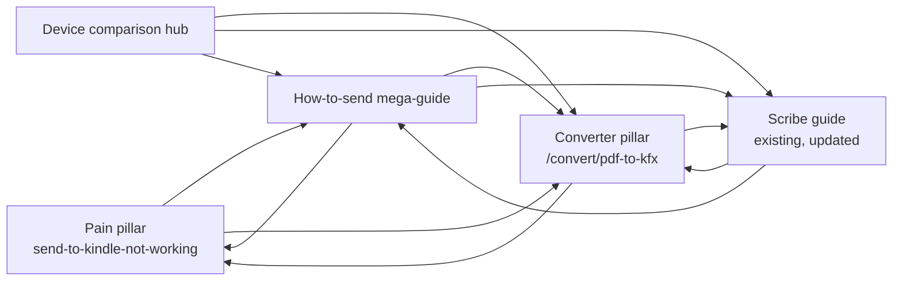

# EB-241 Phase 2 — leafbind SEO content build (5 pages + LowFruits triage)

## Overview

Translate the Phase 1 keyword discovery synthesis into shipped content. Build 4 new SEO pages, update 1 existing page, and run LowFruits triage on the long-tail keyword bucket — collectively targeting ~11,500 monthly addressable searches at very-easy keyword difficulty (KD 17-47 across measured queries).

This plan is execution-shaped, not strategy-shaped. The strategy is settled in the [Phase 1 discovery doc](../seo/eb-241-phase1-discovery.md). The plan's job is to encode page-by-page acceptance criteria, schema markup requirements, internal linking architecture, and the LowFruits workflow.

## Problem Frame

leafbind.io currently has 1 SEO guide (`/guides/pdf-to-kfx-for-kindle-scribe`) and 4 converter pages (`/convert/*`). The Phase 1 audit identified ~11.5k monthly searches that no leafbind page currently captures, spread across three intent clusters:

- **Pain pillar** (~470/mo, KD 17-18): users with broken send-to-kindle workflows actively looking for an alternative
- **How-to-send question hub** (~6,000/mo, KD-thin): the largest single content opportunity — `how to send pdf to kindle` alone is 1,600/mo
- **Device comparison hub** (~3,810/mo, KD 19-31): top-of-funnel buyer research that has zero authoritative content competitor

The converter pillar `convert pdf to kindle format` (720/mo, KD 34) is also addressable, but its SERP is ~45% contaminated with reverse-direction intent (Kindle→PDF) — leafbind must declare direction explicitly in title/H1/lede.

(see origin: [docs/seo/eb-241-phase1-discovery.md](../seo/eb-241-phase1-discovery.md))

## Requirements Trace

- **R1** — Ship 4 new SEO content pages covering the 3 intent clusters above + the converter pillar
- **R2** — Update the existing Scribe guide to capture the transfer-flow keyword variants
- **R3** — Every new page emits valid Article + FAQPage schema (and HowTo where applicable), reusing the shared `SOFTWARE_APP_ID` entity merge from EB-272
- **R4** — Every new page has a 40-60-word lead paragraph following the EB-281 GEO citation pattern (direct answer + named alternatives in first sentence)
- **R5** — Every new page is added to `app/sitemap.ts` and `public/llms.txt`
- **R6** — Every new page has at least 2 internal links to other leafbind pages and at least 1 external link to a primary source (Calibre manual, Amazon help docs) for E-E-A-T
- **R7** — Converter pillar page (#4) declares PDF→Kindle direction explicitly in title, H1, and lede paragraph to fight the bidirectional intent contamination identified in Phase 1
- **R8** — LowFruits triage classifies the 18 zero-volume long-tails + 20-volume bucket from the Phase 1 candidate list by SERP weakness, producing a refined target list for Phase 3

## Scope Boundaries

- **In scope:** writing the 5 pages, extending the schema builder library, sitemap/llms.txt updates, basic discoverability (footer Guides column), LowFruits triage
- **Out of scope:** new converter tool pages (e.g., epub-to-kfx converter page), changes to the actual PDF→KFX conversion pipeline, paid ad campaigns, link-building outreach, blog/post infrastructure
- **Not redesigning the design system** — all pages must conform to existing tokens (Newsreader / DM Sans / IBM Plex Mono, brand-green palette). No new component library additions unless a content pattern genuinely requires one.

### Deferred to Separate Tasks

- **Phase 3 content writing for LowFruits-winners**: separate ticket once LowFruits triage completes (likely 3-5 additional micro-pages)
- **Backlink outreach / link-building**: separate ticket (Phase 4 or later)
- **6-week Semrush re-baseline**: scheduled task ~2026-06-27, separate ticket
- **GSC indexation monitoring**: ongoing, tracked by existing EB-280 follow-ups

## Context & Research

### Relevant Code and Patterns

- **`web_service/frontend/app/(marketing)/guides/pdf-to-kfx-for-kindle-scribe/page.tsx`** — the reference guide template. 742 lines, self-contained: image manifest comment header, `PUBLISHED`/`SLUG`/`CANONICAL` consts, three schema objects (Article + FAQPage + HowTo), FAQ items as single-source-of-truth array, in-page "Related" pill row. Copy this structure for new guides.
- **`web_service/frontend/lib/structured-data.ts`** — schema builder library. Exports `buildSoftwareApplicationSchema`, `buildWebSiteSchema`, `buildHomepageGraph`, `buildPricingProductSchema`, `buildContactPageSchema`, plus interfaces for `FAQPageSchema`, `HowToSchema`, `ArticleSchema`. **Builders for Article/FAQPage/HowTo do NOT yet exist as functions** — Unit 1 adds them.
- **`web_service/frontend/components/JsonLd.tsx`** — schema render component. Usage: `<JsonLd schema={...} />`. Stack multiple in a fragment for multi-schema pages.
- **`web_service/frontend/app/sitemap.ts`** — hand-maintained Next.js sitemap. Append entries with explicit `lastModified: new Date("2026-05-XX")`.
- **`web_service/frontend/public/llms.txt`** — 4782-byte AI-crawler manifest (verified live earlier today, EB-280 diagnostic). New pages should be added here too.
- **`web_service/frontend/components/Footer.tsx`** — 3-column footer; no guides column currently. Unit 8 adds one.
- **`web_service/frontend/components/Header.tsx`** — 4-link nav; no guides nav currently. Out of scope for Phase 2 (revisit if guide count exceeds 5).

### Institutional Learnings

- **[docs/solutions/best-practices/jsonld-script-tag-count-build-instability-2026-05-14.md](../solutions/best-practices/jsonld-script-tag-count-build-instability-2026-05-14.md)** — Next.js 16 + Turbopack collapses multiple JSON-LD blocks into a single `<script>` tag at build time. Schema verification scripts must count `@type` occurrences with `grep -oE '"@type":"[^"]*"' | sort -u`, NOT count `<script>` tags. Affects Unit 7 verification approach.
- **[docs/solutions/best-practices/schema-validator-playwright-headless-quirk-2026-05-14.md](../solutions/best-practices/schema-validator-playwright-headless-quirk-2026-05-14.md)** — validator.schema.org renders blank on repeat Playwright loads. For batch validation across 5 pages, take one Playwright screenshot and use HTTP+JSON-parse for the rest.
- **EB-272 fix (commit db3980e)** — `Product` schema requires `image` field. Reuse `buildPricingProductSchema(packs)` rather than hand-rolling.
- **EB-272 (commit 3eeb33e)** — Shared `SOFTWARE_APP_ID = "https://leafbind.io/#software"` is the canonical `@id` for SoftwareApplication entity merging. All new pages emitting SoftwareApplication schema MUST reuse `buildSoftwareApplicationSchema()` so Google merges them as one entity.
- **EB-281 fix (commit 630d6f7)** — Lead paragraph must be 40-60 words with direct-answer + named alternatives in the first sentence to be AI Overview citation-ready. Extended the Scribe guide lede from 32→55 words. Apply this to ALL 5 Phase 2 pages.
- **[docs/solutions/eb258-seo-phase1-patterns.md](../solutions/eb258-seo-phase1-patterns.md)** — AI Overview verified on "convert pdf to kfx for kindle scribe". Standalone 134-167-word passage blocks recommended. Cite competitor docs directly (Calibre manual quote on multi-column unsupported is the gold standard).
- **[docs/seo/indexation-diagnostic-2026-05.md](../seo/indexation-diagnostic-2026-05.md)** — Site is technically clean. No fixes blocking Phase 2. Cloudflare proxy is OFF for apex (DNS-only); WAF/cache rules from EB-225 don't apply to marketing site, only `api.leafbind.io`. Vercel edge keys by path — use `vercel inspect` for deploy verification, not query-string cache busts.
- **[docs/solutions/eb233-design-system-decisions.md](../solutions/eb233-design-system-decisions.md)** — Forest-green palette (`--lb-green #2f5d3a`, `--lb-cream #f4efe2`). AI-slop checklist (zero gradient-mesh, zero glassmorphism, zero slate/indigo/zinc, zero urgency copy, single primary CTA). Token drift guard (`tools/check-token-drift.mjs`) runs in `prebuild`.
- **Performance reality** ([docs/solutions/eb249-ttfb-diagnosis-2026-05-15.md](../solutions/eb249-ttfb-diagnosis-2026-05-15.md)) — Lighthouse Perf 71-79 / LCP 2.4s on Next.js 16 Turbopack is documented baseline. Stop-the-line thresholds: Perf<60, LCP>5s, CLS>0.25. Don't chase scores.

### External References

External research was skipped for this plan — the SEO strategy is fully captured in the Phase 1 discovery doc, the schema markup patterns are extensively documented in internal solutions, and Next.js 16 App Router patterns are established in the codebase. The [seo skill](~/.claude/skills/seo/SKILL.md) at `~/.claude/skills/seo/SKILL.md` is the durable external-best-practices reference for content writing.

For LowFruits specifically:
- LowFruits is a web tool at lowfruits.io. No MCP available. Workflow is manual: paste keywords, get SERP weakness scores, export CSV.
- Authentication: requires existing LowFruits account (subscription or trial)

## Key Technical Decisions

| Decision | Rationale |
|---|---|
| **All 4 new pages live under `app/(marketing)/guides/<slug>/`** | Matches existing convention (Scribe guide). Single route group keeps marketing layout (Header/Footer/skip-link) consistent. Even the "troubleshooting" page goes in /guides/ — the convention is about route grouping, not semantic page type. |
| **Page #4 converter pillar enhances existing `/convert/pdf-to-kfx`** (does NOT create new `/guides/convert-pdf-to-kindle-format`) | Avoids URL fragmentation (`convert pdf to kindle format` and `convert pdf to kfx` target the same intent). Keeps tool + content on one page. Reuses existing schema (`buildSoftwareApplicationSchema`, `buildPricingProductSchema`). Adds ~2000 words of pillar content below the converter widget. Direction-explicit copy lives in the existing H1/title — just needs amending. |
| **Schema builders extended in `lib/structured-data.ts` BEFORE writing any page** (Unit 1 is foundation) | All 4 new pages share the same FAQ + HowTo + Article schema patterns. Hand-rolling per page creates 4× drift risk. One builder, four call sites. |
| **5 separate PRs (one per page) + 2 infrastructure PRs (schema builders, footer/sitemap update)** | Each page has a distinct keyword target, distinct content, and a distinct deploy-verification step. Stacking them in one PR makes review harder and rollback impossible. Schema builder PR lands first; pages follow in priority order. |
| **One worktree per PR** | Per [worktree-management skill](~/.claude/skills/worktree-management/SKILL.md). Each branch named `feat/EB-241-phase2-<slug>` — clean isolation, no cross-page contamination. |
| **LowFruits stream is fully parallel (separate worktree, separate PR)** | Independent of content stream. Can run any time. Output is a data artifact (CSV in `scratch/` + synthesis note in `docs/seo/`), not a code change. |
| **Lead paragraph rule applies universally** | Per EB-281: 40-60 words, direct-answer + named alternatives. AI Overview citation pattern. Applies to all 5 pages. |
| **Verification: schema validity + visual smoke + sitemap inclusion** | Not chasing Lighthouse scores. Schema validity is the load-bearing check (rich result eligibility). Visual smoke is design-token conformance (AI-slop checklist). Sitemap inclusion is GSC submission readiness. |

## Open Questions

### Resolved During Planning

- **Where do new pages live?** → `app/(marketing)/guides/<slug>/page.tsx` (matches existing convention)
- **Should Page #4 be new `/guides/` page or enhance existing `/convert/pdf-to-kfx`?** → Enhance existing (see Key Technical Decisions table for rationale). Can be flipped during execution if a stronger argument emerges.
- **One PR or many?** → 7 PRs total (1 foundation + 5 content + 1 infrastructure). Justified by independent review surfaces and atomic rollback.
- **Should pages share a guide-template component?** → No, not yet. Two guides isn't enough signal to extract a template. Revisit after page #3 ships — by then we'll have repetition signal to refactor against.
- **Where do LowFruits results land?** → `scratch/lowfruits-results-2026-05-XX.csv` (raw export, gitignored) + `docs/seo/eb-241-phase2-lowfruits-triage.md` (committed synthesis with refined target list)

### Deferred to Implementation

- **Exact word counts per page** — recommended ranges in unit specs (1500-2500 for pain, 3000-4000 for mega-guide, 3000-4500 for comparison hub, 2000-3000 for converter pillar content addition). Implementer can adjust during writing if a section runs naturally longer/shorter without padding.
- **FAQ count per page** — recommended ≥5 per page (FAQPage schema useful threshold), but the actual list emerges from the source material. Implementer can flex.
- **Comparison hub: device pricing inclusion?** — Pricing dates content quickly. Recommended: omit specific dollar amounts, link to Amazon for current pricing. Decide during writing.
- **Internal-link anchor text variants** — exact anchor text per cross-link is best decided contextually during writing rather than pre-specified.
- **Existing Scribe guide update scope** — full reread will surface what new sections are needed vs. what the EB-281 lede extension already covers. Treat as discovery during Unit 6.

## High-Level Technical Design

### Internal linking architecture

The 5 pages form a **pentagon of cross-links** — each page links to the other 4 where contextually relevant, with the converter page as the gravity well (commercial intent):

> *This illustrates the intended cross-link map and is directional guidance for review, not implementation specification. The exact anchor text and per-page hyperlink count emerges during writing.*

Every page should have at minimum:
- 1 link → the most-related sibling page (contextual within content)
- 1 link → the converter pillar (commercial intent funnel)
- 1 link → an external primary source (Amazon docs, Calibre manual)

### Schema markup architecture

Each page emits a stack of JSON-LD schemas via the existing `<JsonLd>` component:

| Page | Article | FAQPage | HowTo | SoftwareApplication (reused) | Product (reused) |
|---|---|---|---|---|---|
| #2 Pain pillar | ✓ | ✓ | — | — | — |
| #3 Mega-guide | ✓ | ✓ | ✓ | — | — |
| #4 Comparison hub | ✓ | ✓ | — | — | — |
| #5 Converter pillar (existing) | ✓ (NEW) | ✓ (extend) | ✓ (NEW) | ✓ (existing) | ✓ (existing) |
| #6 Scribe guide (existing) | ✓ (existing) | ✓ (existing) | ✓ (existing) | — | — |

All SoftwareApplication entities reuse `SOFTWARE_APP_ID = "https://leafbind.io/#software"` for Google entity merging. No new SoftwareApplication entity IDs introduced.

## Implementation Units

- [ ] **Unit 1: Extend `lib/structured-data.ts` with Article, FAQPage, HowTo builders** (foundation)

**Goal:** Add typed builder functions for the three schema types every Phase 2 page needs, so each page imports a builder instead of hand-rolling a schema object.

**Requirements:** R3

**Dependencies:** None

**Files:**
- Modify: `web_service/frontend/lib/structured-data.ts`
- Test: `web_service/frontend/lib/__tests__/structured-data.test.ts` (create if testing infra exists; if not, defer to per-page schema validity verification)

**Approach:**
- Add `buildArticleSchema(args)` → returns `ArticleSchema` with required fields (`@type`, `headline`, `datePublished`, `dateModified`, `author`, `publisher`, `image`, `mainEntityOfPage`)
- Add `buildFAQPageSchema(items: Array<{q: string, a: string}>)` → returns `FAQPageSchema`
- Add `buildHowToSchema(args)` → returns `HowToSchema` with `step: HowToStep[]`
- All builders use `SOFTWARE_APP_ID` for any `publisher` or `provider` references where SoftwareApplication entity merge applies
- Match the existing builder style (interface-typed input, returns the schema object — no rendering, no side effects)

**Patterns to follow:**
- Existing `buildSoftwareApplicationSchema`, `buildPricingProductSchema`, `buildContactPageSchema` in same file

**Test scenarios:**
- Happy path: `buildArticleSchema({headline: "X", ...})` returns object with `@type: "Article"`, `headline: "X"`, all required schema.org fields populated
- Happy path: `buildFAQPageSchema([{q: "Q1", a: "A1"}])` returns FAQPage with `mainEntity` array containing one Question with `acceptedAnswer.text === "A1"`
- Happy path: `buildHowToSchema({name: "How to X", step: [{name, text}, ...]})` returns HowTo with `step` array containing HowToStep entries
- Edge case: empty FAQ items array → returns FAQPage with empty `mainEntity: []` (or omits — implementer choice, just be consistent)
- Edge case: HowTo with one step → still valid HowTo schema (HowTo schema spec permits minimum 2 steps strictly, but Google's structured-data test accepts 1)

**Verification:**
- TypeScript build passes (`pnpm build` or equivalent in `web_service/frontend/`)
- Token drift guard still passes (`tools/check-token-drift.mjs`)
- If tests added, they pass

---

- [ ] **Unit 2: Write "Send to Kindle not working" troubleshooting page** (P0 pain pillar)

**Goal:** Ship the highest-leverage single page in the Phase 1 target set — `send to kindle not working` (260/mo, KD 17, audit-confirmed 7/10 winnable SERP). Position leafbind as the fallback when Amazon's native flow fails.

**Requirements:** R1, R3, R4, R5, R6

**Dependencies:** Unit 1

**Files:**
- Create: `web_service/frontend/app/(marketing)/guides/send-to-kindle-not-working/page.tsx`
- Modify: `web_service/frontend/app/sitemap.ts` (append entry — can be batched into Unit 7)
- Modify: `web_service/frontend/public/llms.txt` (append URL — can be batched into Unit 7)

**Approach:**
- Slug: `send-to-kindle-not-working` (direct match to highest-vol target keyword)
- Title: "Send to Kindle Not Working: 7 Fixes (and a Backup That Always Works)"
- Target keywords: `send to kindle not working` (260), `send to kindle app not working` (210). Combined ~470 monthly addressable.
- Length: 1500-2500 words
- Lead paragraph (40-60 words per EB-281 GEO pattern): direct answer + named alternatives in first sentence. Example shape: "If Send to Kindle isn't working, the most common causes are email-approval-list misconfiguration, file size limits (50MB for personal docs), and Amazon's intermittent server issues — but if Amazon's native flow keeps failing, leafbind converts PDFs to KFX you can sideload directly."
- Structure:
  - H1 + lead paragraph
  - **What's not working?** (intent classifier — sets up the rest)
  - Fix #1: Email approval list (most common failure)
  - Fix #2: File size limits (cite Amazon's 50MB docs)
  - Fix #3: File format restrictions
  - Fix #4: Email delivery delays
  - Fix #5: Amazon server-side issues (status check)
  - Fix #6: App-specific issues (mobile / desktop)
  - Fix #7: Approved sender troubleshooting
  - **If nothing works: the backup that always works** (leafbind positioning, internal link to `/convert/pdf-to-kfx`)
  - FAQ section (≥5 questions, each ≤80 words)
- Schemas: `buildArticleSchema(...)` + `buildFAQPageSchema(...)`. No HowTo (troubleshooting doesn't fit HowTo schema cleanly).
- Internal links: ≥1 to `/convert/pdf-to-kfx` (commercial intent), ≥1 to the new mega-guide (Unit 3, when ready)
- External links: cite Amazon Send-to-Kindle help docs, Amazon Customer Service status page
- Visuals: optional — a simple "decision flowchart" image would lift dwell time but is not blocking

**Patterns to follow:**
- Page structure: copy `app/(marketing)/guides/pdf-to-kfx-for-kindle-scribe/page.tsx` shell (image manifest header, consts, three-schema stack, FAQ-array-once pattern, "Related" pill row)
- Typography classes: see existing Scribe guide for established H1/H2/H3/body styles
- AI-slop checklist (no gradient-mesh / glassmorphism / slate / indigo / urgency / multi-CTA)

**Test scenarios:**
- Happy path: page builds without TS errors, renders at `http://localhost:3000/guides/send-to-kindle-not-working`
- Happy path: rich-results test (search.google.com/test/rich-results) shows valid Article + FAQPage schema, eligible for FAQ rich snippet
- Happy path: lead paragraph word count is 40-60
- Happy path: ≥5 FAQ items
- Edge case: schema verification script counts `@type` occurrences in built HTML (not `<script>` tags — Turbopack collapses them per the JSON-LD pitfall solution)
- Visual smoke: page passes AI-slop checklist; uses brand-green + cream tokens; Newsreader for H1/H2; DM Sans body; Plex Mono eyebrow
- Integration: internal link to `/convert/pdf-to-kfx` resolves; external links to Amazon docs resolve and use `rel="noopener"`

**Verification:**
- Live page loads without errors, schemas validate, lead paragraph hits word target, FAQ ≥5, internal/external link coverage met

---

- [ ] **Unit 3: Write "How to send PDF to Kindle" mega-guide** (P0 question-cluster anchor)

**Goal:** Build the v1 content hub anchoring the ~6,000/mo question cluster — `how to send pdf to kindle` (1,600) is the crown jewel, but the page must answer the EPUB / book / document / file variants too.

**Requirements:** R1, R3, R4, R5, R6

**Dependencies:** Unit 1

**Files:**
- Create: `web_service/frontend/app/(marketing)/guides/how-to-send-pdf-to-kindle/page.tsx`
- Modify: `web_service/frontend/app/sitemap.ts` (batch with Unit 7)
- Modify: `web_service/frontend/public/llms.txt` (batch with Unit 7)

**Approach:**
- Slug: `how-to-send-pdf-to-kindle` (matches highest-vol query in cluster)
- Title: "How to Send PDFs (and EPUBs, Docs, MOBI) to Kindle: Every Method"
- Target keywords: `how to send pdf to kindle` (1,600), `how to send epub to kindle` (1,000), `how to send a pdf to kindle` (720), `how to send pdfs to kindle` (210), `how to send pdf to kindle scribe` (70), + 7 other cluster variants. Combined ~6,000 monthly addressable.
- Length: 3000-4000 words (mega-guide; needs depth to outrank Reddit + Amazon)
- Lead paragraph (40-60 words): direct-answer covering the four main methods (Send-to-Kindle Email, USB cable, Amazon mobile app, leafbind), plus the named-alternatives pattern.
- Structure (one H2 per method, multiple H3s per file type):
  - H1 + lead paragraph
  - **Which method should you use?** (decision table — file type × method matrix)
  - H2: Method 1 — Send-to-Kindle Email
    - H3: For PDFs
    - H3: For EPUBs
    - H3: For documents (DOC/DOCX/TXT/RTF)
    - H3: For MOBI files (deprecated by Amazon but still works for now)
  - H2: Method 2 — Send-to-Kindle App
  - H2: Method 3 — USB cable transfer
  - H2: Method 4 — Convert and sideload via leafbind (commercial-intent funnel)
  - H2: Common failures and fixes (internal link to pain pillar Unit 2)
  - FAQ (≥7 questions covering "can I send mobi", "what's the file size limit", "why doesn't my pdf look right after sending", etc.)
- Schemas: `buildArticleSchema(...)` + `buildFAQPageSchema(...)` + `buildHowToSchema(...)` (the HowTo schema describes the Send-to-Kindle Email workflow as the canonical "how to" — 5-7 steps)
- Internal links: pain pillar (Unit 2), comparison hub (Unit 4), converter pillar (`/convert/pdf-to-kfx`), Scribe guide
- External links: Amazon Send-to-Kindle help, Amazon-approved file types reference

**Patterns to follow:**
- Existing Scribe guide structure
- EB-281 lead paragraph pattern
- EB-258 standalone 134-167-word passage block for AI Overview citation (target the "PDF" section)

**Test scenarios:**
- Happy path: page builds, renders at `/guides/how-to-send-pdf-to-kindle`
- Happy path: rich-results test passes for all three schemas (Article + FAQPage + HowTo); HowTo eligible for rich result with named steps
- Happy path: lead paragraph 40-60 words
- Happy path: ≥7 FAQ items
- Happy path: HowTo schema has ≥5 steps for the Send-to-Kindle Email method
- Edge case: page handles cluster intent — searching for "how to send epub to kindle" (different intent within same page) finds the EPUB H3 anchor with #-link
- Integration: all internal links resolve, including links to Unit 2 (pain pillar) which may not yet exist if order is followed strictly — handle gracefully (either ship Unit 2 first, or stub the link as a relative href that will resolve once Unit 2 lands)

**Verification:**
- Live page loads, all three schemas validate via rich-results test, internal-link integrity check passes against final sitemap

---

- [ ] **Unit 4: Write "Kindle Scribe vs reMarkable vs iPad vs Paperwhite for PDFs" comparison hub** (P0 top-of-funnel)

**Goal:** Capture the largest single-keyword opportunity in the entire Phase 1 set — `kindle scribe vs remarkable` at 2,900/mo, KD 31. Anchor a device-comparison hub that funnels academic-reader buyer-intent traffic to leafbind.

**Requirements:** R1, R3, R4, R5, R6

**Dependencies:** Unit 1

**Files:**
- Create: `web_service/frontend/app/(marketing)/guides/kindle-scribe-vs-remarkable/page.tsx`
- Modify: `web_service/frontend/app/sitemap.ts` (batch with Unit 7)
- Modify: `web_service/frontend/public/llms.txt` (batch with Unit 7)

**Approach:**
- Slug: `kindle-scribe-vs-remarkable` (matches 2,900-vol root; URL is also short and shareable)
- Title: "Kindle Scribe vs reMarkable vs iPad vs Paperwhite: Which Is Best for Reading PDFs?"
- Target keywords: `kindle scribe vs remarkable` (2,900), `kindle scribe vs ipad` (590), `kindle scribe vs paperwhite` (320). Combined ~3,810 monthly addressable.
- Length: 3000-4500 words (centerpiece of the page is a detailed comparison table)
- Lead paragraph (40-60 words): direct-answer (best for academic PDFs vs. best for marginalia vs. best for general reading), named devices, with leafbind positioning as device-agnostic.
- **Framing rule** (per Phase 1 discovery doc): leafbind isn't selling a device. Comparison content must be product-agnostic on device choice and product-evangelizing on PDF handling. Avoids competing with Amazon's affiliate ecosystem; sidesteps trust-signal problem of "obviously biased" comparison content.
- Structure:
  - H1 + lead paragraph
  - **TL;DR** — 3-bullet verdict ("If you want X, get Y")
  - **Comparison table** — 5-7 columns (Display, Note-taking, PDF readability, Price tier, Battery, Ecosystem lock-in, File format support). Devices: Kindle Scribe, Kindle Paperwhite, Kindle Scribe Colorsoft, reMarkable Paper Pro, iPad (10th gen + Pro).
  - H2: For reading academic PDFs (the leafbind sweet spot)
  - H2: For marginalia / note-taking
  - H2: For general fiction / book reading
  - H2: For multi-column PDFs (where Scribe + Calibre fails — leafbind angle)
  - H2: **The PDF problem affects all of these devices** (positioning leafbind as the answer regardless of device choice)
  - FAQ (≥5: "Can the Scribe handle multi-column PDFs?", "Is the iPad worth it just for PDFs?", "Does the reMarkable work with Kindle's ecosystem?", etc.)
- Schemas: `buildArticleSchema(...)` + `buildFAQPageSchema(...)`. No Product schema (devices aren't leafbind's products; using Product schema for them would be misleading).
- Internal links: converter pillar, mega-guide (Unit 3), Scribe guide
- External links: cite Amazon Scribe product page, reMarkable product page, Apple iPad page (primary sources)

**Patterns to follow:**
- Existing Scribe guide layout for hero + lede + main column structure
- Standard tailwind table classes if a `<table>` component exists; otherwise raw HTML table with brand-token classes (border-border, text-text-base, etc.)
- AI-slop checklist
- **EB-279 homepage positioning** — comparison page should align with Scribe-first marketing direction where Scribe is mentioned

**Test scenarios:**
- Happy path: page builds, renders at `/guides/kindle-scribe-vs-remarkable`
- Happy path: rich-results test passes for Article + FAQPage
- Happy path: comparison table renders on mobile (no overflow); test at viewport ≤375px
- Happy path: lead paragraph 40-60 words
- Happy path: ≥5 FAQ items
- Edge case: external links to Amazon / Apple / reMarkable use `rel="noopener nofollow"` (avoid leaking PageRank to retail competitors)
- Edge case: page does NOT contain device pricing in dollars (per the deferred-decision rationale: pricing dates fast; link to product pages for current prices instead)
- Integration: cross-link to `/convert/pdf-to-kfx` is contextual (not just a footer Related pill); appears in the "PDF problem" section

**Verification:**
- Live page loads, schemas validate, comparison table mobile-responsive, AI-slop checklist passes, no $-pricing in copy

---

- [ ] **Unit 5: Enhance existing `/convert/pdf-to-kfx` with direction-explicit pillar content** (P1)

**Goal:** Capture `convert pdf to kindle format` (720) + `how to convert pdf to kindle format` (260) — combined ~1,000/mo — by enhancing the existing converter tool page with pillar-level content. The page becomes "the canonical place" for both the tool and the comprehensive how-to.

**Requirements:** R1, R3, R4, R5, R6, R7

**Dependencies:** Unit 1

**Files:**
- Modify: `web_service/frontend/app/convert/pdf-to-kfx/page.tsx` (existing converter page)
- Modify: `web_service/frontend/app/sitemap.ts` (bump `lastModified`; batch with Unit 7)
- Modify: `web_service/frontend/public/llms.txt` (no URL change; bump description if applicable; batch with Unit 7)

**Approach:**
- Update H1 and `<title>` to be direction-explicit: "Convert PDF to Kindle (KFX) — Online & Free Tier" (existing) becomes something like "Convert PDF to Kindle Format (KFX): Online Converter for Academic & Multi-Column PDFs" — the words "PDF to Kindle" + "Kindle Format" target the queries directly.
- Update lead paragraph (40-60 words): direct-answer with explicit direction declaration. Example shape: "leafbind converts PDFs to Kindle format (KFX) online — built for academic papers, footnotes, and multi-column layouts that Send-to-Kindle and Calibre struggle with. This guide explains the conversion process, formats supported, and what to do if you wanted to go the other direction (Kindle → PDF)."
- Direction-explicit redirect: "Wanted to go the other direction (Kindle → PDF)? Try [Calibre with DeDRM](external link) — leafbind doesn't do that."  This is the eat-the-bounce paragraph that pre-empts the ~45% bidirectional intent contamination identified in Phase 1.
- Add ~2000 words of pillar content BELOW the existing converter widget. Suggested H2s:
  - How PDF→KFX conversion works
  - File formats leafbind accepts (PDF, EPUB, DOCX, etc.)
  - What about multi-column PDFs? (cite Calibre manual — gold-standard differentiation per EB-258)
  - What about academic papers with footnotes? (showcase leafbind's footnote preservation)
  - Why not just use Calibre? (honest comparison — leafbind is the easier path, Calibre is the power-user path)
  - Why not just Send-to-Kindle? (file size limits, formatting losses)
  - Internal link to pain pillar (when broken): "If Send-to-Kindle isn't working, see [our troubleshooting guide]"
  - Internal link to mega-guide: "For ALL methods of getting files onto Kindle, see [How to send PDFs to Kindle]"
  - FAQ extension (existing FAQs preserved + 3-5 new ones targeting direction-explicit queries)
- Schemas: Existing `SoftwareApplication` + `Product` preserved. Add `Article` via `buildArticleSchema(...)` for the content body. Extend the existing FAQPage with new items.

**Patterns to follow:**
- Existing `/convert/pdf-to-kfx/page.tsx` structure (preserve converter widget, preserve existing schemas)
- EB-279 homepage positioning (Scribe-first, academic-paper tested, multi-column ready, pay once)
- EB-258 standalone 134-167-word passage block pattern for AI Overview citation
- Calibre manual quote pattern for E-E-A-T differentiation

**Test scenarios:**
- Happy path: page builds, renders at `/convert/pdf-to-kfx`; converter widget still works (smoke check)
- Happy path: schemas validate — SoftwareApplication still has shared `@id`, Product still has `image` field (per EB-272), new Article schema valid
- Happy path: lead paragraph 40-60 words
- Happy path: direction-explicit text appears in H1, title, AND lede (three places — Google's intent classifier wants the signal repeated)
- Happy path: total page word count after enhancement is ≥2500 (well above Reddit's top-ranked competitor thread)
- Edge case: reverse-direction visitor (someone wanting Kindle→PDF) sees the "you want the other direction" paragraph within first 300 words
- Edge case: converter widget functionality unchanged — no regression on PDF upload, no regression on Stripe checkout flow if user converts a paid PDF
- Integration: existing internal links from converter page (homepage, pricing, etc.) still resolve; new internal links to Unit 2 (pain) and Unit 3 (mega-guide) are stubbed/conditional if those units haven't shipped yet

**Verification:**
- Live page loads, converter widget operational, all schemas validate, direction-explicit copy in H1/title/lede, no broken internal links

---

- [ ] **Unit 6: Update existing `/guides/pdf-to-kfx-for-kindle-scribe` with transfer-flow expansion** (P2)

**Goal:** Capture the smaller-volume Scribe transfer keywords — `send pdf to kindle scribe` (110, KD 47) + `how to send pdf to kindle scribe` (70, KD 25) — by adding a transfer-flow section to the existing pillar guide. Reinforce the internal link map with the new pages.

**Requirements:** R2, R3, R4, R5 (sitemap lastModified bump), R6

**Dependencies:** Units 2, 3 (so internal links resolve)

**Files:**
- Modify: `web_service/frontend/app/(marketing)/guides/pdf-to-kfx-for-kindle-scribe/page.tsx`
- Modify: `web_service/frontend/app/sitemap.ts` (bump `lastModified`; batch with Unit 7)

**Approach:**
- Preserve the existing structure and the EB-281 extended lede (don't undo that work).
- Add a new H2 section: "How to actually send your converted KFX to the Kindle Scribe" — covers the transfer step that follows leafbind conversion. Steps: download KFX → Send-to-Kindle email OR USB transfer → file appears on device → open in Kindle library.
- Add 2-3 new FAQ items targeting the transfer-specific queries.
- Update "Related" pill row to include links to Unit 2 (pain), Unit 3 (mega-guide), Unit 4 (comparison hub).
- Bump `PUBLISHED` and `dateModified` to today's date.
- No new schemas needed — existing Article + FAQPage + HowTo extend via array additions.

**Patterns to follow:**
- Existing page structure (don't restructure)
- FAQ items array pattern — append new entries, do not refactor

**Test scenarios:**
- Happy path: page still builds with no TS errors, schemas still validate
- Happy path: new H2 section renders below existing content; new FAQ items appear in BOTH the JSX rendered list AND the schema's `mainEntity`
- Happy path: `dateModified` schema property updated to today; `lastModified` in sitemap.ts updated to today
- Happy path: existing EB-281 extended lead paragraph (55 words) preserved unchanged
- Edge case: internal links to Units 2/3/4 resolve at build time
- Integration: rich-results test still passes after the addition; no schema validation regressions

**Verification:**
- Live page loads, new section visible, new FAQ items in both JSX and schema, sitemap entry updated, EB-281 lede preserved

---

- [ ] **Unit 7: Sitemap + llms.txt updates for all new pages** (infrastructure)

**Goal:** Ensure all 4 new pages and the updated Scribe guide are discoverable to search engines and AI crawlers. Single consolidated PR that gathers up the sitemap/llms.txt changes at the end (rather than touching these files in every page PR).

**Requirements:** R5

**Dependencies:** Units 2, 3, 4, 5, 6 (all pages should exist before sitemap/llms.txt is updated to reference them)

**Files:**
- Modify: `web_service/frontend/app/sitemap.ts`
- Modify: `web_service/frontend/public/llms.txt`

**Approach:**
- Add 4 new sitemap entries (Units 2, 3, 4, plus Unit 5's `lastModified` bump) and 1 updated entry (Unit 6).
- Each new guide gets `priority: 0.9, changeFrequency: "monthly"` (matches existing Scribe guide priority).
- Append 4 new URL entries to llms.txt with one-line descriptions per the existing llms.txt format.
- Verify sitemap renders at `https://leafbind.io/sitemap.xml` post-deploy.

**Patterns to follow:**
- Existing `app/sitemap.ts` entry format
- Existing `public/llms.txt` entry format (one-line URL + description per line, alphabetically grouped or topically grouped per current convention — preserve)

**Test scenarios:**
- Happy path: `pnpm build` succeeds; sitemap.xml at build output includes all new URLs
- Happy path: llms.txt is valid (text/plain, no trailing whitespace, no broken URLs)
- Edge case: GSC `Inspect URL` for one new page returns "Discovered via sitemap" (post-deploy verification)
- Integration: existing 9 sitemap entries preserved unchanged; no `lastModified` regressions on unrelated pages

**Verification:**
- Live `/sitemap.xml` lists all 4 new URLs; live `/llms.txt` lists them too; GSC submission via Search Console after deploy

---

- [ ] **Unit 8: Add "Guides" column to Footer** (discoverability)

**Goal:** Once we have 5+ guides, the existing 3-column footer (no Guides column) becomes a discoverability gap. Add a Guides column linking to all current guides.

**Requirements:** R6 (internal-linking strengthening)

**Dependencies:** Units 2, 3, 4, 5, 6 (so all 5 guides exist to link from)

**Files:**
- Modify: `web_service/frontend/components/Footer.tsx`

**Approach:**
- Add a 4th column titled "Guides" (or rename existing structure to fit 4 columns at md+ breakpoints; collapse to 2×2 grid on mobile if needed).
- List all 5 guides: Send-to-Kindle Not Working, How to Send PDFs, Kindle Scribe vs reMarkable, Convert PDF to KFX, PDF-to-KFX for Kindle Scribe.
- Use existing Footer link styling (no new tokens).

**Patterns to follow:**
- Existing Footer column structure
- Tailwind responsive grid classes already in use (`grid-cols-1 md:grid-cols-3` becomes `md:grid-cols-4`, etc.)

**Test scenarios:**
- Happy path: Footer renders 4 columns at md+ breakpoints, 2×2 or 1-stack on mobile
- Happy path: all 5 guide links resolve
- Edge case: footer doesn't overflow viewport at 320px (smallest target)
- Edge case: column titles use existing Footer column-title class (no slop)
- Visual: AI-slop checklist passes (no urgency copy, single CTA elsewhere on page unaffected)

**Verification:**
- Live Footer shows 4 columns, links resolve, mobile layout renders correctly

---

- [ ] **Unit 9: LowFruits triage on 18 long-tails + 20-volume bucket** (parallel research stream)

**Goal:** Classify the Phase 1 long-tail keywords (the ones Semrush couldn't measure or returned 20-volume floor for) by SERP weakness using LowFruits, producing a refined target list for Phase 3 content writing.

**Requirements:** R8

**Dependencies:** None (parallel to all content units; can run any time)

**Files:**
- Create: `scratch/lowfruits-results-2026-05-XX.csv` (raw export, gitignored)
- Create: `docs/seo/eb-241-phase2-lowfruits-triage.md` (committed synthesis with refined target list)

**Approach (manual workflow — no MCP):**
1. Open https://lowfruits.io and authenticate
2. Paste the keyword list from Phase 1: 18 zero-volume long-tails + 20-volume bucket keywords (full list in `docs/seo/eb-241-phase1-discovery.md` Section 1.2 + the 20-vol entries in `scratch/semrush-volume-kdi-us-2026-05-16.csv`)
3. Run "Bulk SERP Analysis" mode — generates weakness scores per keyword (LowFruits' proprietary metric based on top-10 SERP characteristics: forum prevalence, low-DA sites, recency of top results, etc.)
4. Export CSV → save as `scratch/lowfruits-results-2026-05-XX.csv`
5. Synthesize into `docs/seo/eb-241-phase2-lowfruits-triage.md`:
   - Top 5-10 winnable long-tails (low weakness score = high winnability)
   - Recommended action per winnable keyword (new micro-page, FAQ entry on existing page, blog post, etc.)
   - Keywords to discard (no winnability signal — Google's already settled the SERP)
6. Update `docs/seo/eb-241-phase1-discovery.md` Section 6 (Action items going into Phase 2) to mark this complete and reference the triage doc

**Patterns to follow:**
- Discovery doc structure (Phase 1 doc as template)
- Keep `scratch/` artifacts raw; commit only the synthesized findings

**Test scenarios:**
- N/A (research task, not a code change). Verification is qualitative: does the triage doc surface 3-5 actionable long-tails for Phase 3?

**Verification:**
- `docs/seo/eb-241-phase2-lowfruits-triage.md` committed with at least 3 actionable recommendations + a "discard" list with rationale
- Commit message references EB-241 ticket

## System-Wide Impact

- **Interaction graph:** New pages plug into existing Header (unchanged) and Footer (extended in Unit 8). No impact on Header/nav or the `/convert/*` converter widget.
- **Error propagation:** All new pages are static (no server-side rendering, no API calls). No runtime error surface.
- **State lifecycle risks:** None — content pages don't manage state. The one risk is **Vercel deploy verification**: per the indexation diagnostic, leafbind.io apex is DNS-only to Vercel, so Cloudflare cache-bust doesn't apply. Use `vercel inspect` post-deploy, not query-string cache busts.
- **API surface parity:** Sitemap and llms.txt are external-consumer surfaces (GSC, AI crawlers). New entries must be valid (no broken URLs, valid lastModified dates).
- **Integration coverage:** Schema validation requires live URL — can't fully validate until deployed to a non-localhost domain (rich-results test rejects `localhost:*`). Plan to validate on Vercel preview deployments before merging each PR.
- **Unchanged invariants:**
  - Existing `/convert/*` converter widget functionality (PDF upload, Stripe checkout, KFX download) — Unit 5 must preserve this.
  - EB-272 Product schema `image` field — must be preserved on `/pricing` and `/convert/pdf-to-kfx`.
  - EB-281 extended Scribe guide lead paragraph (55 words) — Unit 6 must preserve this.
  - `SOFTWARE_APP_ID` shared `@id` — all pages emitting SoftwareApplication must use the existing constant.
  - Token drift guard (`tools/check-token-drift.mjs`) — runs in `prebuild`; no hand-rolled hex colors.

## Risks & Dependencies

| Risk | Mitigation |
|------|------------|
| **Schema verification scripts give false positives** because Next.js 16 + Turbopack collapses multiple JSON-LD `<script>` tags into one | Per [jsonld-script-tag-count-build-instability-2026-05-14.md](../solutions/best-practices/jsonld-script-tag-count-build-instability-2026-05-14.md), count `@type` occurrences via `grep -oE '"@type":"[^"]*"' \| sort -u`, NOT `<script>` tag count |
| **Page #4 comparison hub competes with Amazon's affiliate ecosystem** and could be penalized by algorithmic affiliate-content suspicion | Frame as device-agnostic, evangelize PDF handling not device choice, link to product pages with `rel="nofollow"`, no $ pricing in copy |
| **Page #5 enhancement risks regression on the live converter tool** (PDF upload, Stripe checkout) | Treat as Standard PR with full smoke test (upload + checkout + download) before merge; ensure schema additions don't displace existing Product/SoftwareApplication entities |
| **Internal-link dependency ordering** — Unit 3 references Unit 2's URL, which doesn't exist if Unit 3 ships first | Either ship in priority order (Unit 2 first), OR stub the link with the final URL knowing it 404s briefly until Unit 2 ships. Recommend: ship in priority order. |
| **LowFruits triage requires manual browser work** — no MCP, can't be automated | Acceptable. Phase 1 was the heavy-lift research; Phase 2's LowFruits run is a 30-60 min triage session. |
| **AI Overview citation isn't guaranteed** even with EB-281 lede pattern | This is acceptable. The pattern improves citation odds, doesn't guarantee them. Worth doing; not worth obsessing over. |
| **Bidirectional intent contamination on Page #5** could still hurt rankings if Google's intent classifier mismatches | Direction-explicit copy in H1 + title + lede + eat-the-bounce paragraph is the strongest available mitigation. Monitor GSC for high-bounce queries post-deploy. |
| **5 PRs is review-load** | Acceptable — each PR is focused and atomic. Better than one mega-PR that nobody can review carefully. |

## Documentation / Operational Notes

- **No new docs/solutions/ entries needed during Phase 2 unless something genuinely new is learned.** The existing solutions catalog already covers schema markup, GEO patterns, Vercel deploy verification, and design system constraints.
- **Post-deploy verification per page:**
  1. `vercel inspect` to confirm the build landed
  2. Live URL loads in browser
  3. Rich-results test passes for emitted schemas
  4. GSC `Inspect URL` shows "Indexable" (may take 24-48h to flip)
- **6-week re-baseline tracking:** Schedule a separate ticket for ~2026-06-27 to re-run `phrase_organic` via Semrush on the 8 target keywords (10 units/keyword = 80 units, trivially cheap) to see ranking progress.
- **Update `docs/seo/eb-241-phase1-discovery.md` Action Items section** as each unit completes (checkbox flips).

## Sources & References

- **Origin document:** [docs/seo/eb-241-phase1-discovery.md](../seo/eb-241-phase1-discovery.md)
- Phase 1 raw data: `scratch/semrush-volume-kdi-us-2026-05-16.csv`, `scratch/semrush-questions-send-to-kindle-2026-05-16.csv`, `scratch/semrush-questions-convert-pdf-to-kindle-2026-05-16.csv`
- Indexation diagnostic: [docs/seo/indexation-diagnostic-2026-05.md](../seo/indexation-diagnostic-2026-05.md) (EB-280)
- Schema markup learnings: [docs/solutions/best-practices/jsonld-script-tag-count-build-instability-2026-05-14.md](../solutions/best-practices/jsonld-script-tag-count-build-instability-2026-05-14.md), [docs/solutions/best-practices/schema-validator-playwright-headless-quirk-2026-05-14.md](../solutions/best-practices/schema-validator-playwright-headless-quirk-2026-05-14.md)
- AI Overview / GEO patterns: [docs/solutions/eb258-seo-phase1-patterns.md](../solutions/eb258-seo-phase1-patterns.md), EB-281 fix (commit 630d6f7)
- Design system: [docs/solutions/eb233-design-system-decisions.md](../solutions/eb233-design-system-decisions.md)
- Performance baseline: [docs/solutions/eb249-ttfb-diagnosis-2026-05-15.md](../solutions/eb249-ttfb-diagnosis-2026-05-15.md), [docs/solutions/best-practices/nextjs-16-turbopack-render-blocking-css-2026-05-14.md](../solutions/best-practices/nextjs-16-turbopack-render-blocking-css-2026-05-14.md)
- Jira: EB-241 (parent), EB-272 (Product schema image), EB-279 (homepage repositioning), EB-280 (indexation diagnostic), EB-281 (GEO lede pattern), EB-258 (AI Overview patterns)
- Reference guide template: `web_service/frontend/app/(marketing)/guides/pdf-to-kfx-for-kindle-scribe/page.tsx`
- Schema builder library: `web_service/frontend/lib/structured-data.ts`
- SEO skill: `~/.claude/skills/seo/SKILL.md`
- Semrush skill: `~/.claude/skills/semrush/SKILL.md` (built this session)
- Worktree skill: `~/.claude/skills/worktree-management/SKILL.md`
