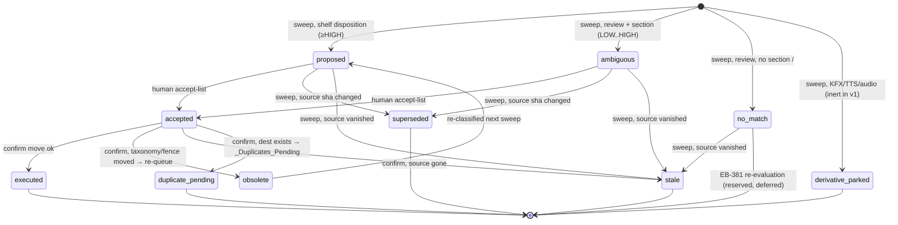

# feat: EB-380 Steady-State Propose-Only Hermes Auto-Filer (v1)

## Overview

A Hermes-scheduled, **propose-only** auto-filer that keeps `F:\Books` organized as new books arrive. A daily
no-agent cron classifies files staged in `F:\Books\_Inbox` and writes a tiered proposal queue — **nothing moves**.
A separate, human-run confirm step (Phase 2, gated on calibration) executes accepted rows via the `book_filer`
`move.py` primitive. This is the steady-state enforcement loop that completes the EB-354 reorganization: the one-time
migration (EB-355/373/375/378) sorted the existing corpus once; this keeps it sorted.

The "propose, don't move" posture is deliberate — it is the canonical spec's prescribed accuracy break-in, and it is
the **Tier T2 ceiling** that ADR-0043 (Hermes Tiered Autonomy) imposes on this filer. Autonomous moving is a T3
prod-mutation requiring a *new ADR*, not part of this plan.

## Problem Frame

`F:\Books` is reorganized into a 12-section taxonomy and finalized, but there is **no enforcement for new arrivals**:
a book dropped in today re-rots the structure. EB-380 builds the incremental intake loop (see origin:
`docs/brainstorms/2026-06-07-eb354-steady-state-autofiling-requirements.md`). v1 proves classification accuracy on
live inbox data without risking a single destructive move, then graduates — under a new ADR — to autonomous filing.

## Requirements Trace

Origin requirements R1–R9 + success criteria (origin §5, §9). Each maps to the units that satisfy it.

**Unit-numbering note (plan vs origin):** this plan refines the origin's decomposition — the origin's single "U2 (`Invoke-BookFileGuarded.ps1`)" splits into **U2 (Python driver `inbox.py`)** + **U3 (PS wrapper)** (the established driver/wrapper pattern), and the origin's "U3 (`Confirm-BookProposals`, gated)" becomes this plan's **U8 (Phase-2 stub)**. Mapping: origin U1→U1; origin U2→U2+U3; origin U4→U4; origin U5→U5; origin U6→U6; origin U7→U7; origin U3(confirm)→U8.

- **R1** (cron → `.sh` → `Invoke-BookFileGuarded.ps1`; on-demand "sweep now") → U2 (driver), U3 (wrapper), U7 (cron)
- **R2** (idempotent `_Inbox` + per-source scaffold; reparse-checked) → U1
- **R3** (deterministic classify via imported `book_filer` primitives; eligibility/in-flight; source reparse) → U2
- **R4** (one tiered row per file in a queue **outside** the library; idempotent sha-keyed upsert) → U2
- **R5** (dedup vs the **live shelf** oracle; derivatives inert→parked) → U2. *(Confirm-time collision → `_Duplicates_Pending` is Phase 2 → U8.)*
- **R6** (fail-safe — any doubt never moves) → U2 (propose); U8 (confirm, Phase 2)
- **R7a** (propose-time: reparse on source; sanitize/long-path; **assert `config.library_root == -LibraryRoot`**; EB-378 containment on the emitted destination) → U2, U3
- **R7b** (confirm-time: reparse + **recompute destination** + containment re-check) → U8 (Phase 2)
- **R8** (no-match detect+flag only; no taxonomy writes) → U2
- **R9** (`Confirm-BookProposals` human-run via `move.py` + own journal; sha re-verify **+ destination recompute**; refuse merge-format) → U8 (Phase 2)
- **v1 Success criteria** (zero cron moves; idempotent; determinism gate; calibrated thresholds; Discord digest; U5 rewiring verified) → U2, U3, U4, U5, U6, U7 *(U8 is Phase 2, not a v1 acceptance gate)*

## Scope Boundaries

- **No autonomous moves.** The cron never moves; only human-run `Confirm-BookProposals` (U8) moves.
- **No Calibre adoption** — no `calibredb add`, no materialize-all-formats. v1 proposes shelf paths only.
- **No Qwen escalation** — deterministic-only (EB-366 deferred).
- **No reconciliation job** — nothing is materialized to reconcile yet.
- **No taxonomy creation** — no-match is detect-and-flag only (EB-381 owns governance).
- **No `_Trash_Pending` purge** — unchanged, manual + separate.

### Deferred to Separate Tasks

- **Autonomous auto-move (cron-invoked confirm):** a **new ADR (T3 prod-mutation)** + `books-authorization.json` fence + measured break-in graduation. Not an implementation ticket — a governance gate. (origin §7 step 5)
- **EB-381 taxonomy evolution** (no-match aggregation → propose→approve → paired cross-repo PRs): separate Story; v1 only reserves the `no-match` holding state + `taxonomy_version` re-check hook.
- **EB-379 bulk import:** separate Story; stages into `_Inbox` and rides this loop.
- **`books-authorization.json` fence** (clone of `qwen-authorization.json`): ClaudeInfra-owned, lands with the auto-move ADR.

## Context & Research

### Relevant Code and Patterns

**book_filer Python primitives to import (the inbox driver imports these — it does NOT call `scan()`, which skips `_Inbox`):**
- `tools/book_filer/classify.py` — `classify_name(name, taxonomy, title=None) -> Classification` (`disposition ∈ {shelf, review, non_library}` — the tier signal).
- `tools/book_filer/scan.py` — `_build_file_facts(path, taxonomy) -> _FileFacts` (composes hash + metadata + classify + planned key; never raises) and `_destination_path(facts, config, disambiguator=None) -> str` (adds the G7 "must resolve under library_root" guard; `""` when non-shelvable). Replicate or import; prefer `_destination_path` over raw `compute_shelf_path` to inherit the guard.
- `tools/book_filer/pathsafe.py` — `compute_shelf_path(...)`, `unique_path(dest)`, `sanitize_component(...)`.
- `tools/book_filer/move.py` — `plan_move(src, dst, *, allow_unique=True) -> MoveDecision` (pure), `execute_move(decision) -> MoveOutcome` (re-asserts reparse/src-present/dst-free, `os.replace`, never deletes/overwrites/raises). **Does NOT journal — the confirm step owns its own journaling.**
- `tools/book_filer/scaffold.py` — `ensure_operational_layout(config)`, `_ensure_safe_dir(path)` (raises `UnsafeLayoutError` on reparse).
- `tools/book_filer/reparse.py` — `has_reparse_in_ancestry(path) -> bool` (fail-closed).
- `tools/book_filer/config.py` — `load_library_config(settings_path=None) -> LibraryConfig` (loads `data["library"]`; fields incl. `library_root, operational_folders, scan_exclude, materialize_mode, max_path_length`).
- `tools/book_filer/identity.py` — `planned_calibre_key(meta, content_sha256) -> str` (dedup identity).
- `tools/book_filer/taxonomy.py` — `load_taxonomy(path=None)`; `metadata.py` — `extract_metadata(path)`.
- **Dedup oracle — must be derived LIVE (verified gap):** `scan._write_scan_outputs` emits `shelf-index.json` only into a *transient* scan run-dir; on disk only stale whatif/debug copies exist (`data/batch_reports/book_filer_whatif/...`, `data/debug/...`) and the finalized migration (`Invoke-BookSourceMigration.ps1`) emits a differently-shaped `migration-manifest.jsonl` instead — **no scheduled job produces a current `shelf-index.json`, and retained copies reflect pre-move paths.** So U2 must build the dedup key-set from the **live shelf** (a fresh `scan()` over the shelved sections — which excludes `_Inbox` — or a direct walk computing `planned_calibre_key`/sha), persisted outside the library, and **fail-closed (route to review) if the oracle is missing/stale**. `dedup.plan_dedup` only compares *within a batch* and never reads the shelf.

**PowerShell wrapper templates:**
- `scripts/Invoke-BookSourceMigration.ps1` — local template: `[CmdletBinding(SupportsShouldProcess)]`, `Set-StrictMode -Version 2.0`, `$ErrorActionPreference='Stop'`, `$ProjectRoot` via `$PSScriptRoot`, **explicit `$env:PYTHONHASHSEED='0'` set/restore in try/finally** before Python shell-out, JSONL via `ConvertTo-Json -Compress`, reusable `Test-ReparsePoint`/`Get-UniqueDestination` helpers.
- ClaudeInfra `tools/Invoke-QwenNightlyTriggerGuarded.ps1` — the canonical guarded-wrapper structure (snapshot run-decision BEFORE any dot-source; `-NoProfile -NonInteractive`).
- Logging: standalone scripts use `Write-Host`; module functions use `Write-EbookLog` (needs the module imported).

**Cron + Discord (ClaudeInfra-owned for U7):**
- Clone target: `configs/hermes/scripts/qwen-feeder-sweep.sh` (deployed to `~/.hermes/scripts/`). Skeleton: `#!/usr/bin/env bash` then `pwsh.exe -NoProfile -NonInteractive -File F:/Projects/EbookAutomation/scripts/Invoke-BookFileGuarded.ps1`. **LF-only** (enforced by `configs/hermes/.gitattributes`), **forward-slash Windows paths** (never `\`, never `/mnt/f`).
- Registration: `hermes cron create "0 3 * * *" --no-agent --script book-inbox-sweep.sh --name book-inbox-sweep --deliver local` (active immediately; raise `cron.script_timeout_seconds` from 120s if needed).
- Discord: the **Windows PS worker** calls `ClaudeInfra/tools/Send-DiscordWebhook.ps1 -ProjectName EbookAutomation -EventType Info -Summary <digest>`. The Qwen recovery wrapper uses the **same sender** (with `-ProjectName ClaudeInfra`) — pass `-ProjectName EbookAutomation` here; its webhook key is already present and `EbookAutomation` is in the sender's `ValidateSet`. Webhook URL in gitignored `ClaudeInfra/configs/discord-webhooks.json`. Best-effort: a Discord failure never blocks the run.

**Test conventions:**
- Python: `tests/test_book_filer_<module>.py` with `sys.path.insert(0, .../tools)` bootstrap, `tmp_path` only (never touch real `F:\Books`), junction tests `@pytest.mark.skipif(os.name != "nt")`.
- PowerShell: **no Pester** — a Python pytest shells out via `subprocess.run([pwsh, "-NoProfile", "-ExecutionPolicy", "Bypass", "-File", SCRIPT, ...])` and asserts on artifacts; parse JSONL with `encoding="utf-8-sig"` (PS writes a BOM). Template: `tests/test_book_source_migration_ps1.py`.

### Institutional Learnings

- `docs/solutions/eb375-book-filer-actuator-first-apply-2026-06-07.md` — R1–R8 + EB-378 containment; **L2 trap:** `scan.py` derives shelve destinations from config `library_root` regardless of `--root`. For v1 this is safe (proposals don't write); at confirm, `--library-root F:\Books` must be wired and the `_Inbox` source is inside it, so containment holds.
- `docs/solutions/eb361-vqa-grader-determinism-self-check-2026-06-02.md` + `eb355`/`eb365` — determinism is a **run-twice gate** (`PYTHONHASHSEED=0`, byte-identical canonical projection), GREEN is gameable without an **auto-shelf floor** (route-everything-to-review false-passes), and every classifier rule is a false-positive surface validated by a **labeled A/B on inbox-distribution data**, not code review. Keep all v1 tiering **monotonic** (default to the lower/review tier on doubt).
- ClaudeInfra `docs/solutions/.../hermes-noagent-cron-pwsh-interop-crlf-exit64-2026-05-31.md` — CRLF → exit 64 → **silent run loss**; LF + forward-slash + `~/.hermes/scripts/` are mandatory.
- ClaudeInfra `docs/solutions/.../dot-source-norun-scope-leak-silent-noop-entrypoint-2026-06-04.md` — dot-sourcing a `-NoRun` helper can reassign the wrapper's own run flag → **silent exit-0 no-op**. Snapshot the run decision before any dot-source; **verify artifacts, not exit codes**; add an entry-point child-process regression; **test-fire on an already-handled cycle**.
- ClaudeInfra `docs/decisions/ADR-0043-hermes-tiered-autonomy-approval-model.md` — **EB-380 is Tier T2 (propose-change, never auto-apply).** Auto-move = T3, requires a new ADR. `qwen-authorization.json` is the fence reference implementation.

### External References

None — strong local patterns; no thin/unfamiliar technology layer (external research skipped).

## Key Technical Decisions

- **Architecture = thin PS guard wrapper + Python inbox driver.** The driver (`tools/book_filer/inbox.py`) owns all classification, dedup, lifecycle, queue I/O, and the lock (complex logic, fully unit-tested in Python). `Invoke-BookFileGuarded.ps1` is the guarded cron entry point that sets `PYTHONHASHSEED=0`, shells out to the driver, surfaces the summary for the digest, and enforces artifact-verification. Mirrors `Invoke-BookSourceMigration.ps1`.
- **Import primitives, never `scan()`.** `scan()` prunes `operational_folders` (incl. `_Inbox`). The driver imports `classify_name`/`_build_file_facts`/`_destination_path`/`reparse`/`identity` and walks `_Inbox` explicitly.
- **Queue lives OUTSIDE `F:\Books`** at `data/batch_reports/book_inbox_sweep/inbox-proposals.jsonl` — `_assert_output_outside_scan` and `_run_dir_conflict` forbid run artifacts inside `library_root`. An optional read-only export under `_Migration_Manifests` is non-authoritative.
- **Forward-compatible queue schema (Phase 1) + accept-list (Phase 2, U8).** Phase 1's job is to emit `inbox-proposals.jsonl` with a schema that **reserves** an `accepted` sentinel and stamps a passive `taxonomy_version` — nothing in Phase 1 reads or writes accept state. The human accept mechanism — a **separate sha-keyed `accepts.jsonl`** the sweep never rewrites, joined `queue ⨝ accepts` by sha so a human's accept can never be reverted by a re-sweep — is designed and built in **U8 (Phase 2)**. **Known edge reserved for U8:** an accept keyed to sha A, then the file is edited (sha B) → the A-accept dangles against a `superseded` tombstone; U8 must surface "accept orphaned — re-review," never silently drop it.
- **Sha-keyed upsert** is the idempotency model: a content edit yields a new sha → a new row; the prior sha's row is tombstoned `superseded`. A vanished source → tombstoned `stale` at the next sweep. The queue never grows with live duplicates or ghosts.
- **Single-run lock** (`O_EXCL` lockfile in the run-dir, outside `F:\Books`, modeled on `actuate.py`) is **mutually exclusive across sweep AND confirm**. On contention the loser **refuses with a distinct, loud signal** — a non-success exit + a digest marker ("sweep skipped: lock held" / "confirm aborted: sweep running — retry") — **never a bare exit 0**, which an operator would misread as "done." To keep the lock-hold window short, U2's `(path,size,mtime)` short-circuit (skip unchanged files; don't re-hash the whole backlog) is a **requirement, not an aspiration**.
- **(Phase 2 / U8) Confirm owns its journal.** `move.py` doesn't journal, so `Confirm-BookProposals` writes its own inbox WAL (`journal.append_record`), journal-is-source-of-truth for `executed`, crash-resumable by reconciling (journal, filesystem, accepts) — mirroring `actuate.py` `intents_by_seq`/`committed_seqs`. **Reserved for the U8 plan; not built in Phase 1.**
- **(Phase 2 / U8) Confirm recomputes the destination — it does NOT trust the row's `proposed_path` or stamped `taxonomy_version`.** At confirm, U8 re-derives the shelf path from the *current* taxonomy + source facts and re-checks reparse + containment + fence; a mismatch → `obsolete` → re-queue (bounded by a re-queue attempt cap to prevent a taxonomy-churn livelock). This also **closes the `accepts.jsonl` tamper path** — a valid-sha row carrying an attacker-chosen `proposed_path` recomputes to a different destination and is refused. Reserved for the U8 plan.
- **Discord from the Windows worker** via `ClaudeInfra/tools/Send-DiscordWebhook.ps1 -ProjectName EbookAutomation`; best-effort; never blocks; a daily heartbeat distinguishes "0 new files, healthy" from "cron dead."
- **Tiering is monotonic + floored.** `shelf`→`propose`; `review` with section ≥ LOW → `ambiguous`; `review` with no section / < LOW → `no_match`; derivatives → `derivative_parked` (non-acceptable). The auto-move graduation gate (Phase 2+) requires an **auto-shelf floor** so GREEN can't be gamed by over-routing to review.
- **Confidence is a keyword-collision ratio, not a correctness probability** (`classify.py:132` `best_hits/total`). The three tiers therefore sort by classification *ambiguity*, not wrong-shelf *likelihood*. U6 must **validate that the threshold actually predicts wrong-shelf** on the labeled sample (plot both axes), and redefine HIGH as a conjunction (e.g. metadata-title match AND a minimum absolute hit count) if the bare ratio doesn't correlate — not merely tune a cutoff.

## Open Questions

### Resolved During Planning

- *Queue location?* → outside `F:\Books` (run-dir). *Reuse `scan()`?* → no, import primitives. *Config block new?* → exists; U1 is a delta. *Confirm via actuator?* → no, `move.py` + own journal. *Discord sender?* → ClaudeInfra `Send-DiscordWebhook.ps1`. *Cron shape?* → clone `qwen-feeder-sweep.sh`. *Accept-mark persistence (C2)?* → separate sha-keyed accept-list. *Concurrency (I5)?* → shared sweep/confirm `O_EXCL` lock. *Crash recovery (C4)?* → journal is source of truth; resumable. *Auto-move gate?* → new ADR (T3), not a grant.
- *Idempotency key (R4)?* → `sha`; carry `path`; content edit → new row, old row `superseded`.
- *In-flight files (R3)?* → skip `.crdownload/.part/.tmp/.!qB` + zero-byte + require a settle window (mtime age).

### Deferred to Implementation

- Exact settle-window minutes and the HIGH/LOW confidence thresholds — **calibrated** against a seeded representative inbox sample in U6 (not guessed).
- Exact queue/accept JSONL field names and the lockfile path constant.
- Whether `_build_file_facts`/`_destination_path` are imported directly (underscore-prefixed but test-imported) or thin public wrappers are added in `scan.py` — decide when touching the code.
- `cron.script_timeout_seconds` value — measure a real sweep first.
- [Affects U7][Needs research — INFRA] Can the `hermes-ubuntu` WSL `pwsh.exe` reach `F:/Projects/EbookAutomation/...`? No existing cron crosses into this repo — verify before registering (else 03:00 silent loss).
- [Affects R5/U2][Technical] The live dedup-oracle build cost + regeneration cadence (re-scan the shelf each sweep vs cache + invalidate) and post-migration key mapping.
- [Affects U6/Phase 3][Technical] The minimum N + per-section coverage to *validate* (not merely set) the ≤2% wrong-shelf graduation gate.

## Output Structure

New files this plan creates (existing files modified in place are listed per-unit):

    tools/book_filer/
        inbox.py                         # U2 — inbox-scoped driver (classify→tier→queue, lock)
        confirm.py                       # U8 — Phase 2 (follow-on plan), NOT this plan
    scripts/
        Invoke-BookFileGuarded.ps1       # U3 — guarded cron entry wrapper (propose)
        Confirm-BookProposals.ps1        # U8 — Phase 2 (follow-on plan), NOT this plan
    tests/
        test_book_filer_inbox.py         # U2/U6
        test_book_filer_confirm.py       # U8 — Phase 2 (follow-on plan)
        test_invoke_book_file_guarded_ps1.py   # U3/U6 (pytest-drives-pwsh)
    data/batch_reports/book_inbox_sweep/ # run-dir (queue + lock in v1; accept-list/journal in Phase 2) — gitignored

    # Target repo: ClaudeInfra (U7)
    configs/hermes/scripts/
        book-inbox-sweep.sh              # U7 — LF no-agent cron wrapper

## High-Level Technical Design

> *This illustrates the intended approach and is directional guidance for review, not implementation specification. The implementing agent should treat it as context, not code to reproduce.*

**Component flow:**

```
hermes-ubuntu (WSL)  ──cron 0 3 * * *──>  ~/.hermes/scripts/book-inbox-sweep.sh   [U7, ClaudeInfra, LF]
      │ pwsh.exe -NoProfile -NonInteractive -File F:/Projects/EbookAutomation/scripts/Invoke-BookFileGuarded.ps1
      v
Invoke-BookFileGuarded.ps1   [U3, guard: snapshot-run-decision, PYTHONHASHSEED=0, -WhatIf, artifact-verify]
      │ python -m book_filer.inbox --library-root F:\Books --run-dir <outside-library>
      v
book_filer/inbox.py   [U2]  --take lock--> scaffold --> walk _Inbox\** --> per eligible file:
      reparse(source) → classify_name → tier → dedup(shelf-index) → derivative? → upsert row (sha key)
      └─> inbox-proposals.jsonl (+ heartbeat summary)            ← NOTHING MOVES
      v
Invoke-BookFileGuarded.ps1  --> Send-DiscordWebhook.ps1 -ProjectName EbookAutomation   [U4]

(separate, human-run, Phase 2)
Confirm-BookProposals.ps1 → book_filer/confirm.py  [U8]  --same lock-->
      read queue ⨝ accepts.jsonl (sha) → re-hash verify → re-validate taxonomy/fence →
      plan_move/execute_move + own journal (resumable) → executed | stale | obsolete | duplicate_pending
```

**Proposal-row lifecycle (the frozen interface shared by U2 and U8 — freeze before both are built):**



**Phase 1 (this plan) implements ONLY:** `proposed/ambiguous/no_match/derivative_parked` + the `superseded`/`stale` sweep-reaping tombstones — and **reserves** an `accepted` sentinel + forward-compatible fields (`taxonomy_version`) so U8 needs no schema migration. **Phase 2 (U8, separate plan)** designs and builds `accepted → executed/obsolete/stale/duplicate_pending` and the accept-list join. `no_match` re-evaluation is reserved for EB-381. The diagram is the *target* lifecycle; only the Phase-1 subset is built here.

## Implementation Units

### Phase 1 — Propose loop (the v1 break-in proof)

- [ ] **Unit 1: Config delta + `_Inbox` per-source scaffold**

**Goal:** Ensure `F:\Books\_Inbox` and per-source subfolders exist (idempotent, reparse-checked); repoint config so the run-dir is outside the library.

**Requirements:** R2

**Dependencies:** None

**Files:**
- Modify: `tools/book_filer/scaffold.py` (add `ensure_inbox_subfolders(config)`)
- Modify: `config/settings.json` (confirm `library` block; add a `book_inbox_sweep` run-dir key under an appropriate section if a config-driven path is preferred over a code constant)
- Test: `tests/test_book_filer_scaffold.py` (extend)

**Approach:**
- `ensure_operational_layout` already creates `_Inbox` (it's in `operational_folders`); add `ensure_inbox_subfolders` that creates `_Inbox\{BookFinder,Manual,Conversions,Migration}` via `_ensure_safe_dir` (raises on reparse). Do **not** re-add existing `library` keys.
- The run-dir (`data/batch_reports/book_inbox_sweep/`) must be outside `F:\Books`; prefer a repo-relative default resolved from `$PSScriptRoot`/`__file__`.

**Patterns to follow:** `tools/book_filer/scaffold.py` `ensure_operational_layout` / `_ensure_safe_dir`.

**Test scenarios:**
- Happy path: calling `ensure_inbox_subfolders` on a clean `tmp_path` creates the four subfolders; returns the created paths.
- Edge case: re-running is a no-op (idempotent), returns empty/created-nothing.
- Error path: an `_Inbox` (or a subfolder) that is a reparse point/junction raises `UnsafeLayoutError` and creates nothing under it (`@skipif(os.name != "nt")`).

**Verification:** The four subfolders exist on disk; a second run changes nothing; a junctioned `_Inbox` is refused.

- [ ] **Unit 2: Inbox-scoped Python driver (`book_filer/inbox.py`)**

**Goal:** The brains — walk `_Inbox`, classify each eligible file, dedup, route derivatives, and upsert exactly one tiered row per file into the proposal queue under a single-run lock. **Moves nothing.**

**Requirements:** R3, R4, R5, R6, R7, R8

**Dependencies:** Unit 1

**Files:**
- Create: `tools/book_filer/inbox.py`
- Test: `tests/test_book_filer_inbox.py`
- Reference (import): `classify.py`, `scan.py` (`_build_file_facts`/`_destination_path`), `pathsafe.py`, `reparse.py`, `identity.py`, `taxonomy.py`, `metadata.py`, `config.py`

**Approach:**
- **Assert `config.library_root == --library-root` (normalized) first — fail-closed on mismatch.** The `_destination_path` G7 guard checks `config.library_root` (scan.py:491), NOT the passed arg, so the two must be single-sourced or `-LibraryRoot` validation is decorative.
- Take the `O_EXCL` lock in the run-dir; on contention emit a distinct "skipped: lock held" marker + non-success exit (not a bare exit 0).
- Walk `_Inbox\**` with `os.walk` (never follow reparse points). **Eligibility:** skip `.crdownload/.part/.tmp/.!qB`, zero-byte, and files whose mtime is younger than the settle window. **Short-circuit** files already queued with unchanged `(path,size,mtime)` — do not re-hash the whole backlog (bounds the lock-hold window).
- For each eligible file: `has_reparse_in_ancestry(source)` → `_Quarantine` route + skip; else `_build_file_facts` → tier from `Classification.disposition` + confidence band (monotonic; default to the lower tier on doubt — but see the confidence caveat in Key Technical Decisions); `_destination_path` for the proposed shelf (guarded under `library_root`); dedup against the **live shelf oracle** (built from a fresh `scan()` of the shelved sections or a direct walk → `planned_calibre_key`/sha; **fail-closed to review if the oracle is missing/stale** — `shelf-index.json` has no live producer) → flag duplicates; KFX/TTS/audio → `derivative_parked`.
- **Upsert by sha** into `inbox-proposals.jsonl` (carry `path,size,mtime,tier,proposed_path,confidence,reason,source_subfolder,dedup_verdict,taxonomy_version,sha`); tombstone vanished-source rows `stale` and changed-sha rows `superseded`. Emit a summary (counts + heartbeat).
- Emit only the **Phase-1 states** and **reserve** the `accepted` sentinel — **no move, no `_Duplicates_Pending`, no accept handling in Phase 1** (those are U8).

**Execution note:** Implement test-first — the tiering, eligibility, and upsert/tombstone logic are the calibration-bearing core.

**Patterns to follow:** `scan.py` import bootstrap + `_FileFacts`; `actuate.py` `O_EXCL` lock; `move.py` test's "moves nothing" source-grep assertion.

**Test scenarios:**
- Happy path: a clean PDF with good metadata in `_Inbox\Manual` → one `proposed` row with the expected shelf path and `tier=propose`; **no file moved** (assert `_Inbox` unchanged).
- Happy path: a low-confidence file → `ambiguous`; a no-section file → `no_match`; a `.kfx` → `derivative_parked`.
- Edge case: a `.crdownload` and a zero-byte file and a file with mtime inside the settle window are all skipped (no rows).
- Edge case (idempotency): re-running on an unchanged `_Inbox` produces an identical queue (no duplicate rows; sha-keyed).
- Edge case (supersede): editing a file's content (new sha) yields a new row and tombstones the old as `superseded`.
- Edge case (stale): deleting a previously-queued file → next run tombstones its row `stale`.
- Error path: a junction in a source file's ancestry → routed to `_Quarantine`, never classified (`@skipif nt`).
- Error path: lock already held → driver exits cleanly without writing the queue.
- Integration: dedup against a **live shelf key-set** (seeded shelved files) — a file whose sha already shelved is flagged `duplicate`, not proposed as new; a missing/stale oracle **fails closed** (routes to review), not silently open.
- Integration: a proposed destination that would resolve outside `library_root` is refused (G7 guard), never emitted.

**Verification:** Running the driver over a synthetic `_Inbox` yields a correct tiered queue, moves nothing, is idempotent, and fail-closes on reparse/lock/containment.

- [ ] **Unit 3: `Invoke-BookFileGuarded.ps1` guarded cron entry wrapper**

**Goal:** The hardened entry point the cron (and "sweep now") invokes: snapshot the run decision, set `PYTHONHASHSEED=0`, shell out to the driver, verify artifacts, and hand the summary to the digest.

**Requirements:** R1, R7

**Dependencies:** Unit 2

**Files:**
- Create: `scripts/Invoke-BookFileGuarded.ps1`
- Test: `tests/test_invoke_book_file_guarded_ps1.py`

**Approach:**
- `[CmdletBinding(SupportsShouldProcess)]`, `Set-StrictMode -Version 2.0`, `$ErrorActionPreference='Stop'`, `-NoProfile -NonInteractive`-safe. **Snapshot `$runMain` and all args BEFORE any dot-source** (silent-no-op defense).
- Params: `-LibraryRoot` — **validate by normalizing both it and the `config/settings.json` value (`[System.IO.Path]::GetFullPath`, case-insensitive) and refusing on mismatch; pass the config-canonical value to Python** (so `F:\Books` vs `f:/books/` can't diverge across the `.sh→pwsh→python` seam). `-RunDir`, `-WhatIf`, `-SweepNow` (on-demand). Set/restore `$env:PYTHONHASHSEED='0'` in try/finally. **The wrapper exposes NO parameter that invokes confirm/move** — auto-move is T3 (carry a comment barrier: `# AUTO-MOVE IS T3 — do NOT add confirm invocation without a new ADR`). A lock-refused run returns a distinct non-success signal, not exit 0.
- Shell out: `& $python -m book_filer.inbox ...`; capture exit code + summary. **Verify the queue artifact (or a "0 new files" marker) was written — do not trust exit code alone.** Non-zero or missing artifact → emit an alert (so a silent 3am failure is loud).

**Execution note:** Add an entry-point regression that invokes the wrapper via `pwsh -File` in a **child process** and asserts an observable artifact — unit-level dot-source tests miss the entry guard.

**Patterns to follow:** `scripts/Invoke-BookSourceMigration.ps1` (PYTHONHASHSEED set/restore, Python shell-out, JSONL); ClaudeInfra `Invoke-QwenNightlyTriggerGuarded.ps1` (snapshot-before-dot-source).

**Test scenarios:**
- Happy path (child process via `pwsh -File`): wrapper runs the driver against a synthetic `_Inbox`, exits 0, and the queue artifact exists with expected rows.
- Edge case: `-WhatIf` performs classification but writes no authoritative queue mutation / makes no moves.
- Error path: driver exits non-zero → wrapper surfaces a non-zero exit AND an alert marker (not a silent 0).
- Error path: `-LibraryRoot` not matching the canonical config value → wrapper refuses.
- Integration (silent-no-op guard): the entry-point guard actually runs `Main` (a child-process fire produces the artifact) — regression against the dot-source `$NoRun` leak.

**Verification:** A child-process fire produces the queue artifact and a truthful exit code; tampered `-LibraryRoot` is refused; a driver failure is loud.

- [ ] **Unit 4: Discord digest + heartbeat**

**Goal:** Post a per-run digest (swept/proposed/ambiguous/no-match/dup/derivative + aging-backlog summary) to Discord; emit a daily heartbeat so silence ≠ death.

**Requirements:** Success criteria (reporting)

**Dependencies:** Unit 3

**Files:**
- Modify: `scripts/Invoke-BookFileGuarded.ps1` (digest call)
- Test: `tests/test_invoke_book_file_guarded_ps1.py` (extend — webhook leak + best-effort)

**Approach:**
- Call `F:/Projects/ClaudeInfra/tools/Send-DiscordWebhook.ps1 -ProjectName EbookAutomation -EventType Info -Summary <digest>` if present; else `Write-Host`. **Best-effort** — wrap so a Discord failure returns 0 and never fails the run. Never pass the webhook URL as a `ShouldProcess` target; `-Verbose:$false` on any REST call. Aged/unactioned rows render as one "aging backlog (N, oldest D days)" line, not per-row re-spam.

**Patterns to follow:** ClaudeInfra `Invoke-QwenNightlyRecovery.ps1` `Send-QwenRecoveryNotice` (Test-Path guard + fallback); webhook-leak lessons (child-`pwsh` `2>&1` + fake-token fixture).

**Test scenarios:**
- Happy path: a run with N proposals calls the sender with a summary containing the counts.
- Edge case (best-effort): the sender missing/throwing does not fail the run (exit still 0, queue still written).
- Error path (leak guard, child `pwsh` `2>&1` + fake token): the webhook URL/token never appears in host/transcript output under `-Verbose`.
- Edge case (heartbeat): a "0 new files, healthy" run still emits a heartbeat distinguishable from no output.

**Verification:** Digest reflects real counts; Discord down doesn't break the sweep; no secret leak; heartbeat present on quiet runs.

- [ ] **Unit 5: §9 ingest rewiring (single-writer funnel)**

**Goal:** Funnel new arrivals through `_Inbox` and exclude operational/non-library folders from legacy scanners, so the loop actually sees new books and never re-processes the shelf.

**Requirements:** Success criteria (U5)

**Dependencies:** Unit 1

**Files:**
- Modify: `config/settings.json` (`BookFinder.output_root` → `F:\Books\_Inbox\BookFinder`)
- Modify: `tools/book_downloader.py` (default output root → `_Inbox\BookFinder`; prefer reading config)
- Modify: `module/EbookAutomation.psm1` (BookFinder fallback paths)
- Modify: `scripts/Scan-BooksFolder.ps1`, `Invoke-TesseractKindleBatch.ps1` (exclusion filter: skip `_`-prefixed, `Audio_Books`, `F:\Documents`)
- Test: extend the relevant existing tests; add a literal-path-audit check

**Approach:**
- Repoint only `output_root` (leave other BookFinder keys). Add the exclusion filter as a shared predicate (skip any top-level folder starting `_`, plus the deny-list). Re-run a repo-wide `F:\Books` literal-path grep as the completion gate.

**Patterns to follow:** existing config-read patterns in `book_downloader.py`; origin §9 touchpoint table.

**Test scenarios:**
- Happy path: BookFinder resolves its output to `_Inbox\BookFinder` (config + downloader default).
- Edge case: `Scan-BooksFolder.ps1` skips `_Inbox`/`_Needs_Review`/`Audio_Books`/`F:\Documents`; still includes a real section folder.
- Integration: the literal-path audit finds no un-repointed writer into the shelf tree.

**Verification:** New downloads land in `_Inbox\BookFinder`; legacy scanners ignore operational/non-library folders; audit clean.

- [ ] **Unit 6: Tests + calibration gate**

**Goal:** Prove the loop is deterministic and the thresholds are right *on inbox-distribution data* before anyone trusts the tiers — and lock the anti-silent-failure regressions.

**Requirements:** Success criteria (determinism, calibration, idempotency)

**Dependencies:** Unit 2 (and U3 for the wrapper regression)

**Files:**
- Create/extend: `tests/test_book_filer_inbox.py`, `tests/test_invoke_book_file_guarded_ps1.py`
- Create: a calibration runbook note under `docs/` (or extend the plan's Operational Notes)

**Approach:**
- **Determinism gate:** run the driver twice over the same seeded `_Inbox` with `PYTHONHASHSEED=0`; assert byte-identical canonical projections (exclude timestamps/run-ids; stable row sort) + identical row counts.
- **Calibration — two stages (set ≠ validate):** (a) **Set provisional thresholds** on a representative seeded sample — the ~11 stragglers (a *biased, hardest-case* subset) **plus** fresh clean-metadata arrivals — and **first confirm `confidence` actually correlates with human-judged wrong-shelf** (plot both axes); redefine HIGH as a conjunction (metadata-title match AND a min absolute hit count) if the bare `best_hits/total` ratio doesn't predict wrong-shelf. Track per-section coverage; don't trust a section with `<K` examples. (b) **Graduation-validate** the ≤~2% propose-tier wrong-shelf gate only on the **live ≥2-week accumulation** with a min N sized for a 2% bound (rule-of-three ⇒ ~150+ clean observations) — a ~20-file pass is *provisional*, NOT graduation evidence. The determinism runs must hold the dedup oracle **fixed** across both passes (a changing oracle breaks byte-identity even at `PYTHONHASHSEED=0`).
- Lock the **entry-point child-process** regression (silent-no-op) and the **moves-nothing** invariant.

**Execution note:** This unit is the gate, not a feature — `Test expectation` is its whole purpose.

**Test scenarios:**
- Determinism: two runs → identical canonical projection (assert equality) and identical counts.
- Calibration: on the seeded sample, `propose`-tier wrong-shelf count is recorded and meets the agreed floor; tiering is monotonic (no `review`→`shelf` silent upgrades).
- Regression: child-process fire writes the artifact (entry guard runs); the cron path moves zero files.

**Verification:** Determinism green twice-over; thresholds calibrated on representative data with a recorded wrong-shelf signal; silent-no-op and moves-nothing regressions pass.

- [ ] **Unit 7: Hermes cron wiring (Target repo: ClaudeInfra)**

**Goal:** Register the `0 3 * * *` no-agent cron that fires the wrapper, deliver the digest, and make any failure loud.

**Requirements:** R1

**Dependencies:** Unit 2, Unit 3 (the wrapper must exist and run)

**Files (ClaudeInfra-relative):**
- Create: `configs/hermes/scripts/book-inbox-sweep.sh` (LF)
- Verify: `configs/hermes/.gitattributes` covers the new script (`* text eol=lf`)
- Doc: extend `docs/operations/hermes-primary-crons.md` with the new job + exit-64 troubleshooting row

**Approach:**
- `.sh`: `#!/usr/bin/env bash` then `pwsh.exe -NoProfile -NonInteractive -File F:/Projects/EbookAutomation/scripts/Invoke-BookFileGuarded.ps1` (forward-slash path). Deploy `cp` → `~/.hermes/scripts/`; `cat -A | tail -1` must end `$`. Register: `hermes cron create "0 3 * * *" --no-agent --script book-inbox-sweep.sh --name book-inbox-sweep --deliver local`. Raise `cron.script_timeout_seconds` if a real sweep exceeds 120s.
- The PS worker (U3/U4) posts the digest; the `.sh` stays minimal.
- **Cross-repo guards (no existing cron crosses into EbookAutomation — this path is novel):** (1) first **confirm `pwsh.exe` in `hermes-ubuntu` can actually reach `F:/Projects/EbookAutomation/...`** (the Qwen crons only target ClaudeInfra-internal paths); verify before registering. (2) **Merge-ordering:** the EbookAutomation wrapper PR must land on `master` BEFORE this cron is registered/activated. (3) The pre-invoke `.ps1`-exists check must **reject a path resolving under `.worktrees/`** (the cron always fires the master tree; a worktree path = stale/dev code) and alert loudly, never silent-no-op. (4) The `.sh` calls ONLY `Invoke-BookFileGuarded.ps1`; cron-invoked moving (T3) requires a separate, ADR-governed `.sh`, not an edit to this one.

**Execution note:** **Test-fire on an already-handled cycle before cutover** — a correct run is then a harmless no-op, so a fire can only reveal a plumbing/guard fault. Verify the queue artifact, not the exit code.

**Patterns to follow:** `configs/hermes/scripts/qwen-feeder-sweep.sh`; `hermes-cron-authoring` skill.

**Test scenarios:**
- Verification (manual/operational, not unit): `hermes cron list` shows `book-inbox-sweep` at `0 3 * * *`; `cat -A` shows LF; a `hermes cron run book-inbox-sweep` test-fire produces the queue artifact + a Discord post.
- Edge case: a missing/renamed `.ps1` → the run emits an alert (pre-invoke existence check), not a silent exit 0.
- Test expectation: none in pytest — this unit is infra; verification is the operational test-fire + the U3 wrapper regressions.

**Verification:** Cron registered with LF endings; a test-fire on a handled cycle is a clean no-op that produced an artifact + heartbeat; a broken `.ps1` path alerts loudly.

### Phase 2 — Confirm/mover (separate follow-on plan, gated on U6 graduation-validation)

- [ ] **Unit 8 (STUB — planned separately): `Confirm-BookProposals` human-run executor**

**Status:** **NOT in the v1 propose-loop scope** (origin D9: "a propose-only proof must not depend on a mover"). U8 is named here only to **freeze the interface U2 must stay compatible with**; its full design + test scenarios live in a dedicated follow-on plan written **after U6 calibration validates the propose loop is accurate enough to warrant a mover.**

**Goal:** Execute human-accepted rows as real, journaled, reversible moves via the `move.py` primitive (NOT the gated `actuate.py`). Human-run only; never in the cron.

**Reserved design constraints (so U2's schema is forward-compatible — do NOT build in Phase 1):**
- Same single-run lock as the sweep; read `inbox-proposals.jsonl` ⨝ a sha-keyed `accepts.jsonl`.
- **Re-hash the source AND recompute the destination** from the *current* taxonomy + source facts (do not trust the row's `proposed_path` or stamped `taxonomy_version`) — this closes the `accepts.jsonl` tamper path; a mismatch → `obsolete` → re-queue, bounded by a re-queue attempt cap (anti-livelock).
- Re-assert `has_reparse_in_ancestry(source)` + EB-378 containment at move time (`move.py` bypasses the actuator gate stack).
- Collision (dest exists) → `_Duplicates_Pending` (never `allow_unique` rename); refuse `derivative_parked`/`merge-format` loudly.
- Own inbox WAL (`journal.append_record`); journal-is-source-of-truth for `executed`; crash-resumable (mirror `actuate.py` `intents_by_seq`/`committed_seqs`); snapshot queue+accepts at lock acquisition (no mid-run re-read).
- Orphaned-accept (file edited after accept → sha drift) → surface "re-review," never silent-drop.

**Interim (until U8 ships):** a documented **manual move runbook** drains the queue so the propose loop is never a dead-end (see Phased Delivery).

**Files (in the follow-on plan):** `tools/book_filer/confirm.py`, `scripts/Confirm-BookProposals.ps1`, `tests/test_book_filer_confirm.py`.

## System-Wide Impact

- **Interaction graph:** the cron (ClaudeInfra) → wrapper (EbookAutomation) → driver → `book_filer` primitives; the digest → ClaudeInfra `Send-DiscordWebhook.ps1`; BookFinder/Plex/conversions now write into `_Inbox` (U5 single-writer funnel).
- **Error propagation:** every failure path is fail-closed (doubt → lower tier / `_Quarantine` / `_Needs_Review`; never a move). A driver/wrapper failure must surface an alert + non-zero exit; a Discord failure must not.
- **State lifecycle risks:** the proposal-row state machine + sha-keyed accept-list are the core integrity surface — accept-marks must survive re-sweeps; the queue must not accumulate ghosts; a crashed confirm must not double-move. All addressed in decisions + U2/U8.
- **API surface parity:** the queue-row schema + lifecycle is a **frozen interface** between U2 and U8 — freeze it before both spawn (parallelization map).
- **Integration coverage:** dedup-vs-shelf-index, crash recovery, lock mutual-exclusion, and the child-process entry-point fire are integration scenarios unit mocks won't prove.
- **Unchanged invariants:** `book_filer`'s `move.py`/`actuate.py`/`scan.py` behavior is **not** changed — v1 imports primitives and adds a new driver + confirm; the migration actuator and its signed-manifest gate are untouched.

## Risks & Dependencies

| Risk | Mitigation |
|------|------------|
| Silent 3am no-op (CRLF→exit 64, or dot-source `$NoRun` leak) | LF `.gitattributes` + forward-slash paths; snapshot-run-decision-before-dot-source; verify artifacts not exit codes; child-process entry-point regression; test-fire on a handled cycle |
| Accept-marks clobbered by the nightly re-sweep (intent loss) | Separate sha-keyed `accepts.jsonl` the sweep never rewrites; confirm joins by sha |
| Classifier GREEN doesn't transfer from the frozen 680-file corpus to the inbox distribution | Calibrate on a representative seeded inbox sample (≥ min_spot_check, fresh + stragglers); record propose-tier wrong-shelf rate; keep tiering monotonic + floored |
| Confirm crash leaves queue/journal desynced (double-move or stuck row) | Journal is source of truth; resumable reconciliation mirroring `actuate.py`; `plan_move` skips already-moved source |
| Concurrent sweep/"sweep now"/confirm corrupt the append-only queue | Shared `O_EXCL` lock outside `F:\Books`; contention → clean refuse |
| Discord webhook token leak / Discord outage blocks the run | Never a `ShouldProcess` target; `-Verbose:$false`; best-effort wrapper returns 0; child-`pwsh` leak test |
| Taxonomy/fence drift between propose and confirm (EB-381 lands) | Confirm re-validates against current taxonomy + fence; `obsolete`→re-queue; don't trust stamped `taxonomy_version` |
| Cross-repo cron points at a stale/worktree tree, or activates before the wrapper lands on master | Merge-ordering gate (wrapper on master before cron activation); pre-invoke check rejects `.worktrees/` paths + alerts; verify WSL→EbookAutomation reachability before registering |
| Dedup oracle has no live producer (`shelf-index.json` stale/absent) — already-shelved books re-proposed | U2 derives the key-set **live** from the shelf each sweep; fail-closed to review if missing/stale |
| `confidence` (`best_hits/total`) is a collision ratio, not a wrong-shelf probability | U6 validates the correlation before trusting thresholds; redefine HIGH as a conjunction if needed; ~20-file pass is provisional (graduation needs ~150+ live) |
| `-LibraryRoot` diverges from `config.library_root` (the G7 guard reads config, not the arg) | U2 asserts normalized equality and fails closed; the wrapper passes the config-canonical value |
| Lock-refusal misread as success (bare exit 0) | Refusal returns a distinct non-success signal + digest marker, never exit 0 |
| Propose-only becomes the silent permanent state | Interim manual-drain runbook + committed Phase-2 trigger/owner |

**Dependencies:** Python 3.12 + `book_filer` module (present); `pwsh` 7; live `hermes-ubuntu` distro (Running, verified); ClaudeInfra `Send-DiscordWebhook.ps1` + `configs/discord-webhooks.json` (`EbookAutomation` webhook must be present); `config/settings.json` `library` block (present).

## Phased Delivery

- **Phase 1 (v1 break-in proof):** U1 → U2 → U3 → (U4, U5, U6) → U7 (**U5 is parallelizable — it does not gate the accuracy proof**, only the steady-state funnel). Ships the propose loop; cron runs propose-only; Discord digest; thresholds *provisionally* calibrated. **This is the EB-380 v1 acceptance gate, and its done-condition includes a documented manual-drain runbook** so the queue is never a dead-end while U8 is pending.
- **Phase 2 (committed follow-on, gated on U6 graduation-validation):** U8 confirm/mover — human-run filing of accepted batches, planned in its own doc. **Trigger + owner committed now** so propose-only does not become the silent permanent state; if graduation never validates, that is an explicit user go/no-go, not a default.
- **Phase 3 (separate task, NOT this plan):** autonomous auto-move — requires a **new ADR (T3)** + `books-authorization.json` fence + the ≥2-week graduation gate (propose-tier wrong-shelf ≤ ~2% on ≥~150 live observations). **Hard barrier:** cron-invoked moving requires a *separate, ADR-governed* `.sh`, never a flag on the propose wrapper.

## Documentation / Operational Notes

- **Runbook (extend ClaudeInfra `docs/operations/hermes-primary-crons.md`):** the new `book-inbox-sweep` job; deploy `cp` + `cat -A` LF check; `hermes cron create` line; **exit-64/CRLF troubleshooting row**; the test-fire-on-a-handled-cycle procedure; the heartbeat canary.
- **`ce:compound` entry** after Phase 1 — this is the first EbookAutomation steady-state inbox-watcher + Discord-digest + no-agent-cron combination; capture the lifecycle/accept-list design and the silent-no-op defenses.
- **Cross-repo PRs:** EbookAutomation (U1–U6, U8) and ClaudeInfra (U7) land as separate PRs on worktree branches; U7 depends on the EbookAutomation wrapper existing at its canonical path.

## Sources & References

- **Origin document:** [docs/brainstorms/2026-06-07-eb354-steady-state-autofiling-requirements.md](docs/brainstorms/2026-06-07-eb354-steady-state-autofiling-requirements.md)
- Canonical design: `docs/superpowers/specs/2026-06-01-fbooks-organization-and-hermes-enforcement-design.md` (§6–§10)
- Reused code: `tools/book_filer/{classify,scan,pathsafe,move,scaffold,reparse,config,identity,taxonomy,metadata,dedup,journal,actuate}.py`
- Wrapper templates: `scripts/Invoke-BookSourceMigration.ps1`; ClaudeInfra `tools/Invoke-QwenNightlyTriggerGuarded.ps1`
- Cron template: ClaudeInfra `configs/hermes/scripts/qwen-feeder-sweep.sh`; `hermes-cron-authoring` skill
- Discord: ClaudeInfra `tools/Send-DiscordWebhook.ps1` (`-ProjectName EbookAutomation`)
- Learnings: `docs/solutions/{eb375-...,eb361-...,eb355-...,eb365-...}.md`; ClaudeInfra solutions (CRLF-exit64, dot-source-noop, webhook-leak)
- Governance: ADR-0043 (Hermes Tiered Autonomy — EB-380 = T2), ADR-0045 (actuator safety)
- Jira: EB-380 (this plan), EB-381 (sibling), EB-379 (downstream), epic EB-354
