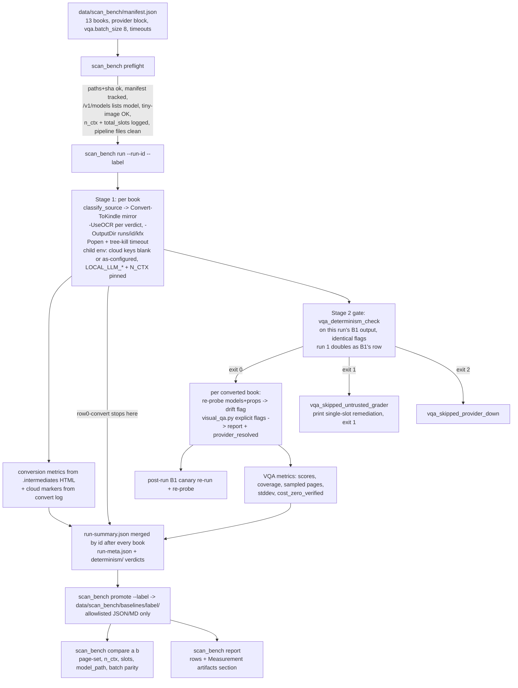

# feat: EB-392 Phase 0 — resolved VQA provenance, adaptive context budget, scan-bench harness, baseline row 0

## Overview

Phase 0 of the local-LLM upgrade (epic EB-391) establishes ground truth before any pipeline
logic changes. It (1) makes every VQA report prove which server, weights, and context window
actually graded it, (2) makes the local vision provider fit its requests to the server's real
context window, (3) adds a fixed 13-book benchmark harness that runs a faithful mirror of the
production PDF-to-KFX path plus local-only VQA and records per-book metrics, and (4) captures
baseline row 0 on current master in three parts: conversion metrics now, VQA after SB-231 raises
the server window, and a one-time cloud-as-configured comparator. It also runs a throwaway
throughput spike for the sb-vision page-transcription tier that Phase 3 will size against.

No extraction, heading, OCR, or Calibre behavior changes in this phase.

## Problem Frame

From the origin document (see origin: `docs/brainstorms/2026-09-05-local-llm-scanned-pdf-conversion-requirements.md`, §2.3, §3, §6 Phase 0):

- Local VQA is currently broken by the `.env` override: it points at `http://localhost:8000/v1`,
  which now resolves to the text-only Flash gateway (HTTP 500 on images). The working endpoint is
  `http://192.168.1.33:8080/v1`, served alias `sb-vision`. Nothing in a VQA report today records
  which endpoint answered — only `model`, which is whatever the caller *requested*.
- `sb-vision` serves `n_ctx` 8192 with `--image-min-tokens 1024`; the grader assumes 32768
  (`GRADING_MAX_OUTPUT_TOKENS = 24576`, `batch_size` 8). Requests overflow before any output.
  SB-231 will raise the server to 32768; the client must degrade gracefully until then and must
  not break after.
- The scan class is where the pipeline loses (VQA mean 57.4, floor 12), yet no scanned book is in
  any baseline file. Every later phase needs the same 13 books measured the same way, and the
  first row must be captured on unmodified master.
- Current master is **not** $0 by default: `Convert-ToKindle` passes `--api-key` to the extractor
  whenever `ANTHROPIC_API_KEY` is set (Claude quality pass, paragraph rejoin, sub-heading
  detection), zero-text scans auto-escalate to Gemini when `GEMINI_API_KEY` is set (EB-349), and
  the VQA Claude fallback defaults on. Cloud-off changes *content*, not only cost, so row 0 needs
  both a cloud-off capture (comparable with Phase 1's keys-unset acceptance) and a
  cloud-as-configured comparator captured while current master still exists — after Phase 1 the
  Anthropic sites become opt-in and that comparator can no longer be produced from master.
- The Calibration Sessions rule (global CLAUDE.md) and EB-361/EB-377 require the determinism
  double-run on the *resolved* endpoint before any VQA delta is treated as a finding, and
  reproducibility is a server property (single-slot serving).

## Requirements Trace

- R1. Every `_visual_qa_report.json` and every determinism verdict records the resolved provider:
  base URL, requested model, server-reported model id (matched to the requested id), the weights
  identity (`model_path`, `build_info`, `n_ctx_train` when the server exposes them), served
  `n_ctx` and its source, `total_slots`, server type, probe status, and the effective batch size /
  output budget. (origin §6 Phase 0, EB-390)
- R2. `config/settings.json` names the served alias (`sb-vision`); the stale `localhost:8000` /
  `qwen3.5-35b-a3b-fp8` fallbacks in code are replaced by one shared resolver; the sweep-2 runner's
  hardcoded GGUF name is aligned; CLAUDE.md's and QWEN.md's VQA text reflect the live state.
  (origin §2.3, EB-390)
- R3. `LocalVisionProvider` probes the server for `n_ctx` and sizes batch size and output budget
  to fit; on 8192 it produces valid (if partial-coverage) results instead of `api_failure`; on
  32768 behavior is unchanged from today; the probe is never fatal, and a degraded regime is
  visible to callers that never read provenance. (origin §2.3, §9 decision 3, EB-350)
- R4. `tools/scan_bench.py` + `data/scan_bench/manifest.json` run all 13 books (origin §3)
  through a faithful mirror of the production conversion path, then local-only VQA with fallback
  off, recording per book: VQA overall + per-page scores + sampled page list + coverage, chapter
  count and bookmark count (alignment when a source TOC exists), word count, text-layer quality
  score, ligature splits, double spaces, footnotes linked/unlinked, page-anchor survival ratio,
  per-stage wall-clock, output format and size ratio, cloud state proven from both the VQA report
  and the conversion log, classify verdict, and the resolved provider. Failures, timeouts, and
  provider drift are recorded as rows, never as crashes.
- R5. Baseline row 0 is captured on current master under `data/scan_bench/baselines/`, landed via
  PR (EB-181): conversion metrics cloud-off now; VQA only under the single-slot ≥ 32768 regime with
  the determinism gate passed; plus a cloud-as-configured comparator at the same commit.
  (origin §6, §8)
- R6. A throwaway spike records sb-vision page-transcription seconds/page, tokens/page, and
  quality on 5 fixed pages each of A1, A2, A5, alongside Tesseract on the same pages.
  (origin §6 Phase 0, §7)

## Scope Boundaries

- No changes to extraction, OCR routing, heading detection, footnotes, or Calibre invocation
  (those are Phases 2–4). Baseline row 0 is expected to contain failures; that is the point.
- No text-LLM provider, no Flash integration (Phase 1).
- No auto-enabling of VQA in the batch, no tiered policy (Phase 5).
- The harness does not use `Invoke-EbookPipeline` (inbox-driven, archives sources with timestamp
  duplicates, runs TTS first, writes `logs/processed.txt` and `logs/failed-books.json`, no
  output-dir control, no timeout) nor `Invoke-ConvergeLoop` (auto-enables Claude chapters and
  rotates strategies). TTS, delivery, and archiving are excluded by design.
- The manifest references source PDFs by absolute path; no PDFs are copied into the repo or
  staged into `archive/`.
- The `.env` file is edited by Joe by hand (credential-write guard). The harness pins its own
  child environment so a wrong `.env` cannot redirect a run; ad-hoc `visual_qa.py` runs outside
  the harness still need the manual fix.
- `--fallback-enabled` parsing (`type=lambda x: x.lower() != "false"`) is left as is; the harness
  passes the literal `false`.
- No pipelined convert/grade interleaving. Strict staging is chosen because the determinism gate
  must precede all grading, resume semantics stay trivial, and once SB-231 lands the VQA stage is
  minutes per book, so the wall-clock saving of interleaving does not justify the complexity.

### Deferred to Separate Tasks

- Raising `sb-vision` to 32768 context with `--parallel 1` kept: SB-231 (SecondBrain repo). This
  is a **prerequisite for the VQA half of row 0**, not a nice-to-have (see Key Technical Decisions).
- Booksmith extraction-module split: deferred until all EB-391 phases land (origin §9 decision 5).
- EB-368 (`-FullVQA` clamp) and streaming chunking: Phase 5.
- Hand-curated `expected_chapters` for B4, B5, A3 (the Phase 4 acceptance books): optional manifest
  field, filled by Joe before Phase 4; row 0 records chapter and bookmark counts without it.
- Re-anchoring the Phase 3/4 acceptance thresholds in the origin document to row 0 numbers (rather
  than the EB-377 figures, whose cloud-key state is unrecorded): a one-line origin edit once row 0
  exists.

## Context & Research

### Relevant Code and Patterns

- `tools/visual_qa.py` — provider factory inline in `main()` (`--provider claude|local|cloud`;
  local base URL from `LOCAL_LLM_BASE_URL` → `visual_qa.local_base_url` → hardcoded
  `http://localhost:8000/v1`; model from `--model` → `LOCAL_LLM_VISION_MODEL` → `visual_qa.local_model`
  → hardcoded `qwen3.5-35b-a3b-fp8`). `load_dotenv(..., override=False)` at import: a value
  already in the process environment (including an empty string) beats `.env`. `build_report(...)`
  emits `model`, coverage fields (`pages_requested/pages_sampled/pages_evaluated/coverage_status/
  coverage_reason/truncation_events`), `token_usage`, and the additive `capture_pipeline` field —
  the precedent for a new `provider_resolved` block. `run_visual_qa` raises without writing a
  report on missing input, 0 pages, Calibre KFX→PDF failure, or render failure, and `main()` exits
  2 on any exception — so exit 2 conflates render failures with provider failures.
  `_apply_large_file_dpi_reduction` clamps >30 MB / >500 pp inputs to 72 DPI / 4 pages unless
  `--dpi` and `--max-pages` appear literally in `sys.argv` (`--full` does not count).
  `visual_qa.py` never removes its `tempfile.mkdtemp('visual_qa_')` render directories.
- `tools/llm_providers/local_provider.py` — `LocalVisionProvider`, `GRADING_MAX_OUTPUT_TOKENS`,
  `ContextWindowOverflowError`, `two_pass_call`. **Branch `fix/EB-350-adaptive-context-budget`
  (PR #184, one commit, merges clean)** already adds `get_context_window()` (GET
  `{base_url}/models` → `data[0].meta.n_ctx`, cached, falls back to 32768), `output_budget_for()`,
  `max_batch_size()`, constants `PER_IMAGE_TOKEN_ESTIMATE=2200`, `RUBRIC_TOKEN_RESERVE=1500`,
  `CONTEXT_SAFETY_MARGIN=1024`, `MIN_OUTPUT_BUDGET=8192`, wires `effective_batch` into
  `run_visual_qa`, and adds tests. Verified live 2026-09-05: llama.cpp `/v1/models` `data[0].meta`
  carries both `n_ctx` (served: 8192 on sb-vision, 32768 on the gateway) and `n_ctx_train`
  (262144); `owned_by` is `llamacpp`; the model `id` is the operator's `--alias`, not the weights;
  `/props` (host root, not under `/v1`) exists on sb-vision with `default_generation_settings.n_ctx`
  and `total_slots`, and returns 404 on the gateway. Whether this build exposes `model_path` and
  `build_info` on `/props` is to be confirmed at implementation.
- `tools/vqa_determinism_check.py` — `build_vqa_runner` duplicates the provider factory with the
  stale hardcoded fallbacks, constructs **one** provider instance reused by both runs, and has its
  own `--batch-size` (default 8); bypasses `visual_qa.main`, so only a cap inside the provider
  reaches it. `compare_reports` gates on per-page score deltas + page-set parity; exit 0 / 1 / 2.
  Output schema example: `data/batch_reports/EB-377-vqa-determinism-pilgrim.json`.
- `module/EbookAutomation.psm1` — `Invoke-EbookPipeline` PDF branch: runs `classify_source.py`,
  sets `-UseOCR` when the verdict is `scan_with_text | scan_no_text | image_only`, then calls
  `Convert-ToKindle` with roughly 22 parameters: `-InputFile`, `-OutputDir`, `-UseHtmlExtraction`,
  `-UseClaudeChapters:`, `-UseOCR:`, `-ForceColumns:`, `-ValidateVisual:`, `-NoCache:`,
  `-UseVision:`, `-VisionCostLimit`, `-UseGemini:`, `-GeminiRemediate:`, `-GeminiCostLimit`,
  `-ProduceEpub:$emailActive`, `-ApplyAIFixes:`, `-Profile`, and the `-No*` content switches — all
  but `-InputFile`/`-OutputDir`/`-UseHtmlExtraction`/`-UseOCR` bound to pipeline parameters at
  their defaults (`-Profile 'full'`, switches false, `$emailActive` false because
  `kindle_delivery.email.auto_send` is unset). `Convert-ToKindle` passes `--api-key` when
  `$env:ANTHROPIC_API_KEY` is truthy (empty string is falsy in PowerShell), names the output from
  title/author metadata (never the source stem), logs `Kindle: done -> <path>` where the path is
  `.kfx` or, after the Enhanced-Typesetting fallback, `.azw3`, returns
  `@{Success; OutputPath; QualityScore; QualityStatus; …}`, writes a transient
  `processing/ebook_meta_<random>.json` (cleaned on the normal path), and has no timeout.
- `tools/batch_qa.py` — `run_kfx_conversion_for_book` (pwsh `Import-Module …psd1 -Force;
  Convert-ToKindle -InputFile … -UsePdfminer -NoCache`, `subprocess.run(timeout=…)`, parses
  `done -> (.+\.kfx)`, treats 0-byte output as failure), `run_visual_qa_for_book` (subprocess
  `visual_qa.py --input <kfx> --provider local --fallback-enabled false`, 900 s),
  `_analyze_html_structure` (chapter_count, word_count, text_layer_score). It is folder-scan
  driven, uses the `-UsePdfminer` path rather than the production switch set, writes to the
  pattern DB and runs cluster analysis, and its cost column reads a key that does not exist.
- `tools/run_eb340_sweep2.ps1` — the sweep pattern to mirror: pins `LOCAL_LLM_BASE_URL` /
  `LOCAL_LLM_VISION_MODEL` in process env (hardcodes the GGUF filename as the model), preflight
  probes `/props`, writes `run-meta.json` (git sha, dirty flag, provider, base_url, model, n_ctx,
  flags, config snapshot), converts with `Convert-ToKindle -InputFile <abs> -OutputDir <dir> -NoCache`
  and resolves the output from the return object, merges `run-summary.json` by id after every book.
- `tools/build_batch_provenance.py` — the join pattern manifest → `kindle_conversion.output_path`
  → `<kfx>.parent/.intermediates/<kfx.stem>_kindle.html` → `<kfx.stem>_visual_qa_report.json`.
- Metric extractors to import, not re-implement: `tools/test_pipeline.py::extract_baseline_from_html`
  (h1/h2/h3 counts, linked/unlinked footnotes, ligature splits, double spaces, standalone page
  numbers, chapter openings, kfx_size_kb), `tools/chapter_alignment.py::verify_chapter_alignment(pdf, html)`
  (needs pypdf bookmarks; returns no score for books without an outline — most Track A scans),
  `extract_tts_text.score_text_layer_quality(text, multi_sample=True)` (English common-word based;
  meaningless for non-Latin A7). Page anchors in the intermediate HTML are ``;
  no existing function counts them. Cloud-usage markers already present in the extractor and module
  logs: `AI Quality Pass: skipped (no API key)` vs `AI Quality Pass: using model=`,
  `AI Rejoin: skipped (no API key)`, `attempting Gemini fallback`, `sending text to Claude`.
- Tests to mirror: `tests/test_local_provider_phase2.py` (provider fixture, `_make_fake_completion`,
  `patch("openai.OpenAI")`, and on the EB-350 branch a `urllib.request.urlopen` fake for the probe),
  `tests/test_capture_pipeline_derivation.py` (`_call_build_report` helper, "legacy call omits field"),
  `tests/test_batch_qa_kfx_success.py` and `tests/test_eb377_vqa_policy.py` (monkeypatched
  `subprocess.run`). Import providers as `from llm_providers…`, never `tools.llm_providers…`.
  On Joe's machine `http://localhost:8000/v1/models` answers with 32768, so any provider test that
  forgets to stub the probe passes locally and fails elsewhere — the stub must be the fixture default.
- Conventions: `logging` to stderr, JSON on stdout, `def main(argv=None) -> int`, UTF-8 reconfigure
  on win32, `SCRIPT_DIR = Path(__file__).resolve().parent`, defaults from `config/settings.json`.
  Editing `tools/visual_qa.py` triggers the post-edit hook (`test_pipeline.py --quick`, minutes).
  `feature-manifest.json` needs a `python_cli_modes` entry for new tools.
- Git/policy facts verified: `data/scan_bench/` is tracked (no ignore rule) but **not** worktree-exempt
  → lands via PR; `*.kfx`, `*.pdf`, `*.log` are globally ignored but `*.html` and `*.png` are not
  (Convert-ToKindle writes `.intermediates/*_kindle.html` and `images/` under its output dir);
  `test-corpus/*` is ignored except top-level `*.baseline.json` → the manifest cannot live there;
  `scratch/` is ignored → home for the spike script; `data/debug/**` is exempt → home for raw
  spike output; `.gitignore` is exempt (direct commit allowed). One benchmark source
  (`F:\Books\…\[sha a5436317].pdf`) has brackets in its name; the harness must never glob or
  `Test-Path` on source paths (use literal paths). Windows CPython `subprocess.run(timeout=…)`
  kills the direct child and then **blocks in `communicate()` until every process holding the
  inherited pipe handles exits** — the grandchildren — so a timeout there neither returns promptly
  nor leaves a live root PID for `taskkill /T`.

### Institutional Learnings

- `docs/solutions/eb377-phase3-50book-regression-sweep-2026-06-07.md` — determinism gates must
  prove the resolved URL + model; env/`.env` override config; output path must come from the
  conversion's own return, never the source stem or a directory glob; manifest needs a
  filename-level review gate; provenance records sha256 per source.
- `docs/solutions/eb361-vqa-grader-determinism-self-check-2026-06-02.md` — reproducibility is a
  server property (`--parallel 1`); the check forces fallback off and `user_supplied_*=True`;
  exit 0/1/2; re-baseline only after exit 0; the Calibration rule is "non-deterministic → fix before
  using", not "grade anyway and label it".
- `docs/solutions/eb340-vqa-sweep2-findings-2026-06-01.md` and `eb340-full-vqa-batch-findings-2026-05-29.md`
  — partial coverage on scans is **output** truncation (EB-358), not input sizing (EB-350); 8192 ctx
  overflowed 8-image batches into silent `api_failure`; A/B deltas are confounded without sampled
  page-set parity; measured wall-clock: First Folio 928 s, Monumental 169 s, Beale 1285 s; every
  prior sweep and every `data/vqa_baseline_post_274/` file was graded at batch size 8.
- `docs/solutions/eb-149-vqa-coverage-loss-surfacing.md` — `coverage_status` derives from
  evaluated vs requested; adaptive batch reduction was explicitly *declined* as a truncation fix,
  so the Unit 1 cap is scoped to input overflow only.
- `docs/solutions/scrum-290-a2-pilot-findings.md` — `pwsh` only; output size > 0; timeout is its
  own status; fail loud on 100 % phase failure; degenerate grader = per-book stddev < 2.
- `docs/solutions/scrum-282-vqa-baseline-methodology.md` — grep for field-name collisions before
  adding provenance fields; compare `pages[].page_number` arrays for parity; scratch → validate →
  promote for baseline data; feed VQA the KFX, never the PDF (`capture_pipeline = kfx-calibre`).
- `docs/solutions/eb-142-calibre-stderr-capture.md` — persist Calibre stdout **and** stderr per book.
- `docs/superpowers/specs/2026-06-07-eb-phase3-50book-regression-sweep-design.md` and
  `2026-06-01-eb340-vqa-stress-sweep2-design.md` — `--fallback-enabled false` exactly lowercase;
  run-wide manifest schema (git sha, commands, config blocks, confirmed `n_ctx`); "$0" is proven by
  `fallback_enabled: false` plus absence of `fallback_*_tokens`, not by a cost field; code lands via
  PR before the run, the run executes from the main working tree, never junction data dirs.
- `docs/solutions/eb370-header-bleed-batch-guard.md` — exit-code contract 0/1/2/3 computed in one
  helper; argparse errors → 3.
- `docs/solutions/eb353-vqa-grader-code-false-positive-2026-06-02.md` and the EB-340 canary
  convention — "garble finding" means a VQA issue whose category or description is in the
  garbled / OCR / illegible / extraction-failure family; low scores on code-heavy books (B6) are
  suspect, on old scans they are likely real; the Oil Kings canary expects zero garble findings.
- `docs/solutions/scrum-280-local-vqa-calibration-patterns.md` — `select_sample_pages` is
  deterministic on `(total_pages, bookmark_pages)`; pipeline changes shift the sampled set, so the
  harness must persist the sampled page list per book per run. Batch composition affects scores,
  so batch size must be pinned across rows.

### External References

- None required; local patterns are strong (three prior sweep harnesses, one open PR for the probe).

## Key Technical Decisions

- **Land PR #184 instead of re-implementing the probe.** The branch already has the probe, budget
  math, wiring, and ~550 lines of tests, and merges clean. Adjustments: the output floor scales
  with the window; the unknown-window path is explicit and visible; the probe is
  constructor-injectable for tests; a `describe()` record is added.
- **Probe order:** `/v1/models` → `data[].meta.n_ctx` for the entry whose `id` equals the requested
  model (served value, verified live; `n_ctx_train` is recorded separately as weights provenance,
  never used as the window) → `<host>/props` → `default_generation_settings.n_ctx` → `/v1/models`
  `max_model_len` (vLLM) → unknown. `/props` is read whenever reachable (not only as a fallback)
  for `total_slots`, `model_path`, and `build_info`. Never fatal, cached once per instance
  (`describe(refresh=True)` re-probes), 5 s timeout, one retry.
- **Unknown window is never silent.** An explicit window wins over probing: `--n-ctx` on
  `visual_qa.py` / `LOCAL_LLM_N_CTX` in the environment (`n_ctx_source: cli`), which the harness
  always sets from its preflight probe. For other callers, an unknown window assumes 8192 (smaller
  batches and truncation rather than overflow) **and** marks the report `coverage_reason:
  probe_failed_conservative_window` with a degraded `evaluation_status`, so `Test-ConversionQuality`,
  the converge loop, and `batch_qa` — none of which read `provider_resolved` — still see that the
  score came from a degraded regime. The branch's silent 32768 default is removed.
- **Cap scope = input overflow only.** On 8192 the provider runs 1 image per call with a small
  output budget; dense pages truncate into `coverage_status: partial`. Graceful degradation, not a
  fix. Trustworthy Track A scores require SB-231, and the harness enforces that for row-0 labels.
- **Provenance comes from the server, not the request.** `provider_resolved` records requested
  model, served model id (the entry matching the request; `models_listed` alongside; `None` with
  `probe_ok` true when the requested id is absent), the weights identity (`model_path`, `build_info`,
  `n_ctx_train` when exposed), served `n_ctx` and its source, `total_slots`, server type, probe
  status, and effective batch size / output budget; the existing `model` field keeps meaning
  "requested". Additive, mirroring `capture_pipeline`. Named `provider_resolved` because
  `build_report` already has a `provider` kwarg. `compare` treats `model_path` (when known),
  `model_served`, `n_ctx`, `total_slots`, and `batch_size_effective` mismatches as `not_comparable`.
- **One resolver.** `resolve_local_vqa_target()` (cli > env > config) is shared by `visual_qa.py`,
  `vqa_determinism_check.py`, and the harness, returning each value with its source. A missing
  `visual_qa.local_base_url` config key is an error (exit 3 naming the key); `default` is a valid
  source only for the model (provider-internal default acceptable). No literal `localhost:8000`
  survives anywhere.
- **Pinned batch size is 8, explicitly.** Every prior sweep, the determinism baseline, and
  `data/vqa_baseline_post_274/` were graded at 8; "what fits" would be 10 at 32768 and 1 at 8192,
  both of which change batch composition and therefore scores. The manifest header carries
  `vqa.batch_size: 8`; the harness passes it to `visual_qa.py` and the determinism check;
  preflight refuses any `row0*`-labelled VQA capture when `max_batch_size() < 8` unless
  `--allow-degraded-batch`; `batch_size_effective` is still recorded.
- **Manifest lives at `data/scan_bench/manifest.json`**, not `test-corpus/scan-bench/`
  (gitignored). Preflight asserts it is tracked (`git ls-files`).
- **Why a new `tools/scan_bench.py` rather than a manifest mode in `batch_qa.py`.** The deltas are
  not additive: a fixed manifest instead of a folder scan, the production switch-set mirror with the
  classify gate instead of `-UsePdfminer`, cloud-off child-environment pinning, the determinism gate
  and per-book drift detection, tracked JSON/MD output under `data/scan_bench/` instead of
  `data/batch_reports/` plus DB writes and cluster analysis, and an exit-code contract. `scan_bench`
  **imports** `batch_qa`'s pwsh invocation and HTML-analysis helpers where their signatures fit
  rather than copying them, and `vqa_determinism_check.compare_reports` for parity, so the
  orchestration surface is new but the mechanics are shared.
- **Conversion entry point = `Convert-ToKindle` mirror of the pipeline's PDF branch:** run
  `classify_source.py`, pass `-UseOCR` for `scan_with_text | scan_no_text | image_only` exactly as
  `Invoke-EbookPipeline` does, plus `-InputFile -OutputDir data/scan_bench/runs/<run>/kfx/<id>
  -UseHtmlExtraction -NoCache`; every other call-site parameter is at its pipeline default. Record
  `entry_point: convert-tokindle-mirror`, `entry_point_switches`, the implicit `-Profile full`, and
  the verdict per row. **Contract test semantics:** (1) the mirror's switch set is a subset of the
  call site's parameter names and the `-UseOCR` gate expression in the harness matches the psm1
  text; (2) the call site's full parameter list equals a pinned snapshot in the test, so any Phase 2
  addition (e.g. a classifier-JSON handoff) fails the test and forces a harness review.
- **Row 0 has three parts, all at the same commit.** `row0-convert`: conversion metrics with cloud
  off, capturable now under any server regime. `row0-vqa`: the VQA half, captured only under
  single-slot ≥ 32768 with the determinism gate passed (`--vqa-only --resume` after SB-231);
  spending hours grading at one image per call would produce rows that `compare` refuses and that
  the next label discards. `row0-cloud`: conversion **and** VQA "as configured" (cloud keys present,
  fallback as configured, `--cloud-as-configured`), the comparator showing what cloud contributes
  today; it must be captured before Phase 1 turns the Anthropic sites into an opt-in provider.
  Expected cost is on the order of one dollar (Haiku quality pass / rejoin / sub-headings on 13
  books, Sonnet chapter detection, any fingerprint fallback).
- **Cloud-off is proven from two sources.** The harness sets `ANTHROPIC_API_KEY=""`,
  `GEMINI_API_KEY=""`, `OPENROUTER_API_KEY=""` and the manifest's `LOCAL_LLM_*` / `LOCAL_LLM_N_CTX`
  values in every child environment (empty strings block `.env` repopulation under `override=False`
  and are falsy in PowerShell; propagation Python → pwsh → python was verified on this machine),
  passes `--fallback-enabled false`, and records `cloud_policy` in run-meta. `cost_zero_verified`
  requires **both** the VQA report (`fallback_enabled: false`, no `fallback_*_tokens`) **and** the
  persisted conversion log to contain none of the cloud markers (`AI Quality Pass: using model=`,
  a non-skipped `AI Rejoin:`, `attempting Gemini fallback`, `sending text to Claude`);
  `extraction_cloud_markers` is recorded per row. Never a cost field.
- **VQA runs as a subprocess with explicit `--provider local --fallback-enabled false --dpi 150
  --max-pages 20 --batch-size 8 --n-ctx <probed> --output-dir <run>/vqa/<id>`.** Explicit
  `--dpi`/`--max-pages` defeat the EB-347 clamp. Each run gets its own `TEMP` under the run dir
  (deleted at row completion) so `visual_qa.py`'s render directories do not accumulate.
- **Two-stage run with a hard gate.** Stage 1 converts all 13 books. Stage 2 opens with the
  determinism gate on this run's B1 (Oil Kings) output (falling back to the first converted book
  of any track, recorded), using identical flags so the gate's first run doubles as B1's graded row.
  Gate exit 0 → grade all; **exit 1 → grading is skipped** (`vqa_skipped_untrusted_grader`), the
  single-slot remediation is printed, run exit 1 — `--grade-untrusted` is the explicit opt-in for
  exploratory runs; exit 2 → `vqa_skipped_provider_down`. Every graded book is preceded by a cheap
  `/v1/models` + `/props` re-probe compared to run-meta (served id, `n_ctx`, `total_slots`,
  `model_path`); mismatch → `provider_drift` on this and later rows, `vqa_trusted: false`. A post-run
  B1 canary re-run and re-probe close the stage.
- **Timeouts are harness-owned, size-scaled, manifest-overridable, and kill the process tree
  while the root is alive.** Conversion and VQA children are started with `Popen` and waited with
  `communicate(timeout=…)`; on `TimeoutExpired` the harness terminates descendants first
  (`taskkill /F /T /PID <root>` while the root still exists, or `psutil` children-recursive if the
  package is present), then kills the root and drains the pipes. `subprocess.run(timeout=…)` is
  explicitly **not** used for these children because it blocks until orphaned grandchildren exit
  and leaves no live root for `/T`. The row is `convert_timeout` / `vqa_timeout` with `elapsed`.
- **VQA outcome classification.** `visual_qa.py` exit 2 is classified by its stderr tail:
  Calibre / "did not produce" / "No pages were rendered" / page-count → `vqa_render_failed`;
  "unreachable after" / connection errors, or a failed pre-book re-probe (no launch) →
  `vqa_provider_down`; otherwise `vqa_api_failure`. The stderr tail is persisted on every
  non-scored row. `--resume` re-attempts non-terminal rows plus `*_timeout`, `*_provider_down`,
  and `vqa_skipped_untrusted_grader` / `vqa_skipped_provider_down`; `--retry <id>` forces one book.
- **Output path parsing accepts both formats:** `done -> (.+\.(?:kfx|azw3))` (case-insensitive),
  `output_format` from the matched extension, size > 0 required for both.
- **Run directory layout.** `data/scan_bench/runs/<run-id>/` holds everything a run produces and
  is **gitignored** (`data/scan_bench/runs/**`, direct commit to `.gitignore`), so raw runs never
  collide with `git pull` after a data PR merges and Convert-ToKindle's `.intermediates/*.html` and
  `images/*.png` never reach a PR. `scan_bench promote --run-id <id> --label <label> [--dest <dir>]`
  copies an explicit allowlist (`run-meta.json`, `run-summary.json`, `report.md`,
  `vqa/<id>/*_visual_qa_report.json`, `determinism/**/*.json`, `manifest.snapshot.json`) into
  `data/scan_bench/baselines/<label>/` — `--dest` points at the worktree checkout for the PR.
  `compare` and `report` read either location.
- **Run ids and resume.** `run-id = <yyyymmdd-HHMMSS>-<sha7>[-label]`; an existing run dir without
  `--resume` is refused; `run-summary.json` is rewritten after every book.
- **Dirty-tree check scoped to pipeline files** (`tools/`, `module/`, `config/settings.json`);
  the main tree always has untracked batch reports. Row-0 captures require clean pipeline files.
  The manifest changes the capture makes (`--write-sha`) are part of what `promote` snapshots.
- **Manifest path resilience.** Rows carry `sha256`, `size_bytes`, `pages`. A missing path triggers
  a size-prefiltered sha256 search under `F:\Books` (`path_resolved_via: sha256_search`); not
  found → `source_missing` row and the run continues. Never match by title.
- **No new Python dependencies.** The probe uses `urllib.request`; process-tree kill uses
  `taskkill /T` (Windows-only harness, documented), with `psutil` used only if already importable;
  the spike uses poppler + pytesseract + the `openai` SDK already installed.

## Open Questions

### Resolved During Planning

- Does llama.cpp expose served `n_ctx` on `/v1/models`? Yes, `data[].meta.n_ctx` (verified on both
  servers 2026-09-05; `n_ctx_train` is a different field and is recorded as weights provenance).
- Where does the manifest live? `data/scan_bench/manifest.json`.
- Which existing code implements the probe? PR #184 / `fix/EB-350-adaptive-context-budget`.
- Which conversion entry point? `Convert-ToKindle` mirror with the classify gate replicated (never
  `Invoke-EbookPipeline` or `Invoke-ConvergeLoop`); `Invoke-EbookPipeline` is the production entry
  point being mirrored, per the origin document.
- Row 0 cost policy? Both: cloud-off (`row0-convert`, `row0-vqa`) and a cloud-as-configured
  comparator (`row0-cloud`) at the same commit.
- Pinned batch size? 8, explicitly (continuity with every prior VQA number).
- Capture VQA at 8192? No. SB-231 (≥ 32768, `--parallel 1`) is a prerequisite for `row0-vqa`;
  conversion metrics are captured now.
- Timeout ceiling for A2/A7? Accept `convert_timeout` at the size-scaled ceiling (~35 min for A2)
  as the row-0 result; a `--retry A2 --convert-timeout 7200` run can record the full number separately.
- Determinism gate failure policy? Exit 1 skips grading (fix the server, then `--resume`);
  `--grade-untrusted` exists for exploration only.
- `--allow-batch-mismatch` on `compare`? Marks affected deltas `batch_mismatch` instead of
  refusing the comparison; never allowed for two `row0*` baselines.
- Canary threshold semantics? B1 below 85 or any garble finding is a run-level WARN; for
  promotion of a `row0*` label it is a hard validation failure.
- Track B canary check in Phase 0? Recorded as metrics only; the 17-check `test_pipeline.py` run
  stays the separate regression gate.
- Gate subject when B1 did not convert? The first converted book in manifest order, any track,
  recorded in run-meta.
- A book present on only one side of `compare`? Row status `missing_on_a` / `missing_on_b`, no delta.

### Deferred to Implementation

- Exact per-image token cost on sb-vision at 150 DPI under `--image-min-tokens 1024` (branch
  constant 2200 was measured on vLLM; Qwen3-VL patching at 150 DPI is close to it). Keep 2200;
  rows record `input_tokens` per batch and the provider logs a WARNING when actual per-image cost
  exceeds the estimate (diagnostic only; no mid-run re-batching).
- Whether the sb-vision llama.cpp build exposes `model_path` / `build_info` on `/props`, and whether
  `/props.default_generation_settings.n_ctx` equals `/v1/models meta.n_ctx` on that build (record
  both when they differ).
- Whether `/v1/models meta.n_ctx` is per-slot or total across slots on llama.cpp — irrelevant while
  `total_slots == 1` (enforced for row-0 labels), to be confirmed if SB-231 ever changes `-np`.
- Timeout constants for the two largest books after the first measured run; manifest overrides
  absorb whatever the first run reveals.
- Live confirmation that no `ebook-convert` / `calibre-parallel` survives a forced timeout.
- The cloud-key state under which the EB-377 / EB-340 numbers cited in the origin were produced
  (check the EB-377 provenance JSON and run logs); `row0-cloud` supersedes them as the comparator.
- `expected_chapters` values (Joe curates; optional).

## High-Level Technical Design

> *This illustrates the intended approach and is directional guidance for review, not implementation specification. The implementing agent should treat it as context, not code to reproduce.*

Per-book status lifecycle: `pending → source_missing | classified | classify_failed (verdict unknown,
continue) → converting → converted | converted_empty | convert_failed | convert_timeout | convert_crashed
→ vqa_pending → vqa_running → evaluated | evaluated_partial | vqa_render_failed | vqa_provider_down |
vqa_api_failure | vqa_no_report | vqa_timeout | vqa_skipped_empty | vqa_skipped_provider_down |
vqa_skipped_untrusted_grader | vqa_skipped_by_flag → metrics_done`. Orthogonal flags per row:
`provider_drift`, `cost_nonzero`, `coverage_reason`, `degenerate_grader`,
`not_comparable_text_quality` (non-Latin), `extraction_cloud_markers`. Every book reaches a terminal
status with stage timings and error text; the run never aborts on a book.

## Implementation Units

- [x] **Unit 1: Land the adaptive context budget (PR #184) with small-window fixes and `describe()`** — done 2026-09-06 (`de9861c`)

**Goal:** `LocalVisionProvider` fits batch size and output budget to the probed or explicitly
supplied `n_ctx`, works on 8192 today, is unchanged on 32768, never fails because of the probe,
makes a degraded regime visible, and exposes a `describe()` record for provenance.

**Requirements:** R3, R1 (the `describe()` source)

**Dependencies:** None (branch exists; rebase onto current master).

**Files:**
- Modify: `tools/llm_providers/local_provider.py`
- Modify: `tools/visual_qa.py` (effective-batch wiring from the branch; `--n-ctx`; degraded-regime
  `coverage_reason` / `evaluation_status`)
- Test: `tests/test_local_provider_phase2.py`, `tests/test_visual_qa_retry.py` (from the branch)

**Approach:**
- Rebase `fix/EB-350-adaptive-context-budget` onto master (merge-tree is clean).
- Constructor accepts an explicit `n_ctx` (from `--n-ctx` / `LOCAL_LLM_N_CTX`, source `cli`) and
  an injectable probe callable; the probe is the fixture default in tests so no test depends on a
  live gateway.
- Probe chain per the decisions (models entry matching the requested id → `/props` → vLLM
  `max_model_len` → unknown). `/props` is also read for `total_slots`, `model_path`, `build_info`
  whenever reachable. Unknown → 8192, WARNING, `probe_ok False`, `n_ctx_source unknown`; one retry.
- Fix the floor: output budget = `clamp(raw, floor, GRADING_MAX_OUTPUT_TOKENS)` where
  `floor = min(MIN_OUTPUT_BUDGET, available - num_images * PER_IMAGE_TOKEN_ESTIMATE)`, so on 8192 a
  single image yields roughly 3.4 K output tokens instead of an 8192 request that exceeds the window.
  If even one image leaves less than a small absolute minimum (order 1 K tokens), log an ERROR
  naming the server `n_ctx` and continue with batch 1 — never raise before the first call.
- `max_batch_size` uses the same scaled floor: 1 on 8192, 10 on 32768 as documented (the harness
  pins 8 regardless; the cap only lowers).
- After the first real response, compare `usage.prompt_tokens` per image to the estimate and log a
  WARNING if actual exceeds it (diagnostic only; no re-batching).
- `describe(refresh=False) -> dict` with the fields in the decisions; on probe failure the URL and
  requested model are set and the rest `None`/`False`.
- `run_visual_qa`: when the provider reports `n_ctx_source unknown`, set
  `coverage_reason: probe_failed_conservative_window` and a degraded `evaluation_status` on the report.
- Update the two existing tests that pin `payload["max_tokens"] == GRADING_MAX_OUTPUT_TOKENS` to
  run with the probe stubbed at 32768.

**Execution note:** Test-first for the floor and the unknown-window path — write the 8192 and
unknown scenarios before touching the math.

**Patterns to follow:** existing tests in `tests/test_local_provider_phase2.py` (fixture, fake
completion, `urlopen` fake context manager on the branch).

**Test scenarios:**
- Happy path: probe returns `n_ctx=32768` → `max_batch_size()==10`, `output_budget_for(1)==24576`,
  `build_request` `max_tokens` unchanged from today.
- Happy path: probe returns `n_ctx=8192` → `max_batch_size()==1`; `output_budget_for(1)` + one image
  estimate + reserves ≤ 8192; `build_request` `max_tokens` equals that budget.
- Explicit window: constructor `n_ctx=32768` with a probe that would return 8192 → the explicit value
  wins, `n_ctx_source=="cli"`, probe still runs for `describe()` metadata.
- Edge case: `n_ctx` so small one image does not fit → ERROR logged, `max_batch_size()==1`, budget
  equals the absolute minimum, no exception.
- Edge case: probe called once per instance; `describe(refresh=True)` makes a new HTTP call and can
  return a different `n_ctx`.
- Probe chain: models entry for the requested id lacks `meta.n_ctx` but `/props` has it → `props`
  source; neither but `max_model_len` present → vLLM source; all fail twice → 8192, `unknown`,
  WARNING, `probe_ok False`.
- Multi-model listing: `/v1/models` lists `sb-chat` and `sb-vision`, request is `sb-vision` →
  `model_served=="sb-vision"` from that entry, `models_listed` has both; requested id absent →
  `model_served None`, `probe_ok True`.
- `/props` present → `total_slots`, `model_path`, `build_info` recorded; 404 → those fields `None`,
  no exception.
- Error path: HTTP error / malformed JSON / non-integer `n_ctx` → unknown path, no exception.
- Diagnostic: a fake completion whose `prompt_tokens` implies 3000 tokens/image logs the WARNING once.
- Integration: `run_visual_qa` with a provider whose `max_batch_size()` returns 1 and 3 page images
  issues 3 batches; a provider without `max_batch_size` (Claude/cloud) is untouched; a provider
  reporting `unknown` yields a report with `coverage_reason probe_failed_conservative_window`.

**Verification:**
- `python -m pytest tests/test_local_provider_phase2.py tests/test_visual_qa_retry.py tests/test_vqa_grader_calibration.py tests/test_visual_qa_hybrid_routing.py` green.
- A live one-page smoke against sb-vision at 8192 returns a scored page (partial coverage allowed)
  instead of `api_failure`.

- [ ] **Unit 2: Shared target resolver, `provider_resolved` in reports and verdicts, stale defaults aligned**

**Goal:** Every VQA report and determinism verdict proves which server, weights, and window graded
it; one resolver replaces the duplicated factories; the determinism check detects a server change
between its two runs; config, the sweep-2 runner, CLAUDE.md, and QWEN.md no longer point at the
dead `localhost:8000` vision path.

**Requirements:** R1, R2

**Dependencies:** Unit 1 (`describe()`).

**Files:**
- Modify: `tools/visual_qa.py` (`resolve_local_vqa_target()`; factory uses it; `build_report`
  gains `provider_resolved`; `run_visual_qa` populates it from `describe()` plus effective batch
  size / output budget; INFO line `resolved provider: …` at construction; stdout summary gains
  `base_url` and `model_served`)
- Modify: `tools/vqa_determinism_check.py` (`build_vqa_runner` uses the resolver and constructs a
  **fresh provider per run** (or calls `describe(refresh=True)` before each run); verdict JSON gains
  `provider_resolved` per run; exit 2 when the two runs resolved to different `base_url`, `n_ctx`,
  `total_slots`, or `model_path`; `--n-ctx` forwarded; log line prints the resolved target)
- Modify: `tools/run_eb340_sweep2.ps1` (model constant → `sb-vision`)
- Modify: `config/settings.json` (`visual_qa.local_model: "sb-vision"`)
- Modify: `CLAUDE.md` and `QWEN.md` (Visual QA text: served alias, the `.env` override trap and
  `override=False` semantics, the 8192 note, `provider_resolved`, `--n-ctx`, and that
  `-ValidateVisual` does not pin provider/fallback)
- Modify: `feature-manifest.json` (`--batch-size` and `--n-ctx` on the `visual_qa.py` entry)
- Test: `tests/test_vqa_provider_resolved.py` (new); `tests/test_capture_pipeline_derivation.py` (regression)

**Approach:**
- Grep `tools/` and `tests/` for `provider_resolved`, `resolved_`, `n_ctx`, `model_served` before
  naming (SCRUM-282 L1).
- Resolver returns `{base_url, model, base_url_source, model_source}` with sources `cli | env |
  config | default`; `base_url` missing from config is an error naming the key; `default` applies
  only to the model.
- `provider_resolved` is emitted for every provider (Claude/cloud fill `None` where they have no
  server metadata) so consumers can rely on the key; downstream readers only read known keys.
- The `.env` values themselves are Joe's manual step; CLAUDE.md and the ticket state the required
  values and explain that harness runs pin their own environment.

**Execution note:** Test-first on `build_report` (mirror `_call_build_report`) and on the resolver.

**Patterns to follow:** `capture_pipeline` handling in `build_report`; `tests/test_capture_pipeline_derivation.py`.

**Test scenarios:**
- Happy path: `build_report(..., provider_resolved={...})` → report contains the block verbatim.
- Edge case: legacy call without the kwarg → key absent (existing callers unaffected).
- Resolver: env set → `env` source; env unset, config present → `config`; CLI `--model` beats env;
  empty-string env value is treated as unset for resolution purposes but reported; config lacking
  `local_base_url` → error exit 3 naming the key.
- Happy path: `run_visual_qa` with a local provider whose `describe()` returns a fixture → report and
  stdout summary carry `base_url` and `model_served`; `batch_size_effective`, `max_tokens_effective`,
  `total_slots`, `model_path` present.
- Edge case: provider without `describe()` (MagicMock with the attribute deleted) → block present with
  `None` fields, no exception.
- Determinism: verdict JSON includes `provider_resolved` for both runs; an injected probe returning
  32768 on the first construction and 8192 on the second → exit 2 with a reason naming `n_ctx`.
- Config: loading `config/settings.json` yields `visual_qa.local_model == "sb-vision"`; with no env and
  no CLI override the factory resolves to the config base URL, not a literal `localhost:8000`.

**Verification:**
- Unit tests green; `pwsh -File tools/verify-manifest.ps1 -Verbose` passes; post-edit hook
  (`test_pipeline.py --quick`) passes once after the batch of edits.
- A live run of `visual_qa.py --input <small kfx> --provider local --fallback-enabled false --dpi 100
  --max-pages 2` writes a report whose `provider_resolved.model_served == "sb-vision"`.

- [x] **Unit 3: Benchmark manifest, README, `.gitignore` entry, and `scan_bench preflight`** — done 2026-09-06 (`50d1ef8`, `83b84a0`); junction check scoped to data dirs in Unit 4 because `tools/poppler` is a legitimate junction in the main tree

**Goal:** A reviewed, tracked manifest for the 13 books, a gitignored raw-run area, and a preflight
that refuses to start a run whose results could not be trusted.

**Requirements:** R4, R5

**Dependencies:** Unit 2 (preflight uses the resolver and prints the same resolved line).

**Files:**
- Create: `data/scan_bench/manifest.json`
- Create: `data/scan_bench/README.md`
- Create: `tools/scan_bench.py` (`preflight` subcommand; `run`/`compare`/`report`/`promote` added
  in Unit 4)
- Modify: `.gitignore` (`data/scan_bench/runs/**`; exempt path, direct commit)
- Modify: `feature-manifest.json` (`python_cli_modes` entry for `scan_bench.py`)
- Test: `tests/test_scan_bench.py` (new)

**Approach:**
- Manifest schema (run-wide): `schema_version`, `ticket`, `created`, `provider` block
  (`base_url`, `model`, `expected_min_n_ctx: 32768`, `expected_total_slots: 1`), `vqa` block
  (`dpi: 150`, `max_pages: 20`, `batch_size: 8`, `fallback_enabled: false`), `cloud_policy: off`,
  `timeouts` defaults (size-scaled formula parameters, VQA per-page factor). Per book: `id`
  (A1…A7, B1…B6), `track`, `title`, `source_path` (absolute; repo `archive/` / `test-corpus/` copies
  for A1, A2, A4, B1, B2, B3; `F:\Books` paths resolved 2026-09-05 for the rest), `sha256`,
  `size_bytes`, `pages`, `expected_class`, `script` (`latin | non-latin`), `known_failure` (one line
  from origin §3), `timeout_overrides` (optional), `expected_chapters` (optional, nullable),
  `toc_source` (`bookmarks | manual | none`), `interpretation_flags` (e.g. `code_heavy` on B6).
- Preflight checks, each a named pass/warn/fail line: manifest is tracked (`git ls-files`); every
  `source_path` exists (literal path, no glob), is a PDF, exceeds a download-stub threshold, and
  matches `sha256` (unset → WARN; `--write-sha` fills it); `/v1/models` at the manifest base URL
  lists the manifest model, `meta.n_ctx` and `/props.total_slots` logged; a tiny image request to the
  resolved target succeeds (a text-only backend answering `/v1/models` must fail here); process env
  `LOCAL_LLM_*` differing from the manifest → WARN listing both (harness will pin); cloud keys present
  in the process env → INFO that they will be blanked (or kept, under `--cloud-as-configured`); git
  sha and pipeline-file dirty state (`--allow-dirty` for exploratory runs); no junctions under the
  repo tree; `pwsh` on PATH; Calibre, Poppler, Tesseract paths from `config/settings.json` exist.
  **Row-0 label rules** (`--label row0*`, or `--strict`): `n_ctx < expected_min_n_ctx`,
  `total_slots != expected_total_slots`, or `max_batch_size() < vqa.batch_size` is a FAIL for any run
  that will grade (WARN when `--skip-vqa`), unless `--allow-degraded-batch` is passed and recorded.
- Exit codes: 0 clean, 1 warnings only, 2 blocking failure, 3 infra/argparse (one helper computes
  it; `ArgumentParser.error` overridden to 3).
- README documents the schema, the exact run recipe from the main working tree, the three-part row 0,
  the two-stage flow and gate policy, `promote` and the scratch → validate → promote sequence, disk
  expectations (facsimile outputs under `runs/` can reach ~1 GB), the definition of a garble
  finding, and the interpretation guardrails (degenerate-grader stddev < 2, EB-353 lens, non-Latin
  text-quality not comparable, single-page deltas are not findings).

**Patterns to follow:** `run_eb340_sweep2.ps1` preflight and `run-meta.json`; `eb370` exit-code helper.

**Test scenarios:**
- Happy path: valid manifest fixture + mocked `/v1/models` (`sb-vision`, 32768) + mocked `/props`
  (`total_slots 1`) + mocked tiny-image success → exit 0.
- Row-0 rules: server reports 8192 with `--label row0-vqa` → exit 2 naming SB-231; same with
  `--skip-vqa` → exit 1; `total_slots 2` with a row-0 label → exit 2; `--allow-degraded-batch`
  downgrades to exit 1 and is recorded.
- Error path: a `source_path` missing → exit 2 naming the book id.
- Error path: file present but below stub threshold → exit 2.
- Error path: `/v1/models` unreachable, or lists no model with the manifest id → exit 2.
- Error path: `/v1/models` fine but tiny-image request returns HTTP 500 → exit 2 ("text-only backend").
- Edge case: sha256 unset → WARN; with `--write-sha` the manifest is updated and re-running passes.
- Edge case: env vars point elsewhere → WARN line lists both values; exit stays 0/1.
- Edge case: a source path containing `[` and `]` is checked literally (no glob expansion).
- Edge case: modified tracked file under `tools/` → exit 2 without `--allow-dirty`, exit 1 with it;
  untracked files under `data/batch_reports/` do not count.
- Integration: the real `data/scan_bench/manifest.json` validates against the schema in the test
  (path existence monkeypatched; no network); `git check-ignore` confirms `data/scan_bench/runs/x`
  is ignored and `data/scan_bench/baselines/x/y.json` is not.

**Verification:**
- Tests green; `verify-manifest.ps1` passes.
- Preflight run from the worktree during development, then again from the main tree after the code
  PR merges, prints 13 file checks, the tiny-image result, `n_ctx`, `total_slots`, and the resolved
  provider line.

- [ ] **Unit 4: `scan_bench run` (two-stage), per-book metrics, `compare`, `report`, and `promote`**

**Goal:** One command converts and grades all 13 books, recording every metric in R4 with
failures, timeouts, and drift as rows, resumable by run id; `compare` produces deltas with parity
checks; `report` renders the row table with a measurement-artifacts section; `promote` copies an
allowlisted baseline into the tracked area.

**Requirements:** R4

**Dependencies:** Units 1–3.

**Files:**
- Modify: `tools/scan_bench.py`
- Test: `tests/test_scan_bench.py`; fixtures under `tests/fixtures/scan_bench/` (small intermediate
  HTML, a VQA report with `provider_resolved`, a determinism verdict, a convert log with and
  without cloud markers)

**Approach:**
- `run --run-id <id> [--label] [--only A1,B1] [--resume] [--retry <id>] [--dry-run] [--skip-vqa]
  [--vqa-only] [--cloud-as-configured] [--grade-untrusted] [--convert-timeout <s>]
  [--vqa-stage-timeout <s>]`. Run id defaults to `<yyyymmdd-HHMMSS>-<sha7>[-label]`; an existing run
  dir without `--resume` is refused.
- Child environment for every subprocess: manifest `LOCAL_LLM_BASE_URL` / `LOCAL_LLM_VISION_MODEL`,
  `LOCAL_LLM_N_CTX` from preflight's probe, cloud keys set to empty strings (or inherited under
  `--cloud-as-configured`), a per-run `TEMP` under the run dir, everything else inherited. Recorded
  once in `run-meta.json` (with git sha, dirty list, python and pwsh versions, exact command
  templates, the `visual_qa` / `classifier_escalation` / `ocr_escalation` / `converge_loop` config
  blocks, the resolved provider incl. `total_slots` and `model_path`, `cloud_policy`, pinned batch
  size, `entry_point_switches`).
- **Stage 1 (per book, manifest order):** resolve source (sha256 relocation on missing path);
  `classify_source.py` → verdict (failure → `unknown`, continue); `pwsh -NoProfile -Command
  'Import-Module <abs psd1> -Force; Convert-ToKindle -InputFile "<abs pdf>" -OutputDir "<run>/kfx/<id>"
  -UseHtmlExtraction -NoCache [-UseOCR]'` — started with `Popen`, waited with `communicate(timeout)`,
  tree-killed on expiry while the root is alive, then drained. Persist full stdout + stderr to
  `<run>/logs/<id>.convert.log`. Output path from the conversion's own output
  (`done -> (.+\.(?:kfx|azw3))` / return object); size > 0 required (`converted_empty` otherwise).
  Record `output_format`, `output_bytes`, `size_ratio`, `convert_sec`, `classify_verdict`,
  `entry_point`, `extraction_cloud_markers` (scan of the convert log). Rewrite `run-summary.json`.
  `--skip-vqa` marks rows `vqa_skipped_by_flag` and stops here.
- **Stage 2 gate:** `vqa_determinism_check.py --input <gate subject> --provider local --dpi 150
  --max-pages 20 --batch-size 8 --n-ctx <probed> --runs 2 --tolerance 0 --json --out-dir
  <run>/determinism/pre`; gate subject is B1's output, else the first converted book in manifest
  order (recorded). Exit 0 → `vqa_trusted: true`, and run 1's report is reused as the subject's
  graded row; exit 1 → all rows `vqa_skipped_untrusted_grader`, remediation printed, run exit 1
  (`--grade-untrusted` overrides, `vqa_trusted: false`); exit 2 → rows `vqa_skipped_provider_down`.
- **Stage 2 (per converted book):** re-probe `/v1/models` + `/props` and compare served id,
  `n_ctx`, `total_slots`, `model_path` to run-meta (mismatch → `provider_drift` on this and later
  rows, `vqa_trusted: false`; probe failure → `vqa_provider_down`, no launch); then
  `sys.executable tools/visual_qa.py --input <kfx> --provider local --fallback-enabled false
  --dpi 150 --max-pages 20 --batch-size 8 --n-ctx <probed> --output-dir <run>/vqa/<id> --verbose`
  with `Popen` + timeout scaled by output size and page count, tree-kill on expiry. Exit 0/1 are
  scored; exit 2 classified by stderr tail (`vqa_render_failed` / `vqa_provider_down` /
  `vqa_api_failure`); missing report → `vqa_no_report`; `converted_empty` → `vqa_skipped_empty`.
  Bound the stage with `--vqa-stage-timeout`. Delete the per-run `TEMP` contents after each row.
- **Post-run:** re-probe and re-run the gate subject once into `<run>/determinism/post`; drift or a
  non-matching score marks `vqa_trusted: false` with reason.
- **Metrics per book** (computed whenever the intermediate HTML exists, even if VQA failed):
  from `<output>.parent/.intermediates/<stem>_kindle.html` via `extract_baseline_from_html`
  (headings, footnotes linked/unlinked, ligature splits, double spaces, standalone page numbers,
  chapter openings), word count, `page_anchors` (count of `<a id="page_N">`), `page_anchor_ratio`
  vs source pages, `score_text_layer_quality(multi_sample=True)` (flagged
  `not_comparable_text_quality` when `script == non-latin`), `chapter_count` (h1 + h2),
  `bookmark_count`, `alignment_score` (nullable) via `verify_chapter_alignment`, `chapter_delta`
  only when `expected_chapters` exists. From the VQA report: `overall_score`, `overall_pass`,
  `evaluation_status`, `coverage_status`, `coverage_reason`, `pages_requested/rendered/evaluated`,
  sampled `page_number` list, per-page scores, per-page stddev on non-cover pages
  (`degenerate_grader` when < 2), `garble_findings` count (issues in the garbled / OCR / illegible /
  extraction-failure family), `category_scores`, `token_usage`, `provider_resolved`,
  `batch_size_effective`, `fallback_enabled`. `cost_zero_verified` = fallback off, no
  `fallback_*_tokens`, and no `extraction_cloud_markers` (failure → `cost_nonzero`, run WARN;
  under `--cloud-as-configured` the field is recorded but not asserted). Stage timings and error text.
- Run-level guardrails: 100 % failure in any stage → run status FAIL, exit 2; canary below 85 or
  `garble_findings > 0` → run WARN. `run` exit codes: 0 all rows terminal-success, 1 some rows
  failed/partial/skipped (expected for row 0), 2 guardrail failure, 3 infra.
- `compare <a> <b> [--md] [--allow-batch-mismatch]`: per-book deltas for every numeric metric;
  sampled page-set parity (mismatch → VQA delta `unreliable`); `n_ctx`, `total_slots`,
  `model_served`, `model_path` (when known), `batch_size_effective` equality (mismatch →
  `not_comparable`; `--allow-batch-mismatch` downgrades the batch case to a `batch_mismatch` flag,
  never for two `row0*` labels); `vqa_trusted` false on either side → `untrusted`; a book on one
  side only → `missing_on_a` / `missing_on_b`; interpretation flags carried onto rows. Reads run
  dirs or promoted baseline dirs. JSON to stdout.
- `report <run-or-label>`: markdown table in manifest order (id, track, status, verdict, format,
  score, coverage, chapters/bookmarks/alignment, words, quality, footnotes, ligatures, double
  spaces, page-anchor ratio, garble findings, timings) plus a "Measurement artifacts (NOT findings)"
  section listing `n_ctx`, `total_slots`, `model_path`, batch size, determinism pre/post verdicts,
  `vqa_trusted`, canary status, cloud policy and any markers, drift and partial-coverage rows.
- `promote --run-id <id> --label <label> [--dest <dir>]`: copies the allowlist (`run-meta.json`,
  `run-summary.json`, `report.md`, `vqa/<id>/*_visual_qa_report.json`, `determinism/**/*.json`,
  `manifest.snapshot.json`) into `<dest or repo>/data/scan_bench/baselines/<label>/`; refuses an
  existing label without `--force`; validates the row-0 promotion rules (all rows terminal,
  `cost_zero_verified` on every graded row unless cloud-as-configured, identical `provider_resolved`
  across rows, `vqa_trusted` true when VQA ran, canary ≥ 85 with zero garble findings) before copying.

**Execution note:** Drive orchestration with monkeypatched `Popen`/`communicate` fakes first
(`tests/test_batch_qa_kfx_success.py` pattern adapted from `subprocess.run`); metrics extraction
against fixtures; one real nested-process timeout test marked slow.

**Patterns to follow:** `batch_qa.run_kfx_conversion_for_book` (invocation shape only),
`run_visual_qa_for_book`; `run_eb340_sweep2.ps1` `Save-Summary` merge-by-id;
`build_batch_provenance._book_record` join; `vqa_determinism_check.compare_reports` page-set parity.

**Test scenarios:**
- Contract: the harness's switch set is a subset of the parameter names at the `Invoke-EbookPipeline`
  PDF call site and its `-UseOCR` gate expression matches the psm1 text; the call site's full
  parameter list equals the pinned snapshot in the test (a changed call site fails the test).
- Happy path: fake classify → `digital_native`, fake pwsh prints `done -> <tmp>/X.kfx` (non-empty),
  fake gate exit 0 with a run-1 report, fake VQA writes a report fixture with `provider_resolved`,
  fixture HTML in `.intermediates/`, convert log without markers → row `metrics_done`, all R4 fields
  populated, `cost_zero_verified == True`, `vqa_trusted == True`; B1's row comes from the gate's run 1
  and VQA is not launched again for it.
- Classify gate: verdict `scan_no_text` → `-UseOCR` present in the pwsh command; `digital_native` →
  absent; classify failure → verdict `unknown`, conversion still attempted, `-UseOCR` absent.
- Child env: the env passed to every fake `Popen` has the manifest `LOCAL_LLM_*`, `LOCAL_LLM_N_CTX`,
  empty-string cloud keys, and a per-run `TEMP`, even when the test process env sets conflicting
  values; under `--cloud-as-configured` the keys are inherited and `cloud_policy` records it.
- Error path: conversion exit 1 with Calibre text on stdout → `convert_failed`, log file persisted
  containing that text, no VQA attempted, timings recorded.
- Timeout: fake `communicate` raises `TimeoutExpired` → the tree-kill is invoked with the still-live
  root PID **before** `kill()`, then pipes are drained; row `convert_timeout`. Slow/live: a nested
  `pwsh -Command 'python -c "import time; time.sleep(60)"'` with a 5 s timeout leaves no descendant
  and returns in roughly 5 s.
- Edge case: `done ->` present but 0-byte file → `converted_empty`; later `vqa_skipped_empty`.
- Edge case: `done -> X.azw3` → `output_format == "azw3"`, VQA still runs.
- Cloud markers: convert log containing `AI Quality Pass: using model=` → `extraction_cloud_markers`
  non-empty, `cost_zero_verified False`, `cost_nonzero`, run WARN; the same log under
  `--cloud-as-configured` → recorded, no WARN.
- Source: path missing but a same-size file with matching sha256 exists under the search root →
  row uses it with `path_resolved_via == "sha256_search"`; no match → `source_missing`, run continues.
- Gate: exit 1 → every row `vqa_skipped_untrusted_grader`, remediation printed, run exit 1;
  `--grade-untrusted` → rows graded with `vqa_trusted False`; exit 2 → `vqa_skipped_provider_down`.
- Gate fallback: B1 `convert_failed` → gate runs on the first converted book, recorded.
- Drift: per-book probe returns a different `n_ctx` (or `total_slots`, or `model_path`) for the third
  book → that row and later rows carry `provider_drift`; `vqa_trusted False`; probe failure → row
  `vqa_provider_down` without launching `visual_qa.py`.
- VQA outcomes: exit 1 → `evaluated`, `overall_pass False`; `coverage_status partial` →
  `evaluated_partial`; exit 2 with Calibre text → `vqa_render_failed`; exit 2 with "unreachable after"
  → `vqa_provider_down`; exit 2 otherwise → `vqa_api_failure`; no report file → `vqa_no_report` with
  stderr tail; timeout → `vqa_timeout`; metrics from HTML still computed in every case.
- Metrics: fixture HTML with 12 `<a id="page_N">` anchors and `pages == 12` → ratio 1.0; A7-style
  `script non-latin` → quality score recorded and flagged; book without bookmarks →
  `alignment_score None`, `bookmark_count 0`, no exception; report issues in the garble family →
  `garble_findings` count.
- Resume: existing summary with A1 terminal, A2 `convert_timeout`, A3 pending, A4
  `vqa_provider_down`, A5 `vqa_skipped_untrusted_grader`; `--resume` re-attempts A2–A5 only;
  without `--resume` the run dir is refused; `--retry A1` re-processes A1 alone; `--vqa-only --resume`
  on a `--skip-vqa` run grades every converted row.
- `compare`: identical sampled page lists → deltas; differing lists → VQA delta `unreliable`;
  differing `n_ctx`, `total_slots`, `model_path`, or `batch_size_effective` → `not_comparable`;
  `--allow-batch-mismatch` on non-row0 labels → `batch_mismatch` flag; untrusted side → `untrusted`;
  book on one side → `missing_on_b`.
- `compare`: per-book stddev < 2 on non-cover pages → `degenerate_grader` flag.
- Guardrail: all fake conversions fail → run exit 2.
- `report`: one row per manifest id in manifest order; measurement-artifacts section lists the
  gate verdicts, `n_ctx`, `total_slots`, `model_path`, and cloud policy.
- `promote`: copies only allowlisted files (an `.intermediates/x.html` and a `.kfx` in the run dir are
  not copied); refuses when a graded row lacks `cost_zero_verified` under cloud-off; refuses an
  existing label without `--force`.

**Verification:**
- Tests green; `--dry-run` from the main tree prints the 13 planned commands with resolved paths
  and the pinned environment (keys shown as blanked).
- A two-book real run (`--only B1,A5`) produces complete rows, a pre/post determinism verdict, and
  a report whose `provider_resolved.model_served == "sb-vision"`; a forced timeout
  (`--convert-timeout 5` on A5) yields a `convert_timeout` row within seconds with no surviving
  `ebook-convert` or `calibre-parallel` process.

- [ ] **Unit 5: Baseline row 0 capture (operational, three parts)**

**Goal:** Baseline row 0 exists on current master for all 13 books: conversion metrics cloud-off,
VQA under the trusted regime with the gate passed, and a cloud-as-configured comparator — all
promoted via PR.

**Requirements:** R5

**Dependencies:** Units 1–4 merged to master; `--write-sha` run once (manifest sha256 values are a
prerequisite, promoted with the baseline); SB-231 applied with `--parallel 1` kept (prerequisite
for `row0-vqa` only); Joe's `.env` edit (for ad-hoc runs; not required by the harness).

**Files:**
- Create: `data/scan_bench/baselines/row0-convert/`, `data/scan_bench/baselines/row0-vqa/`,
  `data/scan_bench/baselines/row0-cloud/` (allowlisted JSON/MD via `promote`)
- Modify: `data/scan_bench/README.md` (link the three baselines, record `n_ctx`, `total_slots`,
  `model_path`, batch size, cloud policy, and the origin numbers' unknown key state)
- Modify: `data/scan_bench/manifest.json` (sha256 values written by `--write-sha`)

**Approach:**
- From the main working tree (never a worktree; no junctions), pipeline files clean:
  1. `preflight --write-sha`, then `run --label row0-convert --skip-vqa` (any server regime).
  2. After SB-231: `preflight --label row0-vqa` must pass the row-0 rules (≥ 32768, one slot,
     batch 8 fits); then `run --label row0-vqa --vqa-only --resume` on the row0-convert run (grading
     the outputs that run produced); gate exit 1 halts — quiesce the node, file the verdict against
     EB-364, `--resume`.
  3. `run --label row0-cloud --cloud-as-configured` (conversion and VQA as configured, same commit),
     ideally back-to-back with step 2 so both share the server regime; record the observed cost.
- `promote` each into `data/scan_bench/baselines/<label>/` with `--dest` pointing at a worktree
  branch; `promote`'s validation is the promotion gate (all rows terminal, canary ≥ 85 with zero
  garble findings, `cost_zero_verified` on every cloud-off graded row, identical `provider_resolved`,
  `vqa_trusted` true). Open one PR per baseline, or one PR for all three if captured together.
- `report` each label; `compare row0-convert row0-cloud` (conversion-side deltas show what the
  Claude extraction passes contribute) and `compare row0-vqa row0-cloud` are the first comparators.

**Test expectation:** none — operational capture; correctness is enforced by Units 3–4 tests and
the preflight, gate, and promotion validation.

**Verification:**
- Three `report.md` files show 13 rows each with statuses; expected failures (A2 timeout or partial,
  A3 zero text, A7) appear as rows, not as a crashed run; the measurement-artifacts sections show
  the gate verdicts and identical `provider_resolved` for the two VQA-bearing labels.
- PRs contain only allowlisted JSON/MD under `data/scan_bench/baselines/` plus the manifest sha diff;
  `git status` in the main tree shows no untracked files under `data/scan_bench/` after the merge.

- [ ] **Unit 6: sb-vision page-transcription throughput spike (throwaway)**

**Goal:** Numbers that size Phase 3: seconds per page, tokens per page, and rough quality for
sb-vision transcription vs Tesseract on the same pages.

**Requirements:** R6

**Dependencies:** Unit 1 merged (budget math sane on 8192); can run in parallel with Units 3–4.
Re-run once after SB-231 if the first pass ran at 8192, since pages-per-call is the number Phase 3 needs.

**Files:**
- Create: `scratch/eb392_vlm_ocr_spike.py` (gitignored, not a tool)
- Create: `data/debug/eb392-vlm-ocr-spike/` (raw per-page outputs and `summary.json`; exempt path)
- Create: `data/scan_bench/spike-vlm-ocr-2026-09.md` (results summary; rides a row-0 PR)

**Approach:**
- For A1, A2, A5: render 5 fixed body-page numbers (recorded in the results) at 200 DPI with
  poppler; send one page per request to sb-vision using the transcription prompt contract from
  `tools/gemini_ocr.py` (heading markers, page marker); record wall-clock, prompt/completion tokens,
  output characters, any `ContextWindowOverflowError`, whether the heading-marker rule was honored,
  and `score_text_layer_quality` of the output; run `pytesseract.image_to_string` on the same page
  images and record the same numbers; record the server regime (`n_ctx`, `total_slots`).
- Results table plus a paragraph on batch sizing implications (pages per call at 8192 vs 32768) go
  into the summary file and a Jira comment on EB-392.

**Test expectation:** none — throwaway; the script must not be imported by any tool or test.

**Verification:**
- Summary has 15 rows (3 books × 5 pages) per engine, a stated seconds/page median per engine, the
  fixed page numbers used, and the regime it ran under.

## System-Wide Impact

- **Interaction graph:** `visual_qa.py` is invoked by `Test-ConversionQuality` (module), the
  converge loop, `batch_qa.py`, `run_eb340_sweep2.ps1`, `vqa_determinism_check.py`, and now
  `scan_bench.py`. The batch cap changes behavior for every local VQA caller when the server
  window is small (more, smaller batches; slower; partial coverage) and is a no-op at 32768; a
  failed probe is now visible to those callers through `coverage_reason` / `evaluation_status`
  rather than silently changing the regime. The resolver changes where the default base URL comes
  from (config instead of a literal) for every caller that passes neither env nor CLI.
- **Error propagation:** probe failure degrades to the conservative window with a WARNING and a
  report flag; provider description failure yields `None` fields, never an exception; harness stage
  failures become rows; only run-level guardrails change the process exit code; the determinism
  gate stops grading on exit 1 rather than producing unusable rows.
- **State lifecycle risks:** run-summary merged after each book so a killed run resumes; raw runs
  are gitignored and can be large; orphaned `ebook-convert` / `calibre-parallel` processes are
  prevented by tree kill while the root is alive; per-run `TEMP` prevents render-dir accumulation;
  nothing writes to `archive/`, `inbox/`, `logs/processed.txt`, or `logs/failed-books.json`
  (`Convert-ToKindle`'s transient `processing/ebook_meta_*.json` may survive a tree kill and is
  harmless).
- **API surface parity:** `_visual_qa_report.json` gains `provider_resolved` and a new
  `coverage_reason` value (additive); `vqa_determinism_check` verdict JSON gains `provider_resolved`
  per run and a new exit-2 cause; `visual_qa.py` and `vqa_determinism_check.py` gain `--n-ctx`;
  `config/settings.json` `visual_qa.local_model` changes value (alias) but not key;
  `run_eb340_sweep2.ps1` model constant updated; `.gitignore` gains one rule; `-ValidateVisual` in
  the module still passes no provider/fallback flags (documented, unchanged).
- **Integration coverage:** the two-book live run, the live forced-timeout check, the tiny-image
  preflight, and the live determinism gate are the cross-layer proofs; unit tests cannot prove the
  server accepts the new `max_tokens`, that `taskkill` reaches `calibre-parallel`, or that
  `/props` exposes `model_path` on this build.
- **Unchanged invariants:** extraction, heading, OCR, Calibre behavior; `capture_pipeline`
  semantics; `--fallback-enabled` parsing; `select_sample_pages` determinism on
  `(total_pages, bookmark_pages)`; the 17-check `test_pipeline.py` regression gate;
  `Invoke-EbookPipeline` itself; batch size 8 as the VQA scale.

## Risks & Dependencies

| Risk | Mitigation |
|------|------------|
| SB-231 delayed → `row0-vqa` and `row0-cloud` wait | `row0-convert` captures the regime-independent half now; preflight makes the dependency explicit rather than silently degrading |
| SB-231 changes the alias, GGUF, or slot count | `model_path`, `model_served`, `total_slots` in `provider_resolved`; row-0 rules and `compare` parity catch it |
| `.env` not edited → ad-hoc runs silently hit the Flash gateway | Harness pins env for children; preflight requires a tiny-image success; reports carry `provider_resolved`; CLAUDE.md/QWEN.md document the fix |
| Cloud calls leak into a cloud-off row | Keys blanked in child env; `cost_zero_verified` requires clean VQA report **and** clean convert log; `promote` refuses otherwise |
| `row0-cloud` cost surprises | Expected ~$1; observed cost recorded in the README; skip the label if Joe vetoes |
| First Folio conversion exceeds timeouts or bloats disk | Manifest override, tree kill while root is alive, TIMEOUT is a row status, README states disk needs |
| Orphaned `ebook-convert` after a timeout drops an output later and confuses the next row | `Popen` + tree kill before root kill; output path taken only from the conversion's own output, never a directory glob |
| Determinism gate fails | Grading stops; verdict filed against EB-364; single-slot remediation printed; `--resume` after the fix |
| Server restarts mid-run | Per-book re-probe → `provider_drift`; post-run canary; `--resume` re-attempts `provider_down` rows |
| Post-edit hook runs `test_pipeline.py --quick` on every `visual_qa.py` edit | Batch edits; run the hook once at the end of Unit 2 |
| PR #184 tests pin 32768 assumptions and a live gateway masks a missing stub | Probe stub is the fixture default; 8192 and unknown scenarios added |
| Per-image token estimate wrong on llama.cpp | Conservative estimate; rows record `input_tokens`; provider warns on overrun; calibrate in Phase 3 |
| Source path with brackets or `_Needs_Review` churn | Literal paths only; sha256 relocation; `source_missing` is a row |
| `chapter_alignment` has no denominator on scans | `bookmark_count` recorded; `expected_chapters` optional; `alignment_score` nullable |
| Raw run dir collides with `git pull` after the data PR | `data/scan_bench/runs/**` gitignored; only `promote`'s allowlist is tracked |

## Documentation / Operational Notes

- CLAUDE.md and QWEN.md Visual QA text updated (Unit 2).
- `data/scan_bench/README.md` is the operator runbook for every later phase.
- Joe's manual steps: edit `.env` (`LOCAL_LLM_BASE_URL=http://192.168.1.33:8080/v1`,
  `LOCAL_LLM_VISION_MODEL=sb-vision`) for ad-hoc runs; apply SB-231 on the R9700 box with
  `--parallel 1` kept (prerequisite for `row0-vqa`); decide whether to capture `row0-cloud` (~$1);
  optionally curate `expected_chapters` for B4, B5, A3 before Phase 4.
- Branch: `feat/EB-392-phase0-scan-bench` in `.worktrees/` for code; captures run from
  `F:\Projects\EbookAutomation` (main tree) after the code PR merges; `promote --dest` targets a
  worktree branch for the data PR.
- Compound at the end (`ce:compound`): the served-vs-requested provenance lesson, the two-source
  cloud-off proof, the `subprocess.run` timeout trap on Windows, and the harness postconditions
  belong in `docs/solutions/`.

## Sources & References

- **Origin document:** [docs/brainstorms/2026-09-05-local-llm-scanned-pdf-conversion-requirements.md](../brainstorms/2026-09-05-local-llm-scanned-pdf-conversion-requirements.md)
- Jira: EB-392 (this), EB-391 (epic), EB-350 / PR #184 (probe branch), EB-390, EB-364, EB-361, SB-231
- Related code: `tools/visual_qa.py`, `tools/llm_providers/local_provider.py`,
  `tools/vqa_determinism_check.py`, `tools/batch_qa.py`, `tools/run_eb340_sweep2.ps1`,
  `tools/build_batch_provenance.py`, `tools/chapter_alignment.py`, `tools/test_pipeline.py`,
  `module/EbookAutomation.psm1` (`Invoke-EbookPipeline` PDF branch, `Convert-ToKindle`)
- Specs: `docs/superpowers/specs/2026-06-07-eb-phase3-50book-regression-sweep-design.md`,
  `docs/superpowers/specs/2026-06-01-eb340-vqa-stress-sweep2-design.md`,
  `docs/superpowers/specs/2026-05-29-tiered-vqa-design.md`
- Policy: `.claude/worktree-policy.json`, `docs/decisions/ADR-EB-181-data-exemption-scope.md`
